# Elata V2: 4-Board ADS1299 EEG System

This document outlines the configuration for the Elata V2 system, which uses four synchronized [TI ADS1299 EVM](https://www.ti.com/tool/ADS1299EEGFE-PDK) boards controlled by a single Raspberry Pi 5. This setup enables high-channel-count EEG data acquisition.

## System Architecture

The system uses a star-topology for clock and signal distribution, with one master board and three secondary boards.

```mermaid
graph TD
    subgraph Raspberry Pi 5
        direction LR
        GPIO_CLK[GPCLK0 on GPIO4]
        SPI_MOSI[MOSI]
        SPI_SCLK[SCLK]
        SPI_MISO[MISO]
        START_PIN[START]
        CS_A[CS_A]
        CS_B[CS_B]
        CS_C[CS_C]
        CS_D[CS_D]
        DRDY_A[DRDY_A]
        DRDY_B[DRDY_B]
        DRDY_C[DRDY_C]
        DRDY_D[DRDY_D]
    end

    subgraph ADS1299 Boards
        direction TB
        Board0[Board 0 - Master]
        Board1[Board 1]
        Board2[Board 2]
        Board3[Board 3]
    end

    GPIO_CLK -- 2.048 MHz Clock --> Board0
    GPIO_CLK --> Board1
    GPIO_CLK --> Board2
    GPIO_CLK --> Board3

    SPI_MOSI -- Shared --> Board0
    SPI_MOSI -- Shared --> Board1
    SPI_MOSI -- Shared --> Board2
    SPI_MOSI -- Shared --> Board3

    SPI_SCLK -- Shared --> Board0
    SPI_SCLK -- Shared --> Board1
    SPI_SCLK -- Shared --> Board2
    SPI_SCLK -- Shared --> Board3

    Board0 -- Tied Together --> SPI_MISO
    Board1 -- Tied Together --> SPI_MISO
    Board2 -- Tied Together --> SPI_MISO
    Board3 -- Tied Together --> SPI_MISO

    START_PIN -- Optional Sync Pulse --> Board0
    START_PIN --> Board1
    START_PIN --> Board2
    START_PIN --> Board3

    CS_A --> Board0
    CS_B --> Board1
    CS_C --> Board2
    CS_D --> Board3

    DRDY_A --> Board0
    DRDY_B --> Board1
    DRDY_C --> Board2
    DRDY_D --> Board3
```

## Wiring Map

| **Signal group** | **Pi 5 pin(s)** | **ADS1299-EEG_FE header / jumper** | **Notes** |
| :--- | :--- | :--- | :--- |
| **Shared power / ground** | 3 V3 (Pin 1 or 17)  5 V (Pin 2 or 4)  GND (any Pi ground) | JP24 (center)  JP4 (5 V pad nearest silk)  JP5 (GND post) | Heavy ribbon or bus wire; same rails feed all four boards. |
| **Internal clock** | - | **J3-17** on every board  (route to chip) | Board 0 star-node wire tees to all three other board headers. |
| **MOSI (DIN)** | GPIO10 (Pin 19) | J3-11 (DIN) | Shared. |
| **SCLK** | GPIO11 (Pin 23) | J3-3 (SCLK) | Shared. |
| **MISO (DOUT)** | GPIO9 (Pin 21) | J3-13 (DOUT1) | *Simple harness:* tie all four DOUT1 pins together here and run RDATAC. *Debug harness:* give each board its own GPIO and leave RDATAC; both work. |
| **START** | GPIO22 (Pin 15) | J3-14 | Tie all four to one GPIO for < 1 µs sync pulse. |
| **CS_A** | CE0 (Pin 24) (hardware cs) | J3-7 board 0 | Pull low for board 0 transfers. |
| **CS_B** | CE1 (Pin 26) (hardware cs) | J3-7 board 1 | — |
| **CS_C** | GPIO5 (Pin 29) (software cs) | J3-7 board 2 | — |
| **CS_D** | GPIO6 (Pin 31) (software cs) | J3-7 board 3 | — |
| **DRDY** | GPIO25 (Pin 22) | J3-15 board 0 | Falling-edge interrupt. |
| **Bias electrode** | — | JP25-4 on **board 0 only** | Close **JP1** on board 0, open on others. |
| **Reference electrode (SRB1)** | — | JP25-6 on every board | Wire-OR; MISC1.SRB1 = 1 on all boards. |

## Jumper Quick Check

| Jumper | Board 0 (clock/bias master) | Boards 1-3 |
| :--- | :--- | :--- |
| JP23 (CLKSEL) | **2-3** | **1-2** |
| JP18 (CLK-route) | **2-3** | **1-2** |
| JP21 | **Installed** (J3-1 = CS) | same |
| JP22 | **Open** (START stays on J3-14) | same |
| JP1 (BIAS_DRV) | **1-2** | **Open** |
| JP7 / JP8 (REF buffer) | As in single-board bring-up | open |

## Clock Generation on Raspberry Pi 5

The clock is using the internal one on board0.

## Register Configuration Differences

To prevent signal contention, only Board 0 should drive the bias signal.

| Register | Board 0 | Boards 1–3 | Notes |
| :--- | :--- | :--- | :--- |
| **BIAS_SENSP** | Set for board 0 | `0x00` | Boards 1-3 do not contribute to bias calculation. |
| **BIAS_SENSN** | Set for board 0 | `0x00` | Boards 1-3 do not contribute to bias calculation. |
| **MISC1** | `SRB1=1` | `SRB1=1` | All boards share the same reference electrode. |
| **BIAS_DRV_EN (JP1)** | Enabled (JP1 closed) | Disabled (JP1 open) | Hardware setting; only board 0 drives the bias electrode. |
