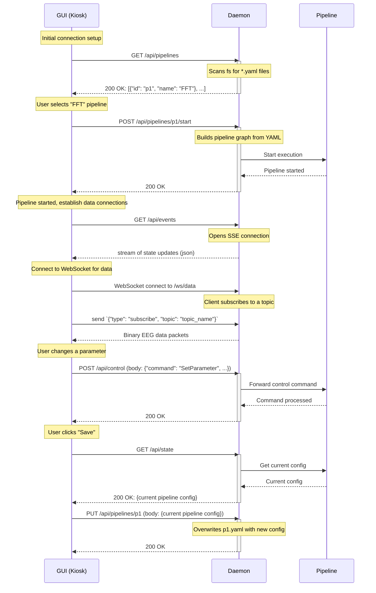

# Elata EEG - Control Plane API

This document describes the RESTful API for controlling and monitoring data processing pipelines in the Elata EEG system.

## Overview

The API provides a control plane for managing data pipelines. It is designed as a RESTful service using standard HTTP methods for requests/responses and Server-Sent Events (SSE) for real-time updates from the server to the client. High-performance EEG data streaming is handled via a central WebSocket broker within the daemon.

The primary components are:
- **Daemon:** A background service that manages and executes pipelines. It exposes the control plane API and a central WebSocket data endpoint on port 9000.
- **Pipeline:** A dataflow graph that processes EEG data through various stages. Data is sent to the WebSocket broker via a `websocket_sink` stage.
- **GUI (Kiosk):** A web-based user interface that interacts with the daemon's API for control and connects to the daemon's central WebSocket endpoint for real-time data streaming.

## Interaction Flow

The system uses a dual-connection approach on a single port (9000):
1. **HTTP/SSE Connection**: For control plane operations and state updates.
2. **WebSocket Connection**: For high-performance EEG data streaming.

The following diagram illustrates the typical interaction between the GUI and the Daemon:



## API Endpoints

### Pipelines

*   **`GET /api/pipelines`**
    *   **Description:** Retrieves a list of all available pipelines discovered by the daemon. The daemon discovers pipelines by scanning configured directories for `*.yaml` files.
    *   **Response:** `200 OK`
    ```json
    [
        {"id": "p1", "name": "FFT"},
        {"id": "p2", "name": "Notch Filter"}
    ]
    ```

*   **`POST /api/pipelines/{id}/start`**
    *   **Description:** Starts a specific pipeline by its ID. The behavior depends on the current state of the daemon:
        - If no pipeline is running, it starts the requested pipeline.
        - If the requested pipeline is already running, it does nothing and returns success.
        - If a different pipeline is running, it returns a conflict error.
    *   **Responses:**
        - `200 OK`: The requested pipeline is now running.
        - `409 Conflict`: A different pipeline is already running. The response body will indicate the ID of the running pipeline.
        ```json
        {
          "error": "Conflict: A different pipeline is already running.",
          "running_pipeline_id": "some_other_pipeline"
        }
        ```

*   **`POST /api/pipeline/stop`**
    *   **Description:** Stops the currently running pipeline.
    *   **Response:** `200 OK`

*   **`PUT /api/pipelines/{id}`**
    *   **Description:** Saves the current configuration of a pipeline by its ID. This overwrites the corresponding `.yaml` file on the filesystem.
    *   **Request Body:** The full pipeline configuration in JSON format.
    *   **Response:** `200 OK`

### Control and State

*   **`POST /api/control`**
    *   **Description:** Sends a control command to the currently running pipeline, such as changing a parameter.
    *   **Request Body:**
    ```json
    {
        "command": "SetParameter",
        "stage_id": "filter_stage",
        "parameter_id": "center_frequency",
        "value": 60
    }
    ```
    *   **Response:** `200 OK`

*   **`GET /api/state`**
    *   **Description:** Retrieves the current state and configuration of the running pipeline. This is useful for the UI to dynamically render controls.
    *   **Response:** `200 OK` with the current pipeline configuration as JSON.

### Real-time Events

*   **`GET /api/events`**
    *   **Description:** Establishes a Server-Sent Events (SSE) connection. Upon connection, the daemon will immediately push a `PipelineStarted` event if a pipeline is already running, containing the full configuration of that pipeline. Subsequently, the daemon will push real-time state updates, data, or other events to the client over this connection.
    *   **Response:** A stream of `text/event-stream` data.

### WebSocket Data Streaming

The daemon provides a single, centralized WebSocket endpoint for streaming high-performance data from pipelines to clients. This endpoint operates on a topic-based publish-subscribe model.

*   **Endpoint:** `/ws/data`
    *   **URL:** `ws://<daemon_address>/ws/data` (e.g., `ws://127.0.0.1:9000/ws/data`)
    *   **Description:** This is the sole endpoint for real-time data transmission. Any client wishing to receive data from a pipeline must connect to it.

#### Topic-Based Subscription Model

To receive data, a client must first connect to the WebSocket endpoint and then subscribe to one or more data "topics." A topic is a named stream of data, typically corresponding to the output of a specific stage in a pipeline (e.g., raw data, filtered data, etc.).

The subscription process is as follows:

1.  **Establish Connection:** The client initiates a WebSocket connection to the `/ws/data` endpoint.

2.  **Subscribe to a Topic:** Immediately after the connection is established, the client must send a JSON message to specify which topic it wants to receive data from. The message must be a JSON object with a `type` field set to `"subscribe"` and a `topic` field with the desired topic name.

    *   **Example `subscribe` message:**
        ```json
        {
          "type": "subscribe",
          "topic": "eeg_voltage"
        }
        ```

3.  **Receive Data:** Once successfully subscribed, the client will begin receiving a stream of binary data packets published to that topic. The format of these packets is the raw binary representation of an `RtPacket`.

4.  **Unsubscribe (Optional):** To stop receiving data from a topic, the client can send an `unsubscribe` message.

    *   **Example `unsubscribe` message:**
        ```json
        {
          "type": "unsubscribe",
          "topic": "eeg_voltage"
        }
        ```

A single client can be subscribed to multiple topics simultaneously by sending multiple `subscribe` messages.

#### `websocket_sink` Stage

The `websocket_sink` pipeline stage no longer creates a server. Its role is to forward data from a pipeline into the central broker.

*   **Configuration:**
    ```yaml
    - name: "websocket_sink_raw"
      type: "websocket_sink"
      params:
        topic: "eeg_raw" # The topic to publish data under
      inputs:
        - "source.output"
    ```
*   **Function:** It takes `RtPacket`s from its input, wraps them in a `BrokerMessage` with the configured `topic`, and sends them to the central `WebSocketBroker`.

#### Data Format

The data sent over the WebSocket is the raw binary representation of an `RtPacket`.

## Design Rationale (FAQ)

*   **How are pipelines discovered?**
    The daemon discovers pipeline definitions (`*.yaml` files) from configured directories on the filesystem. The UI then uses the `GET /api/pipelines` endpoint to get a list of available pipelines to present to the user. This decouples the UI from the filesystem.

*   **How does the GUI know what controls to display?**
    After a pipeline is started (or if the UI connects when a pipeline is already running), the UI **must** call `GET /api/state` to fetch the complete configuration of the running pipeline. This ensures the UI has the necessary information to render the correct controls and avoids race conditions with the event stream. The SSE connection (`/api/events`) should be used for subsequent real-time updates.

*   **Why use both HTTP/SSE and WebSockets?**
    This design uses a dual-connection approach for optimal performance:
    - **HTTP/SSE** for control operations: Simple, stateless, cacheable, and easy to debug for pipeline management
    - **WebSocket** for data streaming: High-performance binary data transfer with low overhead for real-time EEG data
    
    This separation allows each protocol to be optimized for its specific use case. The control plane remains simple and debuggable while the data plane achieves the low latency required for EEG streaming.

*   **How are changes saved?**
    A user can save changes to a pipeline's configuration via a `PUT` request to `/api/pipelines/{id}`. This will overwrite the original YAML file. A "Save As" functionality could be a future enhancement.