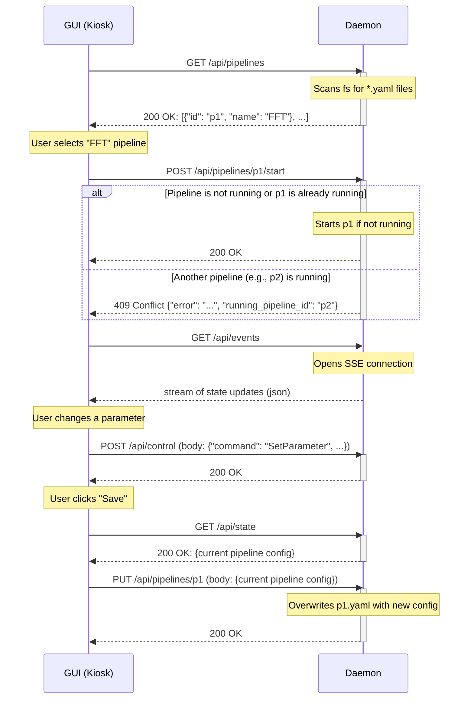

# Elata EEG - Control Plane API

This document describes the RESTful API for controlling and monitoring data processing pipelines in the Elata EEG system.

## Overview

The API provides a control plane for managing data pipelines. It is designed as a RESTful service using standard HTTP methods for requests/responses and Server-Sent Events (SSE) for real-time updates from the server to the client.

The primary components are:
- **Daemon:** A background service that manages and executes pipelines. It exposes the control plane API.
- **GUI (Kiosk):** A web-based user interface that interacts with the daemon's API to provide users with controls for the pipelines.

## Interaction Flow

The following diagram illustrates the typical interaction between the GUI and the Daemon.



## API Endpoints

### Pipelines

*   **`GET /api/pipelines`**
    *   **Description:** Retrieves a list of all available pipelines discovered by the daemon. The daemon discovers pipelines by scanning configured directories for `*.yaml` files.
    *   **Response:** `200 OK`
    ```json
    [
        {"id": "p1", "name": "FFT"},
        {"id": "p2", "name": "Notch Filter"}
    ]
    ```

*   **`POST /api/pipelines/{id}/start`**
    *   **Description:** Starts a specific pipeline by its ID. The behavior depends on the current state of the daemon:
        - If no pipeline is running, it starts the requested pipeline.
        - If the requested pipeline is already running, it does nothing and returns success.
        - If a different pipeline is running, it returns a conflict error.
    *   **Responses:**
        - `200 OK`: The requested pipeline is now running.
        - `409 Conflict`: A different pipeline is already running. The response body will indicate the ID of the running pipeline.
        ```json
        {
          "error": "Conflict: A different pipeline is already running.",
          "running_pipeline_id": "some_other_pipeline"
        }
        ```

*   **`POST /api/pipeline/stop`**
    *   **Description:** Stops the currently running pipeline.
    *   **Response:** `200 OK`

*   **`PUT /api/pipelines/{id}`**
    *   **Description:** Saves the current configuration of a pipeline by its ID. This overwrites the corresponding `.yaml` file on the filesystem.
    *   **Request Body:** The full pipeline configuration in JSON format.
    *   **Response:** `200 OK`

### Control and State

*   **`POST /api/control`**
    *   **Description:** Sends a control command to the currently running pipeline, such as changing a parameter.
    *   **Request Body:**
    ```json
    {
        "command": "SetParameter",
        "stage_id": "filter_stage",
        "parameter_id": "center_frequency",
        "value": 60
    }
    ```
    *   **Response:** `200 OK`

*   **`GET /api/state`**
    *   **Description:** Retrieves the current state and configuration of the running pipeline. This is useful for the UI to dynamically render controls.
    *   **Response:** `200 OK` with the current pipeline configuration as JSON.

### Real-time Events

*   **`GET /api/events`**
    *   **Description:** Establishes a Server-Sent Events (SSE) connection. Upon connection, the daemon will immediately push a `PipelineStarted` event if a pipeline is already running, containing the full configuration of that pipeline. Subsequently, the daemon will push real-time state updates, data, or other events to the client over this connection.
    *   **Response:** A stream of `text/event-stream` data.

## Design Rationale (FAQ)

*   **How are pipelines discovered?**
    The daemon discovers pipeline definitions (`*.yaml` files) from configured directories on the filesystem. The UI then uses the `GET /api/pipelines` endpoint to get a list of available pipelines to present to the user. This decouples the UI from the filesystem.

*   **How does the GUI know what controls to display?**
    After a pipeline is started (or if the UI connects when a pipeline is already running), the UI **must** call `GET /api/state` to fetch the complete configuration of the running pipeline. This ensures the UI has the necessary information to render the correct controls and avoids race conditions with the event stream. The SSE connection (`/api/events`) should be used for subsequent real-time updates.

*   **Why use HTTP/SSE instead of WebSockets?**
    This design uses HTTP for standard request/response interactions (like starting or stopping a pipeline), which is simple and stateless. For real-time updates from the server to the client, Server-Sent Events (SSE) are used. SSE is a simpler protocol than WebSockets and is very efficient for one-way server-to-client data streaming. This combination provides a lightweight and robust solution.

*   **How are changes saved?**
    A user can save changes to a pipeline's configuration via a `PUT` request to `/api/pipelines/{id}`. This will overwrite the original YAML file. A "Save As" functionality could be a future enhancement.