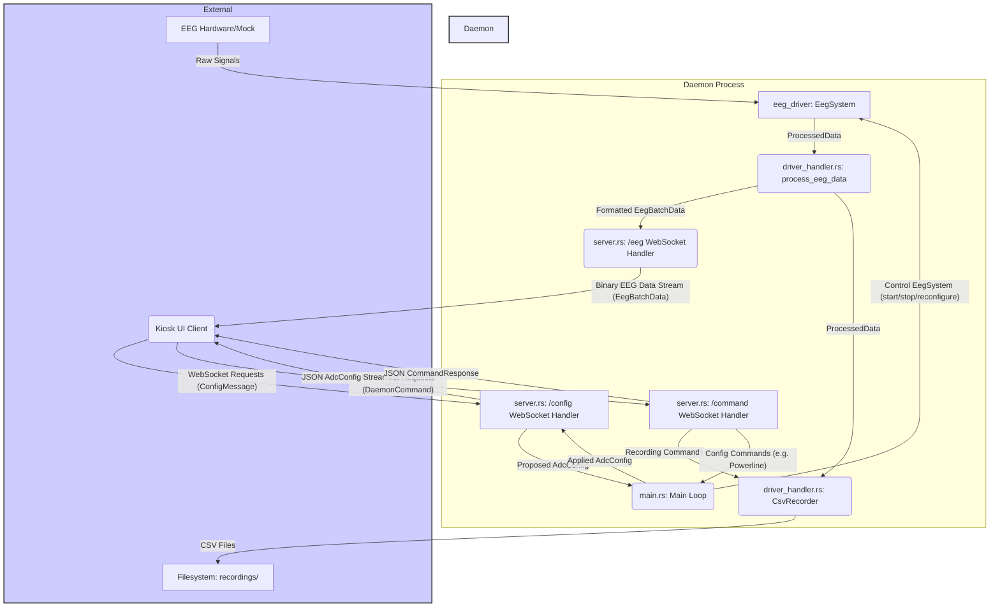

this is an architecture doc for the ai to understand the context of this directory rapidly

# EEG Daemon Architecture

## 1. Introduction

The EEG Daemon is a Rust-based backend application responsible for interfacing with EEG (Electroencephalogram) hardware, acquiring raw data, performing initial processing, managing device configuration, handling data recording, and serving processed data and control interfaces to frontend clients (like the Kiosk application) via WebSockets.

This document provides a high-level overview of the Daemon's architecture to facilitate rapid onboarding, feature development, and bug fixing.

**Key Goals:**
*   Reliable data acquisition from various EEG hardware drivers.
*   Real-time data streaming to clients.
*   Persistent data recording to CSV files.
*   Dynamic configuration management of the EEG device.
*   Robust error handling and status reporting.

## 2. Key Technologies

*   **Rust**: Primary programming language, chosen for its performance, safety, and concurrency features.
*   **Tokio**: Asynchronous runtime for building network applications.
*   **Warp**: A super-easy, composable web server framework for Rust, used here for WebSocket handling.
*   **Serde**: Framework for serializing and deserializing Rust data structures efficiently (e.g., for JSON communication over WebSockets).
*   **eeg_driver Crate**: A local crate (located in [`driver/`](../driver/)) that provides the `EegSystem` for hardware abstraction and data acquisition.

## 3. Core Concepts & Data Flow

The Daemon acts as an intermediary between the EEG hardware and client applications.

**Overall Data Flow:**

1.  **Hardware to Daemon**: The `eeg_driver` crate's `EegSystem` component interfaces with the physical EEG device (or a mock driver), acquiring raw data and performing initial processing (like applying DSP filters). It emits `ProcessedData` packets.
2.  **Daemon Internal Processing**:
    *   [`daemon/src/main.rs`](./src/main.rs) initializes and manages the `EegSystem`.
    *   `ProcessedData` from `EegSystem` is sent to [`daemon/src/driver_handler.rs`](./src/driver_handler.rs) (`process_eeg_data` function).
    *   `process_eeg_data` then:
        *   Forwards data to [`CsvRecorder`](./src/driver_handler.rs) if recording is active.
        *   Transforms and batches data into `EegBatchData` suitable for WebSocket clients.
        *   Broadcasts `EegBatchData` to the [`daemon/src/server.rs`](./src/server.rs) for distribution.
3.  **Daemon to Client (Kiosk UI)**:
    *   [`daemon/src/server.rs`](./src/server.rs) handles WebSocket connections.
    *   Streams `EegBatchData` (containing EEG voltage values and timestamps) to clients connected to the `/eeg` endpoint.
    *   Manages configuration synchronization via the `/config` endpoint.
    *   Handles control commands (like start/stop recording) via the `/command` endpoint.
4.  **Client to Daemon**:
    *   Clients send configuration changes (as `ConfigMessage`) to the `/config` endpoint.
    *   Clients send commands (as `DaemonCommand`) to the `/command` endpoint.

**High-Level Interaction Diagram:**

## 4. Daemon Architecture Overview

The Daemon is structured into several key Rust modules:

*   **[`daemon/src/main.rs`](./src/main.rs)**:
    *   The main application entry point.
    *   Initializes logging and loads daemon configuration from `config.json` via the [`config`](./src/config.rs) module.
    *   Sets up the initial `AdcConfig` for the `EegSystem`.
    *   Creates and manages shared state:
        *   `Arc<Mutex<AdcConfig>>`: The current active ADC configuration.
        *   `Arc<AtomicBool>`: The current recording status.
    *   Initializes and starts the `EegSystem` (from the `eeg_driver` crate).
    *   Spawns the WebSocket server ([`server::setup_websocket_routes()`](./src/server.rs:733)).
    *   Spawns the EEG data processing task ([`driver_handler::process_eeg_data()`](./src/driver_handler.rs:251)).
    *   Contains the main event loop that listens for proposed configuration updates from the WebSocket server. If an update is received and valid:
        *   Stops the current `EegSystem` and its processing task.
        *   Starts a new `EegSystem` and processing task with the new configuration.
        *   Updates the shared `AdcConfig`.
        *   Broadcasts the applied configuration change so the WebSocket server can inform clients.

*   **[`daemon/src/config.rs`](./src/config.rs)**:
    *   Defines the `DaemonConfig` struct, which includes settings like recording directory, DSP filter parameters, default hardware driver type, etc.
    *   Provides [`load_config()`](./src/config.rs) function to read these settings from a `config.json` file (expected in the working directory where the daemon is run, typically the project root or `daemon/` if run directly from there).

*   **[`daemon/src/driver_handler.rs`](./src/driver_handler.rs)**:
    *   Defines `EegBatchData` struct ([`driver_handler::EegBatchData`](./src/driver_handler.rs:18)), which is a version of `ProcessedData` tailored for WebSocket clients (primarily containing voltage values and timestamps).
    *   **`CsvRecorder` struct ([`driver_handler::CsvRecorder`](./src/driver_handler.rs:25))**:
        *   Manages the state and logic for recording EEG data to CSV files.
        *   Handles file creation (with timestamped names, session prefix, and driver info), writing headers (timestamp, channel voltages, raw samples), and appending data.
        *   Implements periodic flushing of the CSV writer.
        *   Supports auto-rotation of recording files based on `max_recording_length_minutes` from `DaemonConfig`.
        *   Methods: [`new()`](./src/driver_handler.rs:39), [`update_config()`](./src/driver_handler.rs:55), [`start_recording()`](./src/driver_handler.rs:60), [`stop_recording()`](./src/driver_handler.rs:155), [`write_data()`](./src/driver_handler.rs:175).
    *   **`process_eeg_data` async function ([`driver_handler::process_eeg_data()`](./src/driver_handler.rs:251))**:
        *   Receives `ProcessedData` from the `EegSystem` (via an `mpsc::Receiver`).
        *   If recording is active, passes the `ProcessedData` to the `CsvRecorder`.
        *   Transforms `ProcessedData` into `EegBatchData` chunks.
        *   Sends `EegBatchData` to a `broadcast::Sender`, which is subscribed to by the `/eeg` WebSocket handler in [`server.rs`](./src/server.rs).
        *   Handles cancellation via a `CancellationToken`.

*   **[`daemon/src/server.rs`](./src/server.rs)**:
    *   Uses `warp` to define and manage WebSocket endpoints.
    *   **`setup_websocket_routes()` function ([`server::setup_websocket_routes()`](./src/server.rs:733))**:
        *   Sets up three main routes: `/eeg`, `/config`, and `/command`.
        *   Returns the combined `warp::Filter` and an `mpsc::Receiver` for `main.rs` to get proposed config updates.
    *   **`/eeg` endpoint handler ([`server::handle_websocket()`](./src/server.rs:153))**:
        *   Subscribes to the `broadcast::Receiver<EegBatchData>` from `process_eeg_data`.
        *   Serializes `EegBatchData` into a custom binary format ([`server::create_eeg_binary_packet()`](./src/server.rs:85)) and streams it to connected clients.
        *   Binary format: `[timestamp_u64_le] [error_flag_u8] [data_payload]`. If `error_flag` is 1, payload is UTF-8 error string. If 0, payload is `f32_le` samples for each channel.
    *   **`/config` endpoint handler ([`server::handle_config_websocket()`](./src/server.rs:193))**:
        *   On client connection, sends the current `AdcConfig` (JSON serialized).
        *   Listens for incoming `ConfigMessage` (JSON) from clients. Validates the message (e.g., channel count, sample rate, powerline filter values).
        *   If a valid change is proposed and recording is not active, it sends the new `AdcConfig` to `main.rs` via an `mpsc::Sender` for application.
        *   Subscribes to a `broadcast::Receiver<AdcConfig>` (fed by `main.rs`) to get notifications of *applied* configuration changes, and forwards these (JSON serialized) to all connected `/config` clients.
    *   **`/command` endpoint handler ([`server::handle_command_websocket()`](./src/server.rs:509))**:
        *   Receives `DaemonCommand` (JSON) from clients. Commands include:
            *   `start`: Initiates CSV recording via `CsvRecorder`.
            *   `stop`: Stops CSV recording via `CsvRecorder`.
            *   `status`: Reports current recording status.
            *   `set_powerline_filter`: Allows changing the powerline filter setting (sends a proposed `AdcConfig` to `main.rs`).
        *   Sends `CommandResponse` (JSON) back to the client.
        *   Periodically sends status updates to connected clients.

*   **`eeg_driver` Crate (External - in [`driver/`](../driver/))**:
    *   This separate local crate is responsible for the low-level hardware abstraction.
    *   Provides `EegSystem`, which the daemon uses to start, stop, and configure the EEG data acquisition.
    *   Defines `AdcConfig` struct, used by the daemon to specify hardware settings (sample rate, channels, gain, DSP filters, etc.).
    *   Emits `ProcessedData` containing timestamped, filtered voltage samples and raw ADC samples.

## 5. Client Interaction (WebSocket Endpoints)

The Daemon exposes three WebSocket endpoints on `0.0.0.0:8080`:

*   **`/eeg`**:
    *   **Purpose**: Streams continuous EEG data from the device.
    *   **Direction**: Daemon to Client.
    *   **Client**: [`kiosk/src/components/EegDataHandler.tsx`](../kiosk/src/components/EegDataHandler.tsx) in the Kiosk app.
    *   **Format**: Custom binary packets (see [`server::create_eeg_binary_packet()`](./src/server.rs:85)). Each packet contains a timestamp, an error flag, and then either channel data (f32 samples) or an error message.

*   **`/config`**:
    *   **Purpose**:
        1.  Provides the initial `AdcConfig` to the frontend upon connection.
        2.  Receives `ConfigMessage` from the frontend when the user attempts to change settings.
        3.  Pushes the *applied* `AdcConfig` to all connected clients if a configuration change is successfully processed by `main.rs`.
    *   **Direction**: Bidirectional.
    *   **Clients**:
        *   Kiosk's [`EegConfigProvider`](../kiosk/src/components/EegConfig.tsx) (for receiving/subscribing to `AdcConfig`).
        *   Kiosk's [`EegMonitor`](../kiosk/src/components/EegMonitor.tsx) (for sending `ConfigMessage` when user changes settings).
    *   **Format**:
        *   Daemon to Client: JSON serialized `AdcConfig`.
        *   Client to Daemon: JSON serialized `ConfigMessage` ([`server::ConfigMessage`](./src/server.rs:56)).

*   **`/command`**:
    *   **Purpose**: Accepts control commands from the frontend (e.g., `start` recording, `stop` recording, `set_powerline_filter`) and returns status/results.
    *   **Direction**: Bidirectional.
    *   **Client**: Kiosk's [`CommandWebSocketProvider`](../kiosk/src/context/CommandWebSocketContext.tsx).
    *   **Format**:
        *   Client to Daemon: JSON serialized `DaemonCommand` enum ([`server::DaemonCommand`](./src/server.rs:16)).
        *   Daemon to Client: JSON serialized `CommandResponse` struct ([`server::CommandResponse`](./src/server.rs:78)).

## 6. Configuration Management Flow

1.  **Initial Load (Client)**: Kiosk's [`EegConfigProvider`](../kiosk/src/components/EegConfig.tsx) connects to `/config`. Daemon's [`handle_config_websocket`](./src/server.rs:193) sends the current `AdcConfig`.
2.  **User Modification (Client)**: User changes a setting in Kiosk UI (e.g., in [`EegMonitor`](../kiosk/src/components/EegMonitor.tsx)).
3.  **Sending Update (Client to Daemon)**: Kiosk sends a `ConfigMessage` to the `/config` endpoint.
4.  **Proposal (Daemon: `server.rs`)**: [`handle_config_websocket`](./src/server.rs:193) receives `ConfigMessage`, validates it. If valid and recording is not active, it constructs a new proposed `AdcConfig` and sends it to `main.rs` via an MPSC channel (`config_update_tx`). It sends an "update submitted" `CommandResponse` to the originating client.
5.  **Application (Daemon: `main.rs`)**: The main loop in [`main.rs`](./src/main.rs) receives the proposed `AdcConfig`.
    *   It checks if the proposed config is different from the current one.
    *   If different and no recording is active:
        *   Stops the current `EegSystem`.
        *   Cancels and awaits the current `process_eeg_data` task.
        *   Starts a new `EegSystem` with the new `AdcConfig`.
        *   Starts a new `process_eeg_data` task.
        *   Updates the shared `Arc<Mutex<AdcConfig>>`.
        *   Broadcasts the *newly applied* `AdcConfig` via `config_applied_tx`.
6.  **Broadcast & Confirmation (Daemon: `server.rs` to Clients)**: [`handle_config_websocket`](./src/server.rs:193) (for all connected `/config` clients) receives the broadcasted applied `AdcConfig` and sends it as JSON to each client. This confirms the change and updates their state.

## 7. Recording Flow

1.  **User Action (Client)**: User clicks "Start Recording" in the Kiosk UI.
2.  **Command (Client to Daemon)**: Kiosk sends a `{"command": "start"}` message to the `/command` endpoint.
3.  **Processing (Daemon: `server.rs`)**: [`handle_command_websocket`](./src/server.rs:509) receives the command.
    *   It acquires a lock on the `CsvRecorder`.
    *   Calls [`recorder.start_recording().await`](./src/driver_handler.rs:60).
4.  **Execution (Daemon: `driver_handler.rs`)**: `CsvRecorder.start_recording()`:
    *   Sets the shared `is_recording` AtomicBool to `true`.
    *   Creates a new timestamped CSV file in the configured `recordings_directory`.
    *   Writes the CSV header.
    *   Updates its internal state.
    *   Returns a success message.
5.  **Response (Daemon to Client)**: [`handle_command_websocket`](./src/server.rs:509) sends a `CommandResponse` (e.g., "Started recording to ...") back to the Kiosk client.
6.  **Data Writing**: As `process_eeg_data` receives `ProcessedData`, if `is_recording` is true, it calls `CsvRecorder.write_data()` to append samples to the active CSV file.
7.  **Stopping**: Similar flow for the `stop` command, calling [`recorder.stop_recording().await`](./src/driver_handler.rs:155).

## 8. Key Directories & Their Purpose

*   **[`daemon/src/`](./src/)**: Contains all Rust source code for the Daemon application.
    *   [`main.rs`](./src/main.rs): Main application logic, coordination.
    *   [`server.rs`](./src/server.rs): WebSocket server implementation.
    *   [`driver_handler.rs`](./src/driver_handler.rs): Data processing, batching, and CSV recording.
    *   [`config.rs`](./src/config.rs): Daemon configuration loading.
    *   [`lib.rs`](./src/lib.rs): Library root (can be used for integration tests or if daemon logic is used as a library).
*   **[`daemon/Cargo.toml`](./Cargo.toml)**: Rust project manifest, defines dependencies (e.g., `tokio`, `warp`, `serde`, `eeg_driver`).
*   **`recordings/`** (Typically at project root, path configured in `config.json`): Default output directory where CSV recording files are saved. The daemon expects this path to be relative to its current working directory when started.

## 9. How to Approach Common Tasks

*   **Modifying Data Processing Before WebSocket Broadcast**:
    *   Changes will likely be in [`daemon/src/driver_handler.rs`](./src/driver_handler.rs), specifically within the `process_eeg_data` function or by modifying how `EegBatchData` is constructed from `ProcessedData`.
    *   If the underlying data from the driver needs to change, modifications might be needed in the `eeg_driver` crate.

*   **Adding a New WebSocket Command**:
    1.  Define the new command variant in the `DaemonCommand` enum in [`daemon/src/server.rs`](./src/server.rs:16).
    2.  Add a handler arm for the new command in the `match daemon_cmd` block within [`handle_command_websocket`](./src/server.rs:509).
    3.  Implement the logic for the command. This might involve:
        *   Interacting with `CsvRecorder`.
        *   Sending a new type of message/config to `main.rs` for more complex state changes.
        *   Reading from the shared `AdcConfig`.
    4.  Ensure appropriate `CommandResponse` messages are sent back.

*   **Changing the CSV Recording Format**:
    *   Modify the `CsvRecorder` struct and its methods in [`daemon/src/driver_handler.rs`](./src/driver_handler.rs:25).
    *   Specifically, update header creation in [`start_recording()`](./src/driver_handler.rs:60) and data row creation in [`write_data()`](./src/driver_handler.rs:175).

*   **Adjusting Hardware Interaction or Adding Support for New Driver Features**:
    *   This will primarily involve changes within the `eeg_driver` crate (in the [`driver/`](../driver/) directory).
    *   If new configuration parameters are needed, the `AdcConfig` struct (defined in `eeg_driver` and used throughout the daemon) will need to be updated.
    *   The daemon's handling of `AdcConfig` in [`main.rs`](./src/main.rs) and [`server.rs`](./src/server.rs) might need adjustments to expose/manage these new parameters.

*   **Changing Daemon-Specific Configuration Options**:
    1.  Add new fields to the `DaemonConfig` struct in [`daemon/src/config.rs`](./src/config.rs).
    2.  Update the `config.json` file structure and provide default/example values.
    3.  Utilize the new configuration values where needed within the daemon's logic (e.g., in `main.rs`, `driver_handler.rs`).