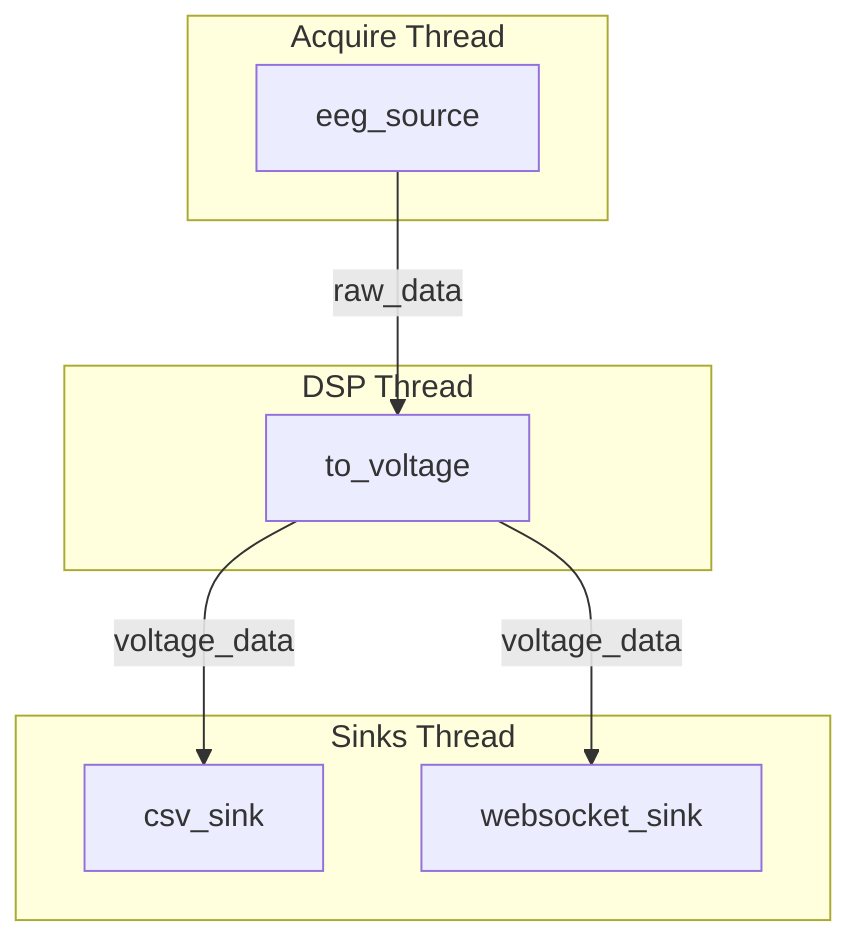
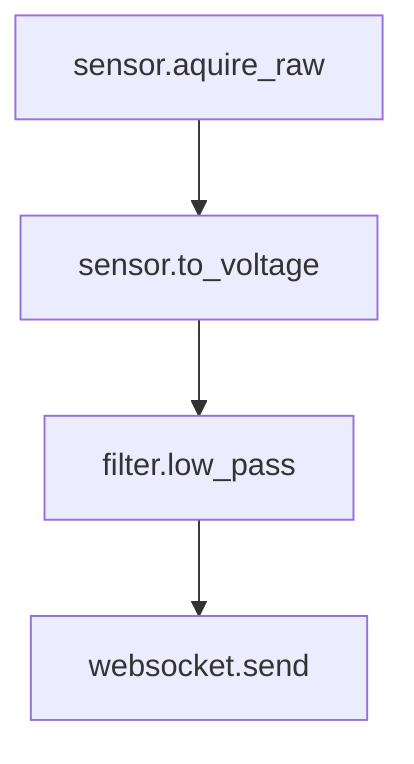

# Architecture Discussion: Pipeline vs. Functional Array

This document compares two potential architectures for the EEG data processing pipeline:
1.  **Current Pipeline Architecture:** A multi-threaded, graph-based system defined in `architecture.md`.
2.  **Proposed Functional Array:** A simpler, single-pass chain of functions.

The goal is to evaluate the trade-offs and decide if the complexity of the current system is justified.

---

## 1. At a Glance

| Feature | Current Pipeline Architecture | Proposed Functional Array |
| :--- | :--- | :--- |
| **Core Model** | Directed Acyclic Graph (DAG) | Linear Array `[f(..), g(..)]` |
| **Execution** | Multi-threaded, parallel groups | Single-threaded, sequential |
| **Data Flow** | Zero-copy `Arc<RtPacket>` | Potential for copies between functions |
| **Flexibility** | High (fan-in/fan-out, dynamic changes) | Low (linear path only) |
| **Complexity** | High | Low |
| **Use Case** | High-performance, real-time systems | Simple, single-purpose processing |

---

## 2. Visual Comparison

### Current Pipeline Architecture (Graph-based)

This model allows for complex routing, like splitting a data stream to multiple sinks (fan-out) or combining multiple sources (fan-in).

### Proposed Functional Array (Linear)

This model is simpler but inherently sequential. It doesn't naturally support branching paths.

---

## 3. Detailed Pros and Cons

### Approach 1: Current Pipeline Architecture

This is the system detailed in [`architecture.md`](crates/pipeline/architecture.md).

**✅ Pros:**

*   **Performance & Parallelism:** Explicitly designed for multi-core CPUs. By pinning I/O, DSP, and sinks to different cores, it minimizes latency and prevents a slow stage (like writing a file) from blocking the real-time acquisition loop.
*   **Robust Data Flow:** The `Arc<RtPacket>` system ensures zero-copy data handling. This is critical for high-throughput (4000 sps) data to avoid performance bottlenecks from memory allocation and copying.
*   **Flexibility (Fan-out/Fan-in):** Natively supports complex topologies. The `default.yaml` example demonstrates this by fanning out the `voltage_data` to both a CSV sink and a WebSocket sink. This is impossible in a simple linear array.
*   **Resilience & Error Handling:** Features advanced, per-stage error policies (e.g., `DrainThenStop`, `SkipPacket`). A fault in one branch (e.g., the CSV writer fails) doesn't have to tear down the entire pipeline; the WebSocket branch could continue streaming.
*   **Dynamic Configuration:** The architecture is built to be controlled at runtime. You can start, stop, and even hot-swap stages without killing the daemon, which is crucial for a system that needs to be highly available.
*   **Decoupling:** The separation of `pipeline_core`, `plugin_api`, and the actual stages is a strong design principle. It allows the core runtime to be refactored without breaking every plugin, which is vital for long-term maintenance and community contributions.

**❌ Cons:**

*   **Complexity:** This is the main drawback. The learning curve is steep. A new contributor needs to understand the executor, allocators, stage traits, and the graph structure. This complexity can be a barrier to entry.
*   **Boilerplate:** While macros like `simple_stage!` help, there is still more boilerplate required to add a new stage compared to just writing a function.

### Approach 2: Proposed Functional Array

This is the model of running a simple array of functions, like `[sensor.aquire_raw, sensor.to_voltage, ...]`.

**✅ Pros:**

*   **Simplicity:** The concept is incredibly easy to grasp. The code would be almost self-documenting. A new contributor could add a new processing step in minutes.
*   **Low Boilerplate:** Adding a new stage is as simple as writing a new function and adding it to the array in the configuration.
*   **Reconfigurability:** The pipeline definition in YAML is straightforward and easy to modify.

**❌ Cons:**

*   **Single-Threaded Performance:** A simple array of functions would execute sequentially on a single thread. At 4000 sps, any function that takes a significant amount of time (file I/O, complex DSP) will introduce latency and could lead to dropped packets, as the acquisition would be blocked.
*   **No Fan-Out:** It cannot handle one-to-many data flows. You couldn't send the same data to a WebSocket and a file simultaneously. You would have to run two separate, redundant pipelines.
*   **Primitive Error Handling:** If one function in the array panics, the entire pipeline crashes. There's no built-in mechanism for the fine-grained error recovery the current system provides.
*   **Inefficient Data Handling:** Passing large vectors of data between functions can lead to frequent memory allocations and copies, which would be a major performance hit at the target sample rates.
*   **Static Configuration:** Any change to the pipeline (e.g., changing a filter's cutoff frequency) would likely require a full restart.

---

## 4. Initial Conclusion

The current architecture, while complex, directly solves several non-trivial problems that are critical for a high-performance EEG system: **parallelism, back-pressure, and flexible data routing (fan-out).**

A simpler functional array would be much easier to understand but would likely fail to meet the system's performance and reliability requirements, especially regarding fan-out to multiple sinks and preventing I/O from blocking data acquisition.

The complexity seems to be a direct and necessary consequence of the system's requirements. The question then becomes: are the requirements themselves "overkill"?

---

## 5. Recommendation: Tame the Complexity

The consensus is that the current architecture's features (parallelism, fan-out, resilience) are necessary to meet the project's goals. The high-level design is sound.

However, the concern about complexity is the most critical issue for the project's health. A powerful but unusable system is a failed system.

The path forward is not to remove the power but to **aggressively manage the complexity**. We must improve the developer experience so that a new contributor can add a simple filter stage without needing to understand the entire multi-threading model.

### Strategies to Reduce Cognitive Overhead

1.  **Create a `Stage Developer's Guide`.**
    *   A short, focused tutorial (`TUTORIAL.md`) that walks a contributor through creating a simple `pass-through` stage.
    *   It should explicitly tell them what they *don't* need to worry about (e.g., "You don't have to think about threads or allocators, just focus on the `process` function.").
    *   Include a "Cookbook" section with recipes for common patterns (e.g., modifying data in-place, creating a new buffer, handling errors).

2.  **Enhance the `simple_stage!` Macro.**
    *   The existing macro is a great start. We could extend it or create new ones to handle more boilerplate automatically.
    *   Could we add a `#[derive(Stage)]` proc-macro to make it even cleaner? This would be the ultimate goal for boilerplate reduction.

3.  **Improve Configuration & Introspection.**
    *   The YAML configuration is good. We can make it better by adding more validation and clearer error messages. If a stage is wired incorrectly, the daemon should provide a human-readable error pointing to the exact line in the YAML.
    *   Add a `GET /pipeline/graph` endpoint to the daemon that returns the current pipeline structure in a machine-readable format (e.g., JSON or DOT graph format). This would allow for building visualizers and debugging tools.

4.  **Add a "Sanity Check" Test Suite.**
    *   Create a set of simple integration tests that new contributors can run to verify their stage hasn't broken the pipeline. This builds confidence.

By focusing on these developer-centric improvements, we can keep the high-performance core while making the project far more welcoming and sustainable.
