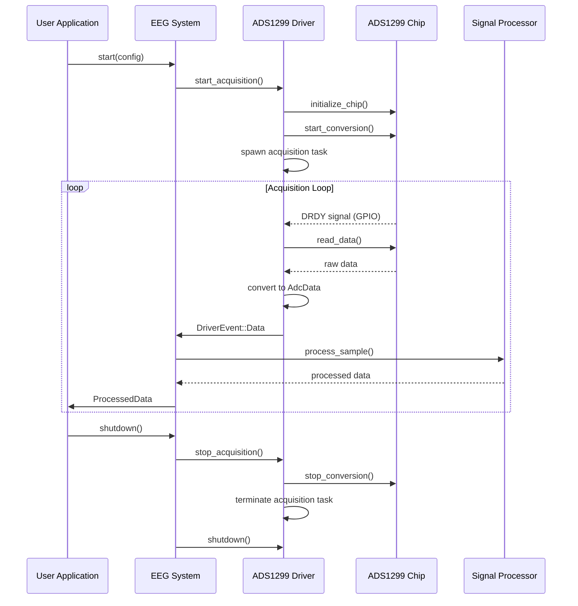
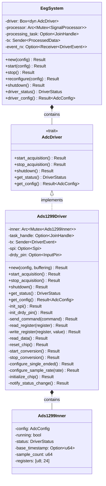
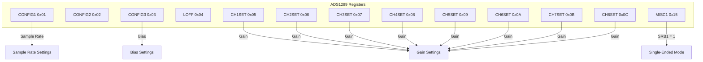
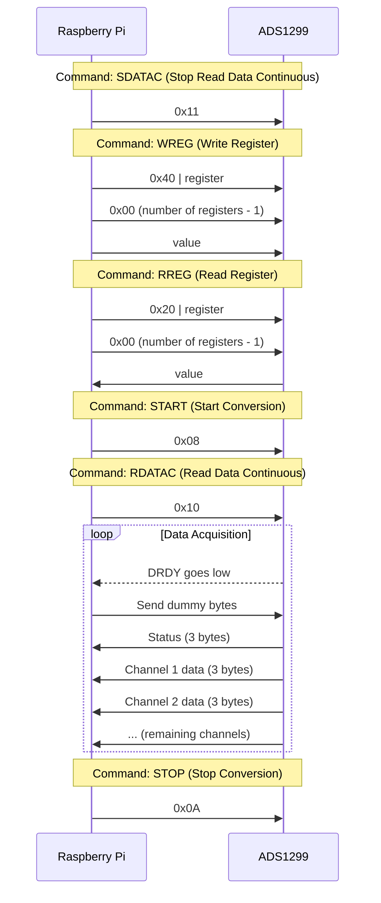

# ADS1299 Driver Architecture

This document provides a visual representation of the ADS1299 driver architecture and its integration with the EEG system.

## System Architecture

```mermaid
graph TD
    User[User Application] --> EegSystem
    
    subgraph "EEG System"
        EegSystem[EegSystem] --> Driver
        EegSystem --> SignalProcessor[Signal Processor]
        Driver --> EventChannel[Driver Event Channel]
        EventChannel --> ProcessingTask[Processing Task]
        ProcessingTask --> SignalProcessor
        SignalProcessor --> OutputChannel[Processed Data Channel]
        OutputChannel --> User
    end
    
    subgraph "ADS1299 Driver"
        Driver[Ads1299Driver] --> Inner[Ads1299Inner]
        Driver --> SPI[SPI Communication]
        Driver --> GPIO[GPIO (DRDY Pin)]
        Driver --> AcquisitionTask[Acquisition Task]
        AcquisitionTask --> SPI
        AcquisitionTask --> GPIO
        AcquisitionTask --> EventChannel
    end
    
    subgraph "Hardware"
        SPI --> ADS1299[ADS1299 Chip]
        GPIO --> ADS1299
        ADS1299 --> Electrodes[Electrodes]
    end
```

## Data Flow



## Component Structure



## Register Map

The ADS1299 has several registers that need to be configured for proper operation. Here's a visual representation of the key registers used in single-ended mode:



## SPI Communication

The ADS1299 communicates with the Raspberry Pi via SPI. Here's a diagram of the SPI communication:



## Hardware Connection

```mermaid
graph LR
    subgraph "Raspberry Pi 5"
        MOSI[MOSI Pin 19]
        MISO[MISO Pin 21]
        SCLK[SCLK Pin 23]
        CS[CS Pin 24]
        DRDY[GPIO25 Pin 22]
        GND[GND Pin 6]
    end
    
    subgraph "ADS1299EEG_FE"
        ADS_MOSI[DIN Pin 11]
        ADS_MISO[DOUT Pin 13]
        ADS_SCLK[SCLK Pin 3]
        ADS_CS[CS Pin 7]
        ADS_DRDY[DRDY Pin 15]
        ADS_GND[DGND Pins 4,10,18]
        
        subgraph "Electrodes"
            CH1[CH1 Pin 36]
            CH2[CH2 Pin 32]
            CH3[CH3 Pin 28]
            CH4[CH4 Pin 24]
            CH5[CH5 Pin 20]
            CH6[CH6 Pin 16]
            CH7[CH7 Pin 12]
            CH8[CH8 Pin 8]
            BIAS[BIAS_ELEC]
            REF[REF_ELEC]
        end
    end
    
    MOSI --> ADS_MOSI
    MISO <-- ADS_MISO
    SCLK --> ADS_SCLK
    CS --> ADS_CS
    DRDY <-- ADS_DRDY
    GND --- ADS_GND