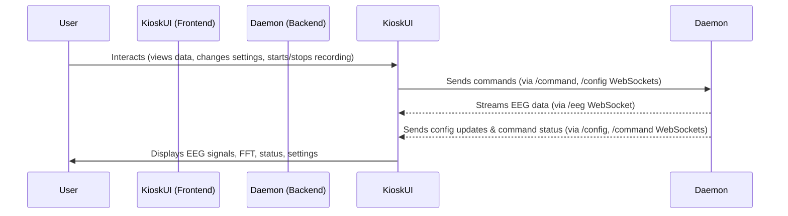

this is an architecture doc for the ai to understand the context of this directory rapidly

# Kiosk Application Architecture

## 1. Introduction

The Kiosk application serves as a frontend for monitoring, recording, and configuring an EEG (Electroencephalogram) device. It provides a user interface to visualize real-time EEG signals, view their Fast Fourier Transform (FFT) spectrum, manage device settings, and control recording sessions.

This document aims to provide a high-level overview of the Kiosk frontend architecture to facilitate rapid onboarding, feature development, and bug fixing.

**Key Technologies:**
*   Next.js (React Framework)
*   React (UI Library)
*   TypeScript (Language)
*   WebSockets (Real-time communication with backend daemon)
*   WebGL (via `webgl-plot` library for high-performance graphing)

## 2. Core Concepts & Data Flow

The Kiosk application interacts with a backend daemon (not covered in this document) that directly interfaces with the EEG hardware.

**Overall Data Flow:**

*   **Backend to Frontend**: The daemon streams EEG data, FFT data (if processed by daemon), and configuration status/updates to the Kiosk UI via WebSockets.
*   **Frontend to Backend**: User interactions, such as changing configuration settings or starting/stopping recordings, are sent as commands to the daemon via WebSockets.
*   **Frontend Internal**: The Kiosk UI processes and renders this data, providing visualizations and controls to the user.

**Key Data Types Handled by Frontend:**

*   **Raw EEG Data**: Time-series voltage values from EEG channels.
*   **FFT Data**: Frequency spectrum data (power/magnitude per frequency bin) derived from raw EEG signals.
*   **Configuration Data**: Parameters like sample rate, active channels, gain, powerline filter settings.
*   **Command/Status Data**: Messages related to operations like recording (e.g., "recording started", "file saved to X").

**High-Level Interaction Diagram:**

## 3. Frontend Architecture Overview

The frontend is a Next.js application structured with React components, context providers for state management, and utility modules.

*   **Main Entry Point**: [`kiosk/src/app/page.tsx`](kiosk/src/app/page.tsx:1)
    *   This is the root page of the Kiosk application.
    *   It sets up the necessary global context providers ([`EegConfigProvider`](kiosk/src/components/EegConfig.tsx:36) and [`CommandWebSocketProvider`](kiosk/src/context/CommandWebSocketContext.tsx:19)).
    *   Renders the main [`EegMonitor`](kiosk/src/components/EegMonitor.tsx:20) component.

*   **Core UI Component**: [`kiosk/src/components/EegMonitor.tsx`](kiosk/src/components/EegMonitor.tsx:20)
    *   Acts as the central hub for the user interface.
    *   Manages different views: Signal Graph, FFT Graph, and Settings panel.
    *   Orchestrates data display by embedding [`EegRenderer`](kiosk/src/components/EegRenderer.tsx:29) and [`FftRenderer`](kiosk/src/components/FftRenderer.tsx:22).
    *   Handles user interactions for changing settings and sends these updates to the backend via its own WebSocket connection to the `/config` endpoint.
    *   Integrates recording controls ([`EegRecordingControls`](kiosk/src/components/EegRecordingControls.tsx)).

*   **Data Handling & Processing**:
    *   [`kiosk/src/components/EegDataHandler.tsx`](kiosk/src/components/EegDataHandler.tsx) (provides the `useEegDataHandler` hook ([`kiosk/src/components/EegDataHandler.tsx:37`](kiosk/src/components/EegDataHandler.tsx:37)))
        *   Establishes and manages the WebSocket connection to the `/eeg` endpoint for receiving raw EEG data.
        *   Parses incoming binary EEG data packets.
        *   If FFT calculation is enabled for the current view, it buffers data and uses [`kiosk/src/utils/fftUtils.ts`](kiosk/src/utils/fftUtils.ts) to compute FFTs.
        *   Directly feeds raw data to the `WebglPlot` lines managed by [`EegMonitor`](kiosk/src/components/EegMonitor.tsx:20) (which are then passed to [`EegRenderer`](kiosk/src/components/EegRenderer.tsx:29)).
        *   Passes calculated FFT data to [`EegMonitor`](kiosk/src/components/EegMonitor.tsx:20) for the [`FftRenderer`](kiosk/src/components/FftRenderer.tsx:22).

*   **Rendering Components (WebGL-based)**:
    *   [`kiosk/src/components/EegRenderer.tsx`](kiosk/src/components/EegRenderer.tsx:29):
        *   Responsible for rendering the raw EEG signal waveforms.
        *   Initializes and manages a `WebglPlot` instance on a dedicated canvas.
        *   Receives line objects and data updates from [`EegMonitor`](kiosk/src/components/EegMonitor.tsx:20) (data originating from [`EegDataHandler`](kiosk/src/components/EegDataHandler.tsx:37)).
    *   [`kiosk/src/components/FftRenderer.tsx`](kiosk/src/components/FftRenderer.tsx:22):
        *   Responsible for rendering the FFT spectrum.
        *   Similar to `EegRenderer`, manages its own `WebglPlot` instance.
        *   Receives FFT data and line configurations from [`EegMonitor`](kiosk/src/components/EegMonitor.tsx:20).

*   **Context Providers (Global State Management)**:
    *   [`kiosk/src/components/EegConfig.tsx`](kiosk/src/components/EegConfig.tsx) (provides `EegConfigProvider` ([`kiosk/src/components/EegConfig.tsx:36`](kiosk/src/components/EegConfig.tsx:36)) and `useEegConfig` hook ([`kiosk/src/components/EegConfig.tsx:33`](kiosk/src/components/EegConfig.tsx:33)))
        *   Connects to the `/config` WebSocket endpoint to *receive* the initial EEG device configuration and any subsequent updates pushed by the backend.
        *   Makes the current `EegConfig` object available to all consuming components.
    *   [`kiosk/src/context/CommandWebSocketContext.tsx`](kiosk/src/context/CommandWebSocketContext.tsx) (provides `CommandWebSocketProvider` ([`kiosk/src/context/CommandWebSocketContext.tsx:19`](kiosk/src/context/CommandWebSocketContext.tsx:19)) and `useCommandWebSocket` hook ([`kiosk/src/context/CommandWebSocketContext.tsx:124`](kiosk/src/context/CommandWebSocketContext.tsx:124)))
        *   Establishes and manages the WebSocket connection to the `/command` endpoint.
        *   Provides functions to send `start` and `stop` recording commands.
        *   Maintains state related to recording status and the path of the recording file.

*   **Key Utility Modules**:
    *   [`kiosk/src/utils/eegConstants.ts`](kiosk/src/utils/eegConstants.ts): Defines various constants used throughout the Kiosk app, especially for display parameters (e.g., `GRAPH_HEIGHT`, `WINDOW_DURATION`) and FFT processing.
    *   [`kiosk/src/utils/fftUtils.ts`](kiosk/src/utils/fftUtils.ts): Contains the core logic for performing Fast Fourier Transform calculations on EEG data segments and preparing frequency bin information.
    *   [`kiosk/src/utils/colorUtils.ts`](kiosk/src/utils/colorUtils.ts): Provides functions for assigning distinct colors to different EEG channels for visualization.

## 4. Backend Interaction (WebSocket Endpoints)

The Kiosk frontend relies on three primary WebSocket endpoints provided by the backend daemon:

*   **`/eeg`**:
    *   **Purpose**: Streams continuous binary EEG data from the device.
    *   **Client**: [`EegDataHandler`](kiosk/src/components/EegDataHandler.tsx:37).
    *   **Direction**: Backend to Frontend.
*   **`/config`**:
    *   **Purpose**:
        1.  Provides the initial EEG device configuration to the frontend upon connection.
        2.  Pushes updates to the configuration if they change on the backend.
        3.  Accepts configuration change commands from the frontend (e.g., user changes sample rate in settings).
    *   **Clients**:
        *   [`EegConfigProvider`](kiosk/src/components/EegConfig.tsx:36) (for receiving/subscribing to config).
        *   [`EegMonitor`](kiosk/src/components/EegMonitor.tsx:20) (for sending config update requests).
    *   **Direction**: Bidirectional.
*   **`/command`**:
    *   **Purpose**: Accepts commands from the frontend (e.g., `start` recording, `stop` recording) and returns status/results of these commands.
    *   **Client**: [`CommandWebSocketProvider`](kiosk/src/context/CommandWebSocketContext.tsx:19).
    *   **Direction**: Bidirectional.

## 5. Configuration Management Flow

1.  **Initial Load**: [`EegConfigProvider`](kiosk/src/components/EegConfig.tsx:36) connects to `/config` and receives the current device configuration. This is stored in its context.
2.  **User Modification**: The user navigates to the "Settings" view within [`EegMonitor`](kiosk/src/components/EegMonitor.tsx:20) and changes a parameter (e.g., number of channels).
3.  **Sending Update**: [`EegMonitor`](kiosk/src/components/EegMonitor.tsx:20) sends the desired new configuration parameters to the `/config` endpoint via its dedicated WebSocket connection.
4.  **Backend Processing**: The backend daemon attempts to apply the new configuration.
5.  **Confirmation/Broadcast**:
    *   The backend sends a status message back to the [`EegMonitor`](kiosk/src/components/EegMonitor.tsx:20)'s `/config` WebSocket connection confirming the change or reporting an error.
    *   If the configuration was successfully changed on the device, the backend *also* broadcasts the new, updated full configuration object to all clients connected to its `/config` endpoint (including the [`EegConfigProvider`](kiosk/src/components/EegConfig.tsx:36)).
6.  **Global Update**: [`EegConfigProvider`](kiosk/src/components/EegConfig.tsx:36) receives the new broadcasted configuration, updates its context, and all components consuming `useEegConfig` re-render with the new settings.

## 6. Key Directories & Their Purpose

*   `kiosk/src/app/`: Contains Next.js page routes. [`page.tsx`](kiosk/src/app/page.tsx:1) is the main application page.
    *   `api/`: Serverless API routes (e.g., for listing/downloading recordings).
*   `kiosk/src/components/`: Core React UI components that make up the Kiosk interface (e.g., [`EegMonitor.tsx`](kiosk/src/components/EegMonitor.tsx:20), [`EegRenderer.tsx`](kiosk/src/components/EegRenderer.tsx:29), [`EegDataHandler.tsx`](kiosk/src/components/EegDataHandler.tsx:37)).
*   `kiosk/src/context/`: React Context providers for managing global or widely shared state (e.g., [`CommandWebSocketContext.tsx`](kiosk/src/context/CommandWebSocketContext.tsx:19), [`EegConfig.tsx`](kiosk/src/components/EegConfig.tsx:36) which also includes a context).
*   `kiosk/src/utils/`: Utility functions, constants, and type definitions shared across the application (e.g., [`fftUtils.ts`](kiosk/src/utils/fftUtils.ts), [`eegConstants.ts`](kiosk/src/utils/eegConstants.ts)).
*   `kiosk/public/`: Static assets like images or icons.
*   `kiosk/`: Root of the Kiosk frontend project, containing Next.js config files (`next.config.ts`, `tsconfig.json`), `package.json`, etc.

## 7. How to Approach Common Tasks

*   **Adding a new UI element to the monitor page**:
    *   Likely involves modifying [`kiosk/src/components/EegMonitor.tsx`](kiosk/src/components/EegMonitor.tsx:20) to include the new element.
    *   You might create a new React component in the `kiosk/src/components/` directory for the element itself.
*   **Changing EEG data processing (e.g., new filter, different FFT windowing)**:
    *   Primary location would be [`kiosk/src/components/EegDataHandler.tsx`](kiosk/src/components/EegDataHandler.tsx:37) (specifically the `useEegDataHandler` hook).
    *   If it's related to FFT, [`kiosk/src/utils/fftUtils.ts`](kiosk/src/utils/fftUtils.ts) might also need changes.
*   **Modifying how EEG signals or FFTs are rendered (e.g., different colors, scaling, line thickness)**:
    *   For raw signals: [`kiosk/src/components/EegRenderer.tsx`](kiosk/src/components/EegRenderer.tsx:29).
    *   For FFT spectrum: [`kiosk/src/components/FftRenderer.tsx`](kiosk/src/components/FftRenderer.tsx:22).
    *   Color logic: [`kiosk/src/utils/colorUtils.ts`](kiosk/src/utils/colorUtils.ts).
*   **Adding a new command to the backend (e.g., trigger device self-test)**:
    *   Frontend: Update [`kiosk/src/context/CommandWebSocketContext.tsx`](kiosk/src/context/CommandWebSocketContext.tsx:19) to include a new function to send the command and handle any specific responses. Add UI elements in [`EegMonitor`](kiosk/src/components/EegMonitor.tsx:20) or a sub-component to trigger this new function.
    *   Backend: The daemon would need to be updated to recognize and process the new command on its `/command` WebSocket endpoint.
*   **Changing a configuration option (e.g., adding a new filter type)**:
    *   Frontend:
        *   Update UI in [`EegMonitor`](kiosk/src/components/EegMonitor.tsx:20)'s settings panel.
        *   Ensure [`EegMonitor`](kiosk/src/components/EegMonitor.tsx:20) sends the new option correctly to the `/config` endpoint.
        *   Update the `EegConfig` interface in [`kiosk/src/components/EegConfig.tsx`](kiosk/src/components/EegConfig.tsx:6) if needed.
        *   Ensure relevant components consuming `useEegConfig` utilize the new option.
    *   Backend: The daemon would need to be updated to understand and apply this new configuration option.