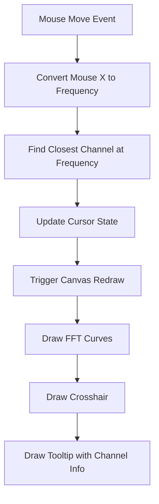

# Add Interactive Cursor to Brain Waves FFT Plugin

## Overview

Add an interactive crosshair cursor to the FFT display that shows frequency and amplitude information when hovering over the plot. The cursor will display:
- **Frequency**: Based on cursor X position (converted to Hz)
- **Amplitude**: From the channel curve closest to the cursor position at that frequency

## Current Architecture Analysis

The FFT system currently works as follows:
1. **Backend (Rust)**: [`plugins/brain_waves_fft/src/lib.rs`](plugins/brain_waves_fft/src/lib.rs:1) processes EEG data and generates FFT packets
2. **Data Flow**: FFT data flows through WebSocket → [`EegDataContext`](kiosk/src/context/EegDataContext.tsx:1) → [`FftRenderer`](plugins/brain_waves_fft/ui/FftRenderer.tsx:1)
3. **Rendering**: Canvas-based rendering with manual drawing of grid, labels, and FFT curves

## Implementation Plan

### Phase 1: Enhance FftRenderer with Mouse Tracking

**File to Modify**: [`plugins/brain_waves_fft/ui/FftRenderer.tsx`](plugins/brain_waves_fft/ui/FftRenderer.tsx:1)

**Changes Needed**:

1. **Add Mouse Event Handlers**
   - `onMouseMove`: Track mouse position and update cursor state
   - `onMouseEnter`/`onMouseLeave`: Show/hide cursor
   - Convert mouse coordinates to frequency and find closest channel

2. **Add Cursor State Management**
   ```typescript
   const [cursorState, setCursorState] = useState<{
     isVisible: boolean;
     mouseX: number;
     mouseY: number;
     frequency: number;
     closestChannel: number;
     amplitude: number;
   } | null>(null);
   ```

3. **Coordinate Conversion Functions**
   - `mouseXToFrequency(mouseX: number): number`
   - `findClosestChannelAtFrequency(mouseX: number, mouseY: number, data: FftData): {channel: number, amplitude: number}`

### Phase 2: Cursor Rendering Implementation

**Visual Elements to Add**:

1. **Crosshair Lines**
   ```typescript
   const drawCrosshair = (context: CanvasRenderingContext2D, mouseX: number, mouseY: number) => {
     // Vertical line spanning full plot height
     // Horizontal line spanning full plot width
     // Semi-transparent styling to not interfere with data
   };
   ```

2. **Tooltip Display**
   ```typescript
   const drawTooltip = (context: CanvasRenderingContext2D, frequency: number, channel: number, amplitude: number) => {
     // Small tooltip box showing:
     // "Ch2: 15.2 Hz, 1.8 µV²/Hz"
     // Use channel color for the channel indicator
   };
   ```

### Phase 3: Channel Detection Logic

**Closest Channel Algorithm**:
```typescript
const findClosestChannelAtFrequency = (mouseX: number, mouseY: number, data: FftData): {channel: number, amplitude: number} => {
  const frequency = mouseXToFrequency(mouseX);
  let closestChannel = 0;
  let minDistance = Infinity;
  let closestAmplitude = 0;
  
  data.psd_packets.forEach((packet) => {
    const amplitude = interpolateAmplitudeAtFrequency(frequency, packet.psd, data.fft_config.sample_rate);
    const plotY = amplitudeToPlotY(amplitude);
    const distance = Math.abs(mouseY - plotY);
    
    if (distance < minDistance) {
      minDistance = distance;
      closestChannel = packet.channel;
      closestAmplitude = amplitude;
    }
  });
  
  return { channel: closestChannel, amplitude: closestAmplitude };
};
```

**Amplitude Interpolation**:
```typescript
const interpolateAmplitudeAtFrequency = (frequency: number, psdData: number[], sampleRate: number): number => {
  const maxFreq = sampleRate / 2;
  const binIndex = (frequency * psdData.length) / maxFreq;
  
  // Linear interpolation between adjacent bins
  const lowerBin = Math.floor(binIndex);
  const upperBin = Math.ceil(binIndex);
  const fraction = binIndex - lowerBin;
  
  if (upperBin >= psdData.length) return psdData[psdData.length - 1];
  if (lowerBin < 0) return psdData[0];
  
  return psdData[lowerBin] * (1 - fraction) + psdData[upperBin] * fraction;
};
```

### Phase 4: UI Polish and Performance

**Optimizations**:
- Throttle mouse move events to maintain 60fps
- Only redraw cursor elements when mouse moves
- Cache frequency calculations
- Efficient tooltip positioning (avoid canvas edges)

**Styling**:
- Match existing dark theme colors
- Use channel colors from [`colorUtils.ts`](kiosk/src/utils/colorUtils.ts:1) for tooltip
- Semi-transparent crosshair lines
- Smooth cursor appearance/disappearance

## Technical Implementation Details

### Mouse Coordinate Conversion
```typescript
// Convert mouse X to frequency
const mouseXToFrequency = (mouseX: number): number => {
  const plotX = mouseX - MARGIN_LEFT;
  const normalizedX = plotX / plotWidth;
  return FFT_MIN_FREQ_HZ + normalizedX * (FFT_MAX_FREQ_HZ - FFT_MIN_FREQ_HZ);
};

// Convert amplitude to plot Y coordinate
const amplitudeToPlotY = (amplitude: number): number => {
  const normalizedY = (amplitude - DATA_Y_MIN) / (DATA_Y_MAX - DATA_Y_MIN);
  return MARGIN_TOP + plotHeight - (normalizedY * plotHeight);
};
```

### Rendering Flow


## Integration Points

1. **No Backend Changes Required**: This is purely a frontend enhancement
2. **Minimal API Changes**: Only affects the FftRenderer component
3. **Backward Compatibility**: Existing functionality remains unchanged
4. **Performance Impact**: Minimal - only adds mouse event handling and cursor rendering

## Expected Difficulty Level

**Difficulty: Medium-Low (3/10)**

**Reasons**:
- ✅ Well-defined scope (single component modification)
- ✅ Existing coordinate system and rendering pipeline
- ✅ No complex state management or API changes
- ✅ Canvas-based rendering is straightforward
- ⚠️ Requires careful coordinate conversion math
- ⚠️ Need to handle channel detection algorithm
- ⚠️ Performance optimization for smooth interaction

**Estimated Implementation Time**: 4-6 hours for complete implementation with polish

## Benefits

1. **Enhanced User Experience**: Interactive exploration of frequency spectrum
2. **Channel-Specific Analysis**: Easy identification of which channel has activity at specific frequencies
3. **Precise Readings**: Exact frequency and amplitude values
4. **Professional Interface**: Modern, responsive cursor interaction
5. **Research Tool**: Helps analyze EEG frequency patterns per channel

## User Interaction Flow

1. User hovers mouse over FFT plot
2. Crosshair appears showing current position
3. Tooltip displays: "Ch3: 12.5 Hz, 2.1 µV²/Hz"
4. As user moves mouse, frequency updates based on X position
5. Channel and amplitude update based on closest curve to cursor
6. User can explore different frequencies and see which channels are active