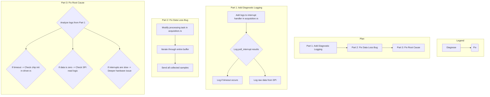

# Plan: Diagnose and Fix the `ads1299` Driver

This document outlines the plan to diagnose and resolve the slow data rate and flatline graph issues observed with the `ads1299` hardware driver.

## Background

The current symptoms are:
*   A data rate of approximately 2Hz, far below the expected ~31.25Hz.
*   The frontend graph shows a flat line, with an occasional single data point appearing (a "dirac delta" effect).

A code review has identified two likely causes:
1.  **Data Loss Bug:** The data processing loop incorrectly discards most of the samples in a batch, only sending the last one.
2.  **Interrupt Timeout:** The interrupt handler uses a 1-second timeout. If hardware interrupts are not firing correctly, this timeout is the likely cause of the ~2Hz data rate.

## The Plan

The investigation will proceed in three parts, prioritizing diagnostics before making significant changes.

### Part 1: Add Diagnostic Logging (Highest Priority)

**Goal:** Understand what the hardware is actually doing.

**File:** `crates/sensors/src/ads1299/acquisition.rs`

**Actions:**
1.  Add detailed logging to the interrupt handler thread.
2.  Log the result of `poll_interrupt` to see if it's succeeding or timing out.
3.  If it succeeds, log the timestamp to measure the interrupt frequency.
4.  Log the raw data buffer read from the SPI bus to check if it contains valid data or is all zeros.

### Part 2: Fix the Data Loss Bug

**Goal:** Ensure all collected data is processed and sent to the application.

**File:** `crates/sensors/src/ads1299/acquisition.rs`

**Actions:**
1.  Modify the `processing_task` to correctly iterate through the entire sample buffer received from the interrupt handler.
2.  Re-structure the logic to create an `AdcData` event for *each sample* in the buffer, not just the last one.

### Part 3: Address the Root Cause

**Goal:** Use the diagnostic information from Part 1 to implement a final fix.

**Actions:**
*   **If logs show `poll_interrupt` is timing out:** The problem is likely in the chip's initialization sequence. The focus will be on `initialize_chip` in `crates/sensors/src/ads1299/driver.rs` to ensure the `START` and `RDATAC` commands are working correctly and the chip is configured to generate interrupts.
*   **If logs show interrupts are firing but data is all zeros:** The problem is likely in the SPI communication (`spi.rs`) or the channel/register configuration (`driver.rs`).
*   **If logs show interrupts are firing, but at the wrong frequency:** This would indicate a more complex issue, possibly related to clock configuration or a hardware fault.

This methodical approach will allow us to pinpoint the exact failure point and fix it efficiently.