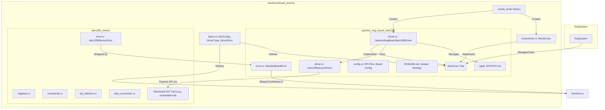

# Plan: Refactor ADS1299 Driver into Board-Specific and Sensor-Specific Components

Date: 2025-06-12

## 1. Objective

To refactor the existing ADS1299 driver located at `driver/src/board_drivers/ads1299/` into two distinct components:
1.  A **Board-Specific Driver**: `openbci_eeg_board_ads1299` - specific to the OpenBCI Cyton-compatible board layout, its Raspberry Pi pin connections, and configurations like jumper settings.
2.  A **Generic Sensor Driver**: `ads1299_sensor` - generic to the ADS1299 chip itself, handling its registers, commands, and data acquisition logic.

This refactoring aims to improve clarity, modularity, reusability, and maintainability of the driver codebase, aligning with the existing `AdcDriver` abstraction.

## 2. Rationale

*   **Clarity and Naming:** The current `ads1299` driver is tightly coupled with specific board (OpenBCI Cyton EVM-like setup with RPi) and jumper configurations. Separating these concerns allows for more accurate naming and understanding of each component's role.
*   **Improved Abstraction and Reusability:**
    *   The `ads1299_sensor` driver will be highly reusable for any project or board utilizing the ADS1299 chip.
    *   The `openbci_eeg_board_ads1299` driver will clearly delineate what is custom to this specific hardware setup.
*   **Maintainability:**
    *   Updates related to the ADS1299 chip (e.g., datasheet revisions) can be made in the `ads1299_sensor` driver without impacting multiple board drivers.
    *   Changes to the specific board hardware (e.g., new revision, different pinouts for a future board) would primarily affect the respective board-specific driver.
*   **Alignment with Existing Architecture:** This refactoring extends the existing hardware abstraction principle embodied by the `AdcDriver` trait and the `create_driver` factory.

## 3. Proposed Directory Structure

```
driver/src/board_drivers/
├── types.rs                     // AdcDriver trait, AdcConfig, etc. (existing)
│
├── ads1299_sensor/              // New: Generic ADS1299 chip sensor driver module
│   ├── mod.rs                   // Public interface for the sensor driver
│   ├── registers.rs             // ADS1299 register definitions, bitmasks, defaults
│   ├── commands.rs              // ADS1299 commands (START, STOP, RDATAC, etc.)
│   ├── spi_interface.rs         // Defines traits/structs for low-level SPI R/W for chip
│   ├── data_conversion.rs       // Raw ADC value to voltage, etc.
│   ├── error.rs                 // Sensor-specific errors (e.g., Ads1299SensorError)
│   └── driver.rs                // Ads1299SensorDriver struct and core logic
│
├── openbci_eeg_board_ads1299/   // New: Specific board driver for OpenBCI Cyton-like setup
│   ├── mod.rs                   // Public interface for this board driver
│   ├── driver.rs                // Implements AdcDriver, uses Ads1299SensorDriver
│   ├── config.rs                // Board-specific configurations, RPi pin definitions
│   ├── error.rs                 // Board-specific errors (e.g., OpenbciBoardError)
│   └── README.md                // Specifics for this board: jumper settings, RPi connections
│
├── mock/                        // Existing mock driver
└── mod.rs                       // Existing module declaration for board_drivers
```

## 4. Component Responsibilities

### 4.1. `ads1299_sensor` (Generic ADS1299 Sensor Driver)

*   Manages all direct communication with the ADS1299 chip via a provided SPI interface.
*   Handles ADS1299 register mapping, definitions, and default values.
*   Implements logic for sending ADS1299 commands (RESET, SDATAC, RDATAC, RREG, WREG, etc.).
*   Interprets raw data frames from the ADS1299.
*   Converts raw ADC counts to voltage values (e.g., using functions from `data_conversion.rs`).
*   Provides an API for higher-level drivers to configure the chip (e.g., set sample rate, gain, channel modes) and initiate/stop data acquisition.
*   Is host-agnostic (does not directly interact with `rppal` or specific GPIOs). It will receive an abstracted SPI device.
*   Defines its own error type (e.g., `Ads1299SensorError`).

### 4.2. `openbci_eeg_board_ads1299` (Board-Specific Driver)

*   Implements the `AdcDriver` trait ([`driver/src/board_drivers/types.rs`](../../driver/src/board_drivers/types.rs:125)).
*   Initializes and manages the physical SPI peripheral and GPIO pins (DRDY, RESET, PWDN) on the Raspberry Pi using `rppal`.
*   Instantiates and uses the `ads1299_sensor` driver, providing it with the configured SPI interface.
*   Handles board-specific startup sequences (e.g., power cycling, specific reset procedures if any beyond chip reset).
*   Translates settings from `AdcConfig` into appropriate calls to the `ads1299_sensor` driver.
*   Manages the DRDY signal: monitors the DRDY GPIO pin and triggers data reads from the `ads1299_sensor` driver.
*   Contains board-specific documentation, including jumper settings and RPi pinout details (moved from the current `ads1299/README.md`).
*   Defines its own error type (e.g., `OpenbciBoardError`), which can wrap `Ads1299SensorError`.

## 5. Refactoring of Existing `driver/src/board_drivers/ads1299/` Content

*   **`driver.rs`**: The core logic will be split.
    *   ADS1299 chip control, register R/W, command sending, and data interpretation logic will form the basis of `ads1299_sensor/driver.rs`.
    *   The `AdcDriver` trait implementation, `rppal` interactions (`init_spi`, `init_drdy_pin`), and overall orchestration will move to `openbci_eeg_board_ads1299/driver.rs`.
*   **`acquisition.rs`**:
    *   The part that reads data frames via SPI based on DRDY will be adapted. The `ads1299_sensor` driver will have a method like `read_data_frame()`.
    *   The `openbci_eeg_board_ads1299` driver will be responsible for monitoring the DRDY pin (from `spi.rs`'s `InputPinDevice`) and calling the sensor's `read_data_frame()` method. The `tokio` task for this loop will reside in the board driver.
*   **`spi.rs`**:
    *   The generic `SpiDevice` and `InputPinDevice` traits might remain at a higher level if useful for other board drivers, or be simplified.
    *   The `init_spi()` and `init_drdy_pin()` functions (using `rppal`) are board-specific and will be part of `openbci_eeg_board_ads1299/driver.rs` or its helpers.
    *   The `ads1299_sensor` driver will expect an object implementing a generic SPI trait (e.g., `embedded_hal::spi::SpiDevice`).
*   **`registers.rs`**: Most content (register addresses, bitfield constants, default values, `gain_to_reg_mask`, `sps_to_reg_mask`) moves to `ads1299_sensor/registers.rs`.
*   **`helpers.rs`**: Functions like `ch_sample_to_raw` and `ch_raw_to_voltage` are generic to ADS1299 and move to `ads1299_sensor/data_conversion.rs` (or similar). Timestamping might remain in the board driver or `EegSystem`.
*   **`builder.rs`**: The builder pattern might be re-evaluated. The `ads1299_sensor` driver might have a simple constructor. The `openbci_eeg_board_ads1299` driver will be constructed via the `create_driver` factory.
*   **`error.rs`**: The current `Ads1299Error` will be split. Chip-specific errors go into `ads1299_sensor/error.rs`, board-related errors into `openbci_eeg_board_ads1299/error.rs`.
*   **`README.md`**: Jumper settings, RPi connections, and board-specific setup instructions move to `openbci_eeg_board_ads1299/README.md`. Generic ADS1299 information (if any remains relevant beyond datasheets) could be in `ads1299_sensor/README.md`.
*   **`test.rs`**: Tests will need to be refactored to target the new components. Mocking the SPI interface for the sensor driver will be crucial.

## 6. SPI and GPIO Abstraction

*   The `ads1299_sensor` driver will receive an abstracted SPI device (e.g., implementing `embedded_hal::spi::SpiDevice` or a custom simple trait). It will not directly use `rppal`.
*   The `openbci_eeg_board_ads1299` driver will be responsible for initializing the actual SPI peripheral and GPIOs (DRDY, RESET, PWDN) using `rppal` and providing the abstracted SPI interface to the sensor driver.
*   The DRDY interrupt/polling logic will reside within the `openbci_eeg_board_ads1299` driver. It will then call appropriate methods on the `ads1299_sensor` driver to read data.

## 7. Error Handling

*   `ads1299_sensor/error.rs` will define `Ads1299SensorError` for errors originating from direct chip interaction (e.g., invalid chip ID, SPI communication issues reported by the SPI interface).
*   `openbci_eeg_board_ads1299/error.rs` will define `OpenbciBoardError` for board-level issues (e.g., `rppal` GPIO/SPI initialization failures) and can wrap `Ads1299SensorError`.
*   The main `DriverError` enum in `driver/src/board_drivers/types.rs` will be updated to include a variant for `OpenbciBoardError`, e.g., `DriverError::OpenBCIBoard(OpenbciBoardError)`.

## 8. Integration with `EegSystem`

*   A new variant (e.g., `DriverType::OpenBCIBoardAds1299`) will be added to `DriverType` in [`driver/src/board_drivers/types.rs`](../../driver/src/board_drivers/types.rs:32).
*   The `create_driver` factory function in [`driver/src/board_drivers/types.rs`](../../driver/src/board_drivers/types.rs:136) will be updated to instantiate `OpenbciEegBoardAds1299Driver` for this new type.
*   The existing `DriverType::Ads1299` will be deprecated or removed once the refactor is complete.

## 9. Visual Plan (Mermaid Diagram)



## 10. Next Steps (Post-Plan Approval)

1.  Create the new directory structures: `ads1299_sensor/` and `openbci_eeg_board_ads1299/`.
2.  Begin migrating and refactoring code piece by piece, starting with the `ads1299_sensor` components (registers, commands, basic SPI interaction logic).
3.  Develop the `openbci_eeg_board_ads1299` driver, integrating the `ads1299_sensor` driver.
4.  Update `DriverType`, `create_driver`, and `DriverError`.
5.  Thoroughly test each component and the integrated system.
6.  Update all relevant documentation.