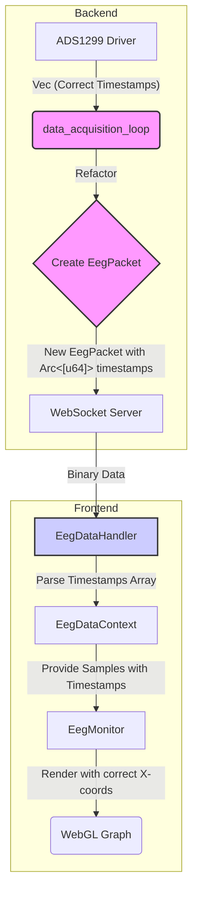

# Plan: ADS1299 Per-Sample Timestamp Fix

## 1. Problem Summary

The EEG graph displays data as vertical spikes instead of a continuous time-series waveform. This makes the data unreadable and gives the appearance of a "step function" where the graph is empty or data scrolls off-screen instantly.

## 2. Root Cause Analysis

The root cause is a fundamental mismatch between the data structure on the backend and the rendering expectations on the frontend.

-   **Backend (`crates/device/src/main.rs`)**: The `data_acquisition_loop` processes individual samples from the `ads1299` driver (which have unique timestamps), but then batches them into an `EegPacket`. During this batching process, it discards the individual timestamps and assigns a **single, identical timestamp** to the entire batch.
-   **Data Structure (`crates/eeg_types/src/event.rs`)**: The `EegPacket` struct is defined with `timestamp: u64`, supporting only one timestamp per packet.
-   **Frontend (`kiosk/src/components/EegMonitor.tsx`)**: The frontend receives this packet and, seeing all samples with the same timestamp, plots them at the same X-coordinate, creating a vertical line.

This issue persists despite previous frontend fixes that stabilized WebSocket connections and rendering, because the underlying data itself is flawed at the source.

## 3. Proposed Solution: The Great Timestamp Refactor

The solution is to refactor the entire data pipeline, from backend to frontend, to support per-sample timestamps.

### Data Flow Diagram



## 4. Detailed Implementation Plan

### Phase 1: Backend Refactoring (Rust)

**1. Modify `EegPacket` Struct**

*   **File**: `crates/eeg_types/src/event.rs`
*   **Action**: Change the `timestamp` field to `timestamps` to hold an array.

```rust
// Current
pub struct EegPacket {
    pub timestamp: u64,
    // ...
    pub samples: Arc<[f32]>,
    // ...
}

// New
pub struct EegPacket {
    pub timestamps: Arc<[u64]>, // Changed from u64 to Arc<[u64]>
    // ...
    pub samples: Arc<[f32]>,
    // ...
}
```

*   **Action**: Update the `EegPacket::new` constructor.

```rust
// Current
pub fn new(
    timestamp: u64,
    frame_id: u64,
    samples: Vec<f32>,
    // ...
) -> Self {
    Self {
        timestamp,
        // ...
    }
}

// New
pub fn new(
    timestamps: Vec<u64>, // Changed from timestamp: u64
    frame_id: u64,
    samples: Vec<f32>,
    // ...
) -> Self {
    Self {
        timestamps: timestamps.into(), // Changed
        // ...
    }
}
```

*   **Action**: Update the `to_binary` serialization method to handle the array.

```rust
// New to_binary implementation
pub fn to_binary(&self) -> Vec<u8> {
    let mut buffer = Vec::new();
    // Format: [num_samples_u32_le][timestamps_u64_le...][samples_f32_le...]
    buffer.extend_from_slice(&(self.samples.len() as u32).to_le_bytes());
    for &ts in self.timestamps.iter() {
        buffer.extend_from_slice(&ts.to_le_bytes());
    }
    for &sample in self.samples.iter() {
        buffer.extend_from_slice(&sample.to_le_bytes());
    }
    buffer
}
```

**2. Update `data_acquisition_loop`**

*   **File**: `crates/device/src/main.rs`
*   **Action**: Collect individual timestamps and pass them to the new `EegPacket` constructor.

```rust
// In data_acquisition_loop
// ...
if min_buffer_size >= batch_size {
    let mut voltage_samples = Vec::new();
    let mut sample_timestamps = Vec::new(); // New Vec for timestamps

    // ... (inside the loop processing channel_buffers)
    let batch: Vec<_> = buffer.drain(0..batch_size).collect();
    
    // Collect timestamps from the batch
    for &(_, timestamp) in &batch {
        sample_timestamps.push(timestamp);
    }

    // ... (after processing all channels)

    // Sort timestamps to ensure they are monotonic, just in case.
    sample_timestamps.sort_unstable(); 
    // Remove duplicates that might arise from buffering logic
    sample_timestamps.dedup();

    let eeg_packet = EegPacket::new(
        sample_timestamps, // Pass the Vec<u64>
        frame_counter,
        flattened_samples,
        num_channels,
        sample_rate.into(),
    );
    // ...
}
```

### Phase 2: Frontend Refactoring (TypeScript / TSX)

**1. Update `EegDataHandler.tsx`**

*   **File**: `kiosk/src/components/EegDataHandler.tsx` (or wherever the WebSocket `onmessage` handler is)
*   **Action**: Update the binary parsing logic to match the new backend format.

```typescript
// Inside the onmessage handler
const dataView = new DataView(event.data);
let byteOffset = 0;

const numSamples = dataView.getUint32(byteOffset, true);
byteOffset += 4;

const timestamps = new BigUint64Array(numSamples);
for (let i = 0; i < numSamples; i++) {
    timestamps[i] = dataView.getBigUint64(byteOffset, true);
    byteOffset += 8;
}

const samples = new Float32Array(numSamples);
for (let i = 0; i < numSamples; i++) {
    samples[i] = dataView.getFloat32(byteOffset, true);
    byteOffset += 4;
}

// This `parsedData` object will then be passed to the context
const parsedData = { timestamps, samples }; 
```

**2. Update `EegDataContext.tsx`**

*   **File**: `kiosk/src/context/EegDataContext.tsx`
*   **Action**: Modify the data structures to store samples and their corresponding timestamps together.

```typescript
// Example change to the rawSamples state
// Instead of just numbers, store an object
interface EegSample {
  value: number;
  timestamp: bigint;
}

const [rawSamples, setRawSamples] = useState<EegSample[]>([]);

// When processing data from the WebSocket:
const newSamples: EegSample[] = [];
for (let i = 0; i < parsedData.samples.length; i++) {
    newSamples.push({
        value: parsedData.samples[i],
        timestamp: parsedData.timestamps[i],
    });
}

// Then update the context state
setRawSamples(prev => [...prev, ...newSamples]);
```

**3. Update `EegMonitor.tsx`**

*   **File**: `kiosk/src/components/EegMonitor.tsx`
*   **Action**: Use the per-sample timestamp for rendering. This part is highly dependent on the current rendering logic (`webgl-plot`), but the principle is to use the timestamp to determine the X-coordinate. The existing rate-limited display logic should be adapted to work with the new data structure.

## 5. Verification Plan

1.  **Compile Backend**: Ensure the Rust code compiles without errors after the refactoring.
2.  **Run with Mock Driver**: Temporarily switch `config.json` to use the `mock_eeg` driver.
3.  **Observe Frontend**:
    *   Confirm that the graph now scrolls smoothly from right to left.
    *   Verify there are no more vertical spikes.
    *   Check the browser's developer console for any new errors related to data parsing or rendering.
4.  **Run with ADS1299 Driver**: Switch back to the `ads1299` driver and repeat the frontend observation.
5.  **Data Integrity Check**: Add temporary `console.log` statements to verify that the timestamps being received on the frontend are unique and monotonically increasing.

## 6. Expected Outcome

-   **Bug Fix**: The "vertical spike" graph issue will be permanently resolved.
-   **Data Fidelity**: The frontend will accurately visualize the time-series data as captured by the hardware.
-   **Architectural Improvement**: The data pipeline will be more robust and correctly represent the nature of the EEG data.