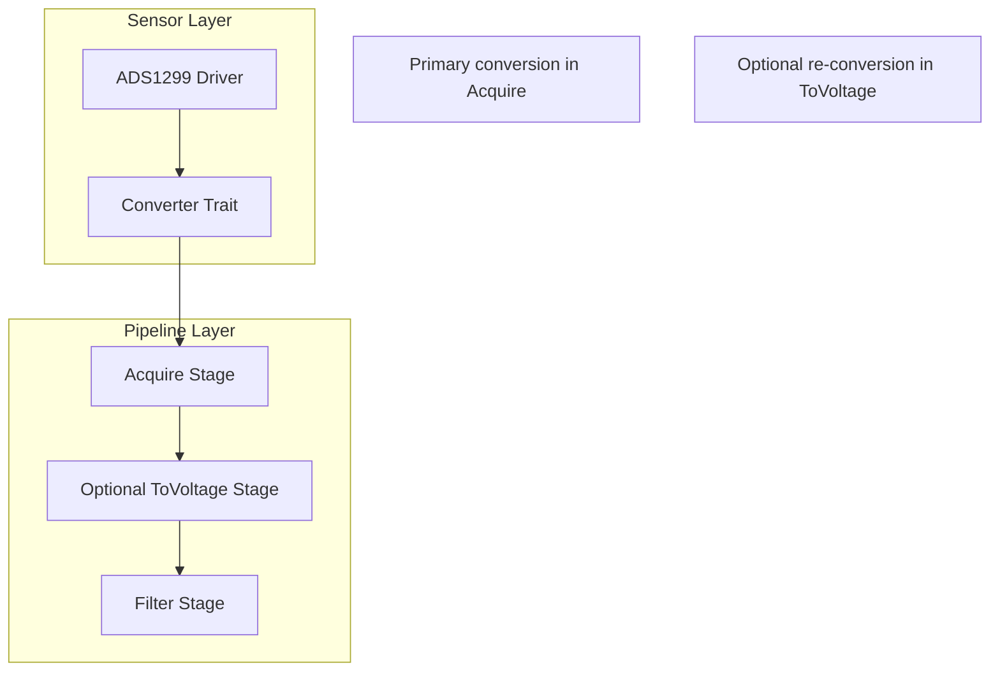

# Architectural Feedback Synthesis

## Comparison: Original Analysis vs. My Implementation Plan

Your original analysis was excellent and identified the core architectural tension perfectly. Let me provide feedback on both approaches and synthesize the best path forward.

## What Your Analysis Got Right

1. **Clear Problem Definition**: You correctly identified that the current approach creates coupling between sensors and pipeline stages
2. **Comprehensive Options**: Your four options (Stage-only, Trait-based, Driver-only, Hybrid) cover the design space well
3. **Practical Trade-offs**: The summary table clearly shows the trade-offs between approaches
4. **Edge Cases**: You identified important edge cases like multiple sensor types and calibration

## Where My Plan Differs (and Why)

### Key Difference: Conversion Location

**Your Recommendation**: Keep `ToVoltageStage` but make it generic over a trait
```rust
pub struct ToVoltageStage {
    converter: Arc<dyn ToVoltage>,
    packets_processed: u64,
}
```

**My Recommendation**: Move conversion into the `AcquireStage` and eliminate/simplify `ToVoltageStage`

### Why I Chose This Approach

1. **Single Responsibility**: Acquisition and conversion are conceptually linked - they both depend on sensor hardware knowledge
2. **Data Preservation**: Raw data is still preserved in `EegPacket` for reprocessing scenarios
3. **Simpler Pipeline**: Fewer stages means less complexity and better performance
4. **Natural Boundary**: The sensor-pipeline boundary is the logical place for this conversion

## Synthesis: Best of Both Approaches

After reviewing your analysis, I think the optimal solution combines elements from both:

### Hybrid Architecture



### Implementation Strategy

1. **Primary Conversion in Acquire Stage**
   - Most pipelines get voltage data directly from acquisition
   - Sensor-specific conversion logic via traits
   - Raw data preserved for flexibility

2. **Optional ToVoltage Stage for Special Cases**
   - Research scenarios requiring different conversion parameters
   - Post-processing with alternative calibration
   - Backward compatibility during migration

3. **Configuration Flexibility**
   ```json
   {
     "stages": [
       {
         "name": "acquire1",
         "type": "acquire",
         "params": {
           "sensor_type": "ADS1299",
           "convert_to_voltage": true  // Default: true
         }
       },
       {
         "name": "reprocess_voltage",
         "type": "to_voltage", 
         "params": {
           "vref": 3.3,  // Different from sensor default
           "source": "raw_samples"
         },
         "inputs": ["acquire1"]
       }
     ]
   }
   ```

## Refined Recommendation

### Core Principles
1. **Sensors own their conversion knowledge** via traits
2. **Acquire stage does primary conversion** for efficiency
3. **ToVoltage stage becomes optional** for special cases
4. **Raw data always preserved** for flexibility

### Trait Design (Enhanced)
```rust
pub trait SensorConverter: Send + Sync {
    /// Primary conversion method
    fn raw_to_voltage(&self, raw: i32) -> f32;
    
    /// Sensor characteristics
    fn vref(&self) -> f32;
    fn adc_bits(&self) -> u8;
    fn sensor_type(&self) -> &str;
    
    /// Advanced features
    fn apply_calibration(&self, voltage: f32, channel: u8) -> f32;
    fn validate_raw_value(&self, raw: i32) -> bool;
    
    /// For alternative conversions (research scenarios)
    fn raw_to_voltage_with_params(&self, raw: i32, vref: f32, gain: f32) -> f32{
        let max_value = (1 << (self.adc_bits() - 1)) - 1;
        (raw as f32 / max_value as f32) * vref / gain
    }
}
```

### Pipeline Stage Responsibilities

1. **AcquireStage**: 
   - Interface with sensor hardware
   - Apply primary sensor conversion
   - Preserve raw data
   - Attach sensor metadata

2. **ToVoltageStage** (Optional):
   - Re-convert with different parameters
   - Research/calibration scenarios
   - Backward compatibility

3. **Other Stages**: 
   - Work with voltage data
   - Remain sensor-agnostic

## Migration Path

### Phase 1: Implement Traits
- Add `SensorConverter` trait
- Implement for existing sensors
- No breaking changes

### Phase 2: Enhance Acquire Stage
- Add optional conversion capability
- Default to sensor's primary conversion
- Maintain backward compatibility

### Phase 3: Deprecate Old ToVoltage
- Mark current `ToVoltageStage` as deprecated
- Provide migration guide
- Keep for special cases

### Phase 4: Optimize
- Remove deprecated code paths
- Optimize performance
- Simplify configuration

## Final Assessment

Your original analysis was spot-on in identifying the problem and solution space. My implementation plan was perhaps too aggressive in eliminating the `ToVoltageStage` entirely. 

The best approach combines:
- **Your insight** about trait-based sensor conversion
- **My emphasis** on moving primary conversion to acquisition boundary
- **Flexibility** to handle both common and edge cases

This gives us:
- ✅ Extensibility (new sensors just implement trait)
- ✅ Clean boundaries (sensor logic with sensors)
- ✅ Flexibility (optional re-conversion for research)
- ✅ Performance (single conversion in common case)
- ✅ Backward compatibility (gradual migration)

The key insight is that we don't have to choose between "conversion in acquire" vs "conversion in pipeline" - we can do both, with the acquire stage handling the common case and an optional pipeline stage for special scenarios.