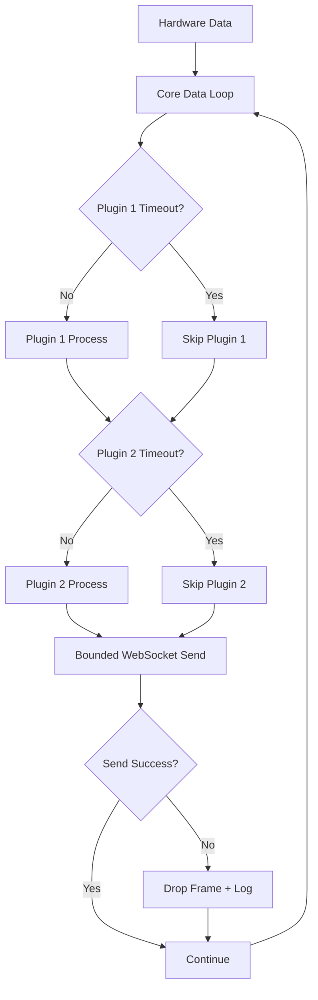

# Architecture Robustness Analysis: EEG Data Pipeline

## Problem Statement

The current EEG data pipeline experiences "no data" failures after ~10 minutes of operation, despite WebSocket connections remaining active. The system has grown complex with multiple async layers that can silently fail:

- Hardware → Data Acquisition Loop → EventBus → Plugins → WebSocket Broadcast → ConnectionManager → Frontend

## Core Tension

**Abstraction vs Robustness**: We want plugin extensibility but need bulletproof reliability.

## Current Architecture Issues

### Silent Failure Points
1. **Broadcast Channel Lag**: `broadcast::Receiver` can lag and drop messages silently
2. **Plugin Task Failures**: Individual plugin tasks can hang/crash without affecting others
3. **Buffer Accumulation**: Multiple buffering layers (channel buffers, plugin buffers, WebSocket buffers)
4. **Async Coordination**: Complex tokio::select! loops with potential race conditions

### Fragility Sources
- **Too Many Async Boundaries**: Each async hop introduces potential failure
- **Unbounded Growth**: Buffers can grow without limits
- **Error Isolation**: Failures in one component don't propagate properly
- **State Synchronization**: Multiple moving parts can get out of sync

## Creative Solution: "Robust Plugin Pipeline"

### Core Principle: **Fail-Fast with Graceful Degradation**

Instead of trying to make every component perfect, design for inevitable failure:

```rust
// Conceptual API
struct RobustPipeline {
    // Single-threaded core loop with plugin hooks
    core_loop: DataLoop,
    // Plugins as simple function calls, not async tasks
    plugins: Vec<Box<dyn SyncPlugin>>,
    // Single output channel with backpressure
    output: BoundedSender<WebSocketEvent>,
}

trait SyncPlugin {
    // Synchronous, bounded execution time
    fn process(&mut self, data: &EegData) -> Result<Option<WebSocketEvent>, PluginError>;
    
    // Plugin must declare max processing time
    fn max_processing_time(&self) -> Duration;
}
```

### Key Design Changes

1. **Single-Threaded Core**: Main data loop runs all plugins synchronously
2. **Bounded Everything**: All channels, buffers, and processing times have hard limits
3. **Plugin Timeouts**: Plugins that take too long get skipped for that frame
4. **Immediate Feedback**: Any failure immediately visible in logs and metrics
5. **Graceful Degradation**: System continues with reduced functionality rather than hanging

### Implementation Strategy



### Benefits
- **Predictable Performance**: No async coordination overhead
- **Obvious Failures**: Timeouts and drops are immediately visible
- **Simple Debugging**: Single thread, linear execution
- **Plugin Safety**: Bad plugins can't break the system
- **Bounded Resources**: Memory and CPU usage are predictable

### Trade-offs
- **Reduced Parallelism**: Plugins run sequentially, not in parallel
- **Plugin Constraints**: Plugins must be fast and synchronous
- **Less Flexibility**: More rigid plugin API

## Next Steps

1. **Prototype the robust pipeline** with existing plugins converted to sync
2. **Benchmark performance** vs current async approach
3. **Test failure scenarios** to validate robustness improvements
4. **Document plugin development guidelines** for the new constraints

## Open Questions

- Can we maintain acceptable performance with synchronous plugins?
- How do we handle plugins that genuinely need async operations (file I/O, network)?
- Should we have a hybrid approach with a "fast path" for critical plugins?