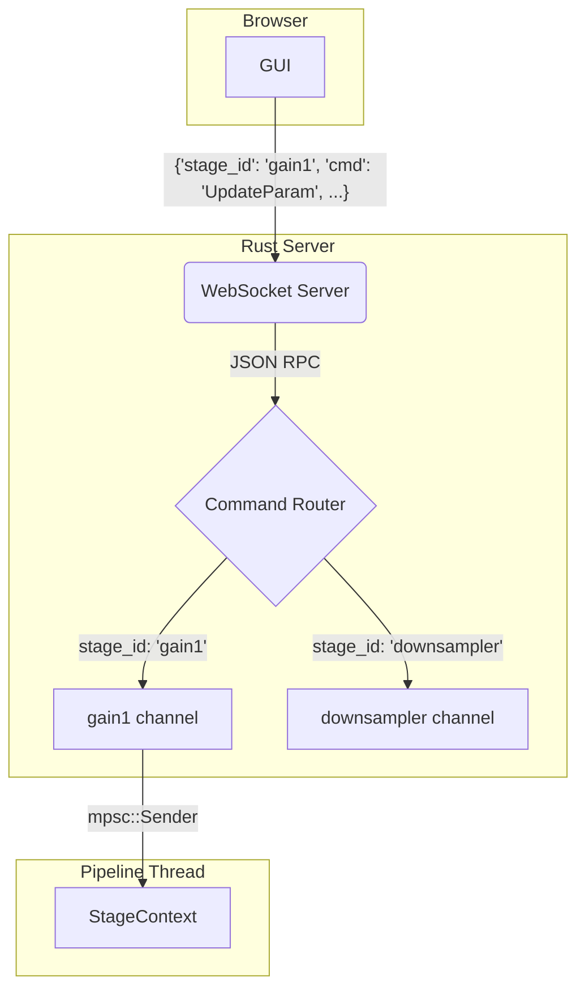

> [!WARNING]
> # DEPRECATED: Outdated Architectural Vision
> This document describes an architectural vision for a dynamic, ABI-driven plugin system that is NOT currently implemented in the codebase. The current implementation uses a pure-Rust, inventory-based static plugin registration system. This document is retained for historical context but should not be used as a reference for the current architecture.

# Unified Hybrid Sensor Pipeline Architecture

**Version: 2.0 (ABI-First)**

This document provides a single, authoritative guide to the new **ABI-driven** hybrid sensor pipeline architecture. It defines a stable, dynamic plugin model that allows for high-performance, real-time processing without requiring host recompilation.

## 1. Executive Summary

To meet the high-performance and extensibility requirements of the project, we are adopting an ABI-driven pipeline architecture. This design separates the system into two distinct planes:

*   **The Control Plane:** A `PipelineRuntime` responsible for configuration, management, and low-frequency event handling. It discovers and manages plugins through a `PluginManager`.
*   **The Data Plane:** A high-performance path for real-time sensor data. It is built on five core principles:
    1.  **Stable Plugin ABI:** A dedicated `pipeline-abi` crate defines a C-compatible `StageDescriptor` struct. This allows the host to dynamically load plugins (`.so`/`.dll` files) at runtime, creating a clear, versioned contract.
    2.  **Zero-Copy Data Flow:** Pre-allocated `MemoryPool`s provide reusable `Packet<T>` buffers, eliminating runtime allocations.
    3.  **Lock-Free Communication:** Bounded, lock-free queues (`rtrb` or `crossbeam`) pass lightweight packet pointers between stages, avoiding mutex contention.
    4.  **Data-Driven Execution:** The pipeline is activated by the arrival of data from the acquisition source, similar to an interrupt-driven system.
    5.  **Separation of Concerns:** The data path is isolated from the control path, allowing for independent operation and control (e.g., pausing the pipeline).

This approach provides the performance and stability required for real-time processing while enabling a robust, "drop-in" plugin ecosystem.

## 2. Architectural Deep Dive

### 2.1. The ABI-Driven Plugin Model

The core of the new architecture is a stable Application Binary Interface (ABI) that decouples the host application from its plugins. This allows new plugins to be added (`git clone`, `cargo build`) without recompiling the host.

```mermaid
graph TD
    subgraph Host Application
        A[PluginManager] -- Scans --> B((plugins/));
        A -- "1. dlopen(plugin.so)" --> C{Plugin Dynamic Library};
        A -- "2. dlsym('register_stage')" --> C;
        A -- "3. Gets StageDescriptor" --> D[Stage Registry];
        E[PipelineRuntime] -- Uses factory from --> D;
    end

    subgraph Plugin: my_fft.so
        style C fill:#dfd,stroke:#333
        C -- Exposes --> F(#[no_mangle] register_stage);
        F -- Returns pointer to --> G[StageDescriptor];
        G -- Contains --> H[id: "com.mycorp.fft"];
        G -- Contains --> I[version: 1];
        G -- Contains --> J[constructor_fn];
    end

    subgraph Plugin: another_plugin.so
        K[Another Plugin] -- Also exposes --> F;
    end

    B -- Contains --> C;
    B -- Contains --> K;
```

*   **`pipeline-abi` Crate:** A dedicated crate defines the stable contract. Its key component is the `StageDescriptor`.
*   **`StageDescriptor`:** A `#[repr(C)]` struct that every plugin exposes. It contains all the metadata the host needs to use the plugin: a unique string `id`, a `version`, and a function pointer to a constructor for the stage.
*   **`PluginManager`:** A service in the host that loads `.so`/`.dll` files from the `plugins/` directory, calls the `register_stage` function to get the descriptor, validates the ABI version, and populates a central `StageRegistry`.
*   **`plugin.toml`:** A manifest file alongside each plugin for non-code metadata like author, license, and UI component paths.

### 2.2. The `MemoryPool` and `Packet<T>` Smart Pointer

The `MemoryPool` is a thread-safe, lock-free container that holds a number of pre-allocated `Packet<T>` buffers. Its internal free-list is implemented with `crossbeam::ArrayQueue` for maximum performance.

*   **`Packet<T>`:** A smart pointer that contains a `PacketHeader` and a mutable reference to a buffer (`T`). Its `Drop` implementation automatically returns the buffer to its origin pool. This is the cornerstone of the zero-copy design.
*   **`PacketHeader`:** A metadata struct carried with every packet. It includes essential runtime information like `batch_size` and `timestamp`. Stages that modify the data's shape (e.g., a downsampler) are responsible for updating the header before sending the packet downstream.
*   **Acquisition Methods:** The pool provides two ways to get a packet:
    *   `acquire()`: An `async` method that waits until a packet is available.
    *   `try_acquire()`: A non-blocking method that returns `Option<Packet<T>>`. This allows stages to handle pool exhaustion by either dropping a frame or applying backpressure.
*   **Safety:** The implementation of the pool and packet requires `unsafe` Rust to manage the static lifetimes. This code will be isolated in its own module and rigorously tested with `miri` and `loom` to prevent undefined behavior.
*   **Multiple Pools for Different Data Shapes:** The system supports multiple, named memory pools. This is critical for stages like downsamplers, which change the batch size (and thus packet size) of the data. A stage can acquire a packet from one pool and produce a packet for another.

### 2.2.1. Dynamic Batch Size Handling

The pipeline supports dynamic batch sizes to accommodate stages that alter the data's shape, such as downsamplers or FFT windowing stages. The batch size is not a single, pipeline-wide constant. Instead, it is a property of the data itself, carried within each `Packet<T>`'s header.

*   **Propagation:** By default, a stage should assume the output batch size is the same as the input batch size. Most stages, like filters or gain stages, modify data in-place and do not need to change the batch size.
*   **Transformation:** Stages that fundamentally change the number of samples (e.g., a downsampler that consumes 16 samples to produce 1) are responsible for this transformation. The workflow is as follows:
    1.  Receive an input `Packet<T>` (e.g., with `batch_size: 16`).
    2.  Process the data.
    3.  Acquire a *new* `Packet<U>` from a `MemoryPool` configured for the smaller output size (e.g., `batch_size: 1`).
    4.  Populate the new packet and send it downstream.
*   **Origination:** The initial batch size is determined by the acquisition stage at the beginning of the pipeline (e.g., reading from a sensor). This stage acquires packets from a memory pool configured for its specific needs.

This model provides maximum flexibility, allowing different parts of the pipeline to operate on data chunks of the most appropriate size, which is critical for both performance (e.g., FFTs on power-of-two sizes) and latency (e.g., smaller batches for UI updates).

### 2.3. Bounded, Lock-Free Queues

Communication between data plane stages is handled by bounded, single-producer, single-consumer (SPSC) or multiple-producer, single-consumer (MPSC) lock-free queues.

*   **No Mutexes:** These queues use atomic operations, not mutexes, for all per-packet communication, ensuring the data path is wait-free.
*   **Configurable Capacity:** The capacity of each queue is a critical tuning parameter set in the pipeline's JSON configuration. A small capacity (e.g., 4) minimizes latency for fast stages, while a larger capacity (e.g., 200) absorbs jitter for slow, I/O-bound stages like a WebSocket sink.
*   **Sizing Formula:** As a rule of thumb, the minimum queue capacity can be estimated with the formula: `min_capacity = ceil(max_stage_latency_ms / batch_period_ms)`. This helps prevent random guessing during configuration.

## 3. Implementation Plan (ABI-First)

The implementation is prioritized to establish the stable plugin contract first, enabling parallel development of the host and plugins.

### 3.1. Phase 1: The Stable ABI & Plugin System
1.  **`pipeline-abi` Crate:** Create the dedicated, versioned crate defining the `StageDescriptor`, `DataPlaneStage` trait, and the `register_stage` function signature.
2.  **`PluginManager`:** Implement the host-side service to load dynamic libraries, validate their ABI version via the `StageDescriptor`, and populate a `StageRegistry`. All calls into plugin code must be wrapped in `std::panic::catch_unwind`.
3.  **Developer Tooling:** Create a `cargo xtask build-plugins` script and a `cargo generate` template to standardize plugin creation and building.

### 3.2. Phase 2: Initial Vertical Slice
1.  **Core Stages:** Implement essential stages like `AcquisitionStage`, `ToVoltageStage`, and `WebSocketSink` as ABI-compliant plugins.
2.  **Configuration:** The `GraphBuilder` will be updated to read a JSON configuration that references stages by their string IDs (e.g., `"com.mycorp.fft"`). It will use the `PluginManager`'s registry to look up the corresponding constructor and instantiate the graph.

### 3.3. Phase 3: UI Integration & Full Adoption
1.  **UI Discovery:** Implement a `/api/plugins` endpoint on the server that serves the `plugin.toml` manifests.
2.  **Dynamic UI:** The Kiosk frontend will fetch from this endpoint and use dynamic `import()` to load the UI bundles for available plugins.

## 4. Stage Developer's Guide & Code Example

A developer implements the `DataPlaneStage` trait. The runtime handles the rest.

**The primary source of truth for the developer experience is the detailed code example document: [`todo/pipeline-stage-code-example.md`](todo/pipeline-stage-code-example.md).** That document provides fully-commented examples of how to build stages that handle data processing, memory management, and pipeline control.

**Key Principles for Stage Developers:**

*   **Receive a Packet:** `let packet = context.inputs.get_mut("my_input").unwrap().recv().await?;`
*   **Handle Empty Queues:** The `recv` call is non-blocking. If it returns `Ok(None)`, the stage should simply `return Ok(())` to yield its turn in the run loop.
*   **Modify In-Place:** If possible, modify the packet's data directly. This is the most efficient approach.
*   **Allocate a New Packet:** Only if the stage's output is a different type or size from its input, call `let new_packet = context.memory_pool.acquire::<NewType>().await;`
*   **Send a Packet:** `context.outputs.get_mut("my_output").unwrap().send(packet).await?;`
*   **Memory Release is Automatic:** `Packet<T>`'s `Drop` implementation handles returning memory to the pool.

## 5. Implementation Strategy: Direct Adoption

The previous transition plan involving "bridge" stages is now **obsolete**. We are pursuing a direct implementation of the final architecture.

*   **No Bridge Stages:** The `ToDataPlane` and `FromDataPlane` stages will not be implemented. This avoids the complexity and technical debt of a temporary migration layer.
*   **Parallel Systems:** The legacy `PipelineStage` system and the new `DataPlaneStage` system will coexist in the codebase during development but will not interact within a running pipeline.
*   **Focus on New System:** All new development effort will be focused on creating and running pipelines within the new, ABI-driven Data Plane.
*   **Deprecation:** Once the new system achieves feature parity for all critical use cases, the legacy runtime, traits, and stages will be removed from the codebase.

## 6. Risk Analysis & Mitigation

The primary complexities are the `unsafe` code in the memory pool and the FFI boundary of the plugin system.

*   **Risk: Undefined Behavior in Memory Pool:** Data races or memory corruption due to incorrect `unsafe` implementation.
    *   **Mitigation:** Isolate the `MemoryPool` and `Packet` in a self-contained module. Mandate rigorous testing with `miri` and `loom`.
*   **Risk: Plugin Panic:** A faulty plugin crashes the entire host application.
    *   **Mitigation:** The `PluginManager` **must** wrap every call across the FFI boundary (e.g., to the stage constructor or `process` method) in `std::panic::catch_unwind`. A panicking plugin will be disabled and logged, not crash the system.
*   **Risk: ABI Drift:** A plugin compiled with an old `pipeline-abi` version is loaded by a new host, causing a segfault.
    *   **Mitigation:** The `StageDescriptor` contains a version field. The `PluginManager` will compare this to its own ABI version at load time and refuse to load incompatible plugins.

This document, now aligned with the ABI-first approach, provides a complete and actionable plan.

## 7. Implementation and Documentation Standards

To ensure clarity and maintainability, the following standards are required for implementation:

1.  **In-Code Documentation:** All `unsafe` blocks must be accompanied by a `// SAFETY:` comment explaining the invariants that make the operation safe.
2.  **Conceptual Comments:** Complex mechanisms (e.g., the non-blocking run loop, memory pool management, backpressure handling) must be explained with high-level comments in the relevant modules.
3.  **Configuration-Driven:** All magic numbers (queue sizes, batch sizes, filter taps, etc.) must be configurable through the pipeline's JSON configuration file, not hardcoded.
4.  **Explicit Error Handling:** All functions that can fail must return a `Result`. Panics should only be used for unrecoverable logic errors. Stage execution will be wrapped in `catch_unwind` to prevent a single plugin from crashing the data plane.

## 8. Pipeline Control & State Management

This section details the mechanisms for controlling the pipeline's state and passing commands from the user interface to individual stages.

### 8.1. “Recording Lock”: Preventing Live Edits

To ensure data integrity and system stability during a recording, the pipeline implements a "recording lock." This lock prevents parameters from being changed while the pipeline is actively processing data. The responsibility for enforcing this is layered.

| Layer              | What it protects                                    | How to implement                                                                                                                                                                     |
| ------------------ | --------------------------------------------------- | ------------------------------------------------------------------------------------------------------------------------------------------------------------------------------------ |
| **GUI**            | UX clarity (“Settings greyed-out while REC is red”) | Disable controls when the pipeline state → `Running`                                                                                                                                 |
| **Runtime (Rust)** | Hard safety—prevents rogue clients/scripts          | Add `PipelineState` in the runtime. `UpdateParam` is *ignored* (or queued) unless `state == Paused`. <br>`rust if runtime_state.load() == Running { return Err(StageError::Busy); }` |

### 8.2. GUI to Stage Control Flow

Control commands (e.g., updating a filter's coefficients) originate from the GUI and are sent to the pipeline runtime over a single WebSocket connection. The server then routes the command to the appropriate stage's control channel.



The JSON RPC message contains the `stage_id` which the server uses as a key to look up the correct `mpsc::Sender` for the target stage.

**Example JSON RPC:**
```json
{
  "stage_id": "gain1",
  "cmd": "UpdateParam",
  "key": "gain",
  "value": 1.5
}
```