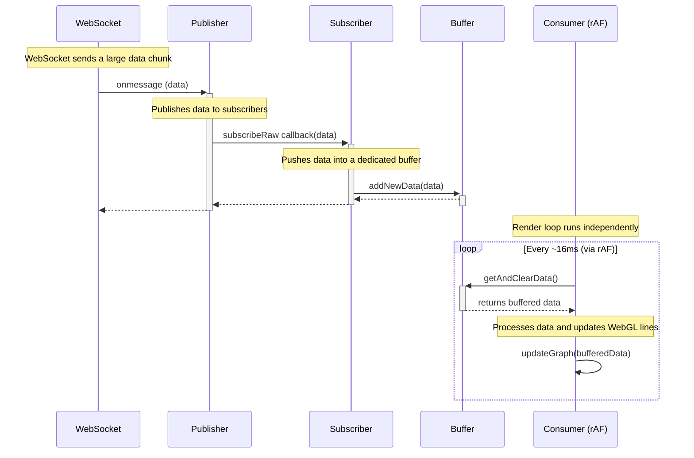

# Plan: Fix Kiosk UI Freeze

**Date:** 2025-06-24
**Status:** Approved

## 1. Problem Summary

The Kiosk UI, including both the main signal graph and the circular graph, freezes completely shortly after the page loads. The root cause is a performance bottleneck where large batches of EEG data are processed and rendered synchronously, blocking the browser's main thread.

- The **main signal graph** uses a "pull" method that processes all accumulated data in a single, blocking loop.
- The **circular graph** uses a "push" (Pub/Sub) method that triggers rapid, expensive re-renders on every new data packet, creating a "render storm."
- The previous circular graph issue, where it was stuck at "1600 data points," was a symptom of a broken data stream. The current freezing issue is a more severe problem affecting the entire application.

## 2. Goal

The goal is to refactor the data handling and rendering pipeline for all graph components to be fully asynchronous. This will prevent the main thread from blocking, ensuring a smooth and responsive user interface regardless of the data volume or velocity.

## 3. Architectural Solution: Decoupled Data Pipeline

We will implement a decoupled data pipeline using a classic producer-consumer pattern with a buffer and `requestAnimationFrame`. This ensures that data processing (the "producer") is separate from rendering (the "consumer"), and that rendering happens at a consistent, non-blocking cadence.

### Proposed Architecture

## 4. Implementation Plan

### Phase 1: Create a Reusable `DataBuffer` Hook

- **Action:** Create a new custom hook, `useDataBuffer`, in a new file: `kiosk/src/hooks/useDataBuffer.ts`.
- **Logic:**
    - This hook will encapsulate the buffering logic.
    - It will expose two primary methods:
        - `addData(newData)`: To be called by the data subscriber. It will append new data to an internal buffer (`useRef`).
        - `getAndClearData()`: To be called by the rendering component. It will return all data currently in the buffer and then clear it.
    - This makes the buffering logic self-contained and reusable for any component that needs it.

### Phase 2: Refactor `EegMonitor.tsx` (The Subscriber)

- **Action:** Modify the `useEffect` hooks that handle data to use the new `useDataBuffer` hook.
- **Logic for Circular Graph:**
    - The `subscribeRaw` callback will be simplified to a single line: `circularGraphBuffer.addData(newSampleChunks)`.
    - It will no longer call `setState`, thus eliminating the "render storm."
- **Logic for Signal Graph:**
    - The old "pull" `useEffect` will be removed entirely.
    - A new subscription will be created for the signal graph, similar to the circular graph, which will also push data into its own dedicated buffer instance from `useDataBuffer`.

### Phase 3: Refactor Graph Components (The Consumers)

- **Action:** Modify `EegCircularGraph.tsx` and `EegRenderer.tsx` to pull data from their respective buffers within a `requestAnimationFrame` loop.
- **Logic:**
    - Remove the `useEffect` hooks that currently react to the `data` prop.
    - Create a new `useEffect` that starts a `requestAnimationFrame` loop when the component mounts.
    - **Inside the loop:**
        1. Call `buffer.getAndClearData()` to get the latest data.
        2. If data exists, process it and update the WebGL visualization.
        3. Schedule the next frame.
    - The loop will be stopped when the component unmounts.

## 5. Expected Outcome

- The UI will no longer freeze.
- Both the main signal graph and the circular graph will update smoothly and asynchronously.
- The data handling logic will be more robust, scalable, and easier to maintain.