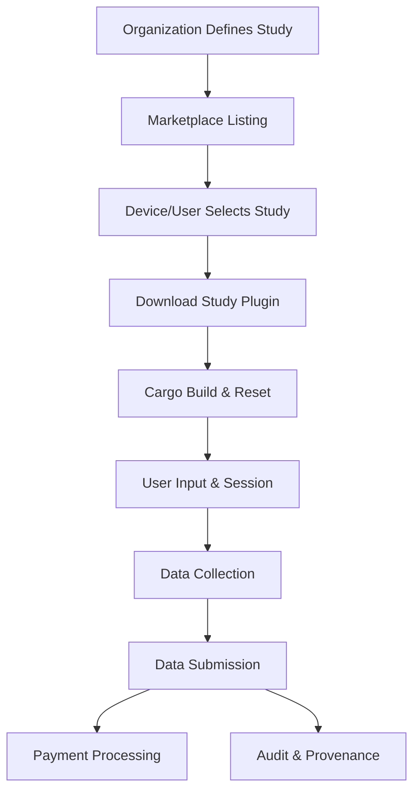

# EEG DeSci Marketplace Architecture

## Concept Overview

A decentralized EEG study marketplace where organizations define studies as downloadable, parameterized pipelines. Devices and users participate by downloading, building, and running these studies, with compensation and data requirements managed via a unified platform.

---

## Workflow

1. **Study Definition**
   - Organizations define studies: protocol, compensation, required fields (e.g., age, weight, height), session details (e.g., 5 minutes/day, 32 channels), and agreements.
   - Each study is packaged as a plugin/pipeline with a manifest (parameters, endpoints, UI fields, payment structure).

2. **Marketplace Listing**
   - Studies are listed in a public marketplace with metadata, requirements, and compensation details.
   - Users and devices can browse, review, and select studies to participate in.

3. **Pipeline Download & Build**
   - Device downloads the study package.
   - Runs `cargo build` to compile the study-specific pipeline/plugin.
   - Device resets and loads the new pipeline.

4. **User Session & Data Collection**
   - UI prompts user for required fields (demographics, consent, etc.).
   - Compensation is specified per field (e.g., $10 for age, $20 for weight).
   - Data is collected according to the study protocol.

5. **Data Submission & Payment**
   - Data is submitted to the study endpoint.
   - Payments are processed automatically (tokenized or fiat), with breakdown per field/session.

6. **Audit, Provenance, and Reproducibility**
   - All pipeline configs, user inputs, and data hashes are logged for auditability.
   - Provenance is tracked for each data point and session.

---

## Key Features

- **Plugin-Based Pipelines:** Each study is a self-contained plugin, downloaded and built on demand.
- **Parameterized & UI-Driven:** Studies define required user input fields and compensation per field.
- **Automated Build & Reset:** Devices automatically build and load new study pipelines.
- **Marketplace & Agreements:** Centralized listing, agreements, and payment management.
- **Open, Auditable, and Reproducible:** Full provenance and audit trails for all data and pipeline configs.

---

## Example User Flow

1. User browses marketplace, selects a study:  
   _"5 minutes/day, 32 channel EEG, $x per session"_
2. Device downloads and builds the study pipeline.
3. UI prompts for age ($10), weight ($20), height ($20).
4. User completes session, data is submitted, and payments are processed.
5. All actions are logged for reproducibility and audit.

---

## Diagram

---

## Architectural Critique & Suggestions

### Strengths of Current Pipeline-Graph-Architecture

- **Modular, Graph-Based Pipelines:** Well-suited for plugin-based, parameterized studies.
- **Explicit Data Contracts:** Good for defining required fields and endpoints.
- **Versioning & Reproducibility:** Supports audit and provenance needs.

### Suggested Tweaks

1. **Plugin Manifest Standardization:**  
   - Define a manifest schema for study plugins (parameters, required fields, compensation, agreements).

2. **Marketplace Integration:**  
   - Add APIs for listing, searching, and downloading study plugins.
   - Support for agreements and payment terms in the pipeline config.

3. **Automated Build Hooks:**  
   - Standardize build/reset hooks for seamless device integration.

4. **UI Field Injection:**  
   - Allow plugins to define UI fields and validation logic, auto-generated in the device UI.

5. **Payment & Consent Modules:**  
   - Integrate payment processing and consent management as pipeline stages or plugin interfaces.

6. **Enhanced Provenance:**  
   - Log all user inputs, pipeline configs, and data hashes for each session.

---

## Conclusion

The current architecture is a strong foundation for a DeSci EEG marketplace. With the above tweaks—especially around plugin manifests, marketplace APIs, UI integration, and payment/consent modules—it can fully support decentralized, incentivized, and auditable EEG research at scale.
