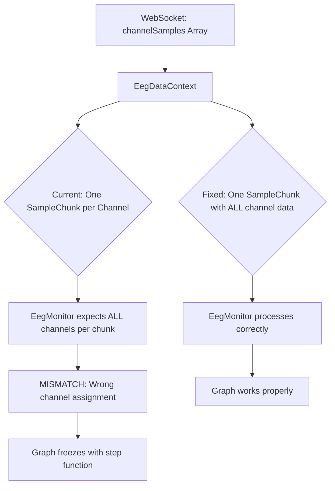

# EEG Graph Stalling Fix Plan - UPDATED ANALYSIS

## Root Cause Analysis (CORRECTED)
The EEG graph stalls after ~1.5 seconds with a vertical step function due to a **data structure mismatch** between `EegDataContext.tsx` and `EegMonitor.tsx`. The attempted buffer management fix addressed the wrong problem.

### Real Problem Identified:
1. **Data Structure Mismatch**: `EegDataContext.tsx` creates one `SampleChunk` per channel, but `EegMonitor.tsx` expects each chunk to contain samples for ALL channels
2. **Incorrect Channel Assignment**: Samples from channel 0 are being assigned to channel 1, causing voltage range violations
3. **WebGL Buffer Corruption**: Wrong channel assignment causes vertical jumps that break WebGL rendering

### Evidence:
- WebSocket continues sending data (packets #85-88) but graph freezes
- Vertical step function indicates samples assigned to wrong channels
- Issue occurs regardless of configuration changes - it's a fundamental data flow problem

### Previous Analysis Was Wrong:
The buffer management logic was not the issue. The problem is in how channel data flows from WebSocket → Context → Monitor.

## Corrected Solution
Fix the data structure mismatch between context and monitor components.



## Implementation Steps

### 1. Fix Data Structure in EegDataContext.tsx
```typescript
// CURRENT (WRONG): Creates one SampleChunk per channel
const newSampleChunks: SampleChunk[] = channelSamples.map(channelData => {
  // This creates separate chunks for each channel - WRONG
});

// FIXED: Create one SampleChunk with all channel data
const allSamples: EegSample[] = [];
channelSamples.forEach((channelData, channelIndex) => {
  for (let i = 0; i < channelData.values.length; i++) {
    allSamples.push({
      value: channelData.values[i],
      timestamp: channelData.timestamps[i],
      channelIndex // Add explicit channel identifier
    });
  }
});

const newSampleChunk: SampleChunk = {
  config: {
    channelCount: currentChannelCount,
    sampleRate: currentSampleRate,
  },
  samples: allSamples
};
```

### 2. Update EegSample Interface
```typescript
interface EegSample {
  value: number;
  timestamp: bigint;
  channelIndex: number; // Add explicit channel tracking
}
```

### 3. Fix Processing Logic in EegMonitor.tsx
```typescript
// Process the unified chunk correctly
newSampleChunks.forEach((sampleChunk) => {
  const channelBatches: Record<number, number[]> = {};
  
  sampleChunk.samples.forEach((sample) => {
    const chIndex = sample.channelIndex; // Use explicit channel index
    if (!channelBatches[chIndex]) {
      channelBatches[chIndex] = [];
    }
    channelBatches[chIndex].push(sample.value);
  });
  
  // Add batched samples to WebGL lines
  Object.entries(channelBatches).forEach(([chIndexStr, values]) => {
    const chIndex = parseInt(chIndexStr);
    if (lines[chIndex]) {
      lines[chIndex].shiftAdd(new Float32Array(values));
      dataWasAdded = true;
    }
  });
});
```

### 4. Alternative: Revert to Original Structure
If the above is too complex, revert to `EegSample[][]` and fix buffer management more simply:
```typescript
// Keep original structure but fix the processing
const newSampleChunks = rawSamples.slice(previousSamplesLength);
newSampleChunks.forEach((channelSamples, channelIndex) => {
  if (lines[channelIndex] && channelSamples.length > 0) {
    const values = new Float32Array(channelSamples.map(s => s.value));
    lines[channelIndex].shiftAdd(values);
  }
});
```

## Verification Plan
1. **Immediate Tests**:
   - Verify samples are assigned to correct channels (check console logs)
   - Confirm graph runs >5 minutes without freezing
   - Test that vertical step function is eliminated

2. **Data Integrity Tests**:
   - Each channel shows expected signal pattern
   - No cross-channel contamination
   - WebGL buffer stays within expected voltage ranges

3. **Stress Tests**:
   - Configuration changes during streaming
   - Extended runtime (60+ minutes)
   - Multiple rapid channel count changes

4. **Debug Verification**:
   - Add logging to track channel assignment
   - Monitor WebGL line buffer states
   - Verify timestamp consistency across channels

## Risk Mitigation
- **Rollback Plan**: Create snapshot before changes
- **Monitoring**: Add channel assignment validation warnings
- **Feature Flag**: Implement toggle for new data structure

## Timeline


## Next Steps
1. **Priority 1**: Fix the data structure mismatch (Option A above)
2. **Priority 2**: If that fails, revert to original `EegSample[][]` structure
3. **Priority 3**: Implement proper buffer management after data flow is fixed

## Key Insight
The attempted fix addressed buffer management but missed the fundamental issue: **data structure mismatch between context and monitor components**. The "step function going off the page" is a clear indicator of samples being assigned to wrong channels, not a buffer overflow issue.

## Rollback Strategy
If the fix doesn't work immediately:
1. Revert all SampleChunk changes
2. Return to original `EegSample[][]` structure  
3. Focus on simpler buffer management
4. Investigate WebGL line initialization timing issues