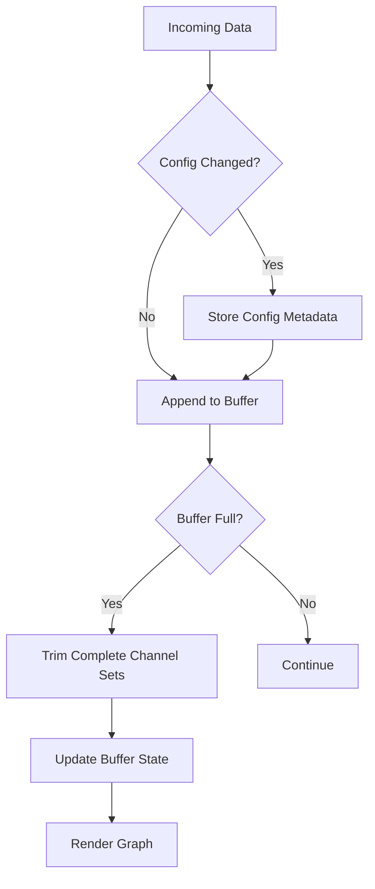
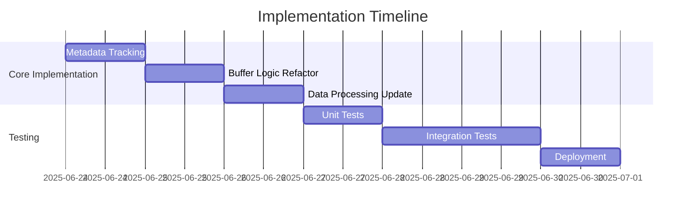

# EEG Graph Stalling Fix Plan

## Cause Cause Analysis
The EEG graph stalls halfway through the first pass due to buffer misalignment when channel configuration changes. The circular buffer management logic in `EegDataContext.tsx` assumes consistent channel counts across all chunks, but configuration changes create mixed-format data that breaks processing assumptions in `EegMonitor.tsx`.

### Key Vulnerabilities:
1. **Static Channel Assumption**: Buffer trimming uses current channel count (`config.channels.length`) to remove historical chunks
2. **Data Misalignment**: New chunks with different channel counts break the modulo-based channel indexing in `EegMonitor`
3. **No Configuration Tracking**: Buffer doesn't store metadata about channel configuration per chunk

## Proposed Solution
Implement channel-agnostic buffer management with configuration metadata tracking.



## Implementation Steps

### 1. Add Configuration Metadata (EegDataContext.tsx)
```typescript
interface SampleChunk {
  config: {  // Add metadata to each chunk
    channelCount: number;
    sampleRate: number;
  };
  samples: EegSample[];
}

// Update state type
interface EegDataContextType {
  rawSamples: SampleChunk[]; // Changed from EegSample[][]
  // ... other properties
}
```

### 2. Refactor Buffer Trimming Logic
```typescript
setRawSamples(prev => {
  const newSamples = [...prev, ...newChunksWithMetadata];
  
  // Trim only complete channel sets
  let totalChannels = 0;
  let setsToRemove = 0;
  
  for (const chunk of newSamples) {
    totalChannels += chunk.config.channelCount;
    if (totalChannels >= MAX_SAMPLE_CHUNKS * currentChannelCount) {
      setsToRemove++;
    }
  }
  
  return setsToRemove > 0 ? newSamples.slice(setsToRemove) : newSamples;
});
```

### 3. Update Data Processing (EegMonitor.tsx)
```typescript
// Process chunks using their original channel count
newSampleChunks.forEach(chunk => {
  const chunkChannelCount = chunk.config.channelCount;
  chunk.samples.forEach((sample, sampleIndex) => {
    const chIndex = sampleIndex % chunkChannelCount;
    // Add to corresponding WebGL line
  });
});
```

### 4. Handle Configuration Changes
```typescript
// Clear buffer when config changes
useEffect(() => {
  setRawSamples([]);
  sampleTimestamps.current = [];
}, [config.channels, config.sample_rate]);
```

## Verification Plan
1. **Unit Tests**:
   - Buffer trimming with mixed-configuration chunks
   - Data processing with variable channel counts
   - Configuration change handler

2 ** **Integration Tests**:
   - Simulate channel count changes during streaming
   - Verify continuous rendering for 60+ minutes
   - Stress test with rapid configuration changes (5+ changes/minute)

3. **Metrics**:
   - Buffer alignment score
   - Chunk processing time
   - Frame rendering consistency

## Risk Mitigation
- **Rollback Plan**: Create snapshot before changes
- **Monitoring**: Add buffer validation warnings
- **Feature Flag**: Implement toggle for new buffer logic

## Timeline


## Next Steps
1. Review this plan
2. Implement in Code mode
3. Verify with real EEG device