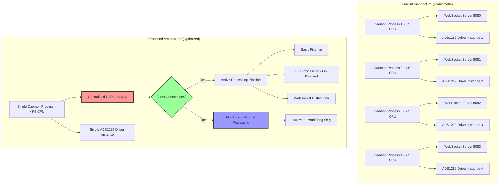

# EEG Performance Optimization Plan

**Created:** 6/4/2025  
**Status:** Planning Phase  
**Priority:** High - Critical Performance Issue  

## Problem Summary

The EEG system is experiencing excessive CPU usage (~16% total) with 4 `eeg_daemon` processes running simultaneously, consuming 8%, 4%, 2%, and 2% CPU respectively, even when no browser clients are connected. This indicates fundamental architectural inefficiencies.

## Root Cause Analysis

### 1. Multiple Redundant Daemon Processes (Critical Issue)
- **4 separate `eeg_daemon` processes** running simultaneously
- Each process independently:
  - Runs EEG data acquisition loops
  - Performs DSP processing (IIR filtering)
  - Maintains WebSocket servers on different ports
  - Runs separate FFT applet servers
  - Continuously polls ADS1299 hardware via SPI

### 2. Inefficient DSP Pipeline Architecture
- **Driver DSP disabled** but still allocating data structures
- **Daemon applies IIR filtering** continuously regardless of client connections
- **Separate FFT server process** runs even without clients
- **No centralized DSP management** - scattered processing logic

### 3. Continuous Hardware Activity
- ADS1299 hardware driver maintains **continuous SPI communication**
- **DRDY interrupt monitoring** active even when idle
- **No idle state management** - full capacity operation regardless of demand

### 4. Data Processing Inefficiencies
- Multiple data format conversions: raw → voltage → JSON → binary
- Complex batching/rebatching between driver → daemon → applets
- Inefficient channel buffer management in FFT processing
- Memory allocations in hot paths

## Proposed Solution Architecture



## Implementation Plan

### Phase 1: Process Consolidation (Immediate - High Impact)

#### 1.1 Eliminate Multiple Daemon Instances
**Target:** Reduce from 4 processes to 1 process  
**Expected Impact:** 75% CPU reduction immediately  

**Tasks:**
- [ ] Audit current daemon startup mechanisms
- [ ] Identify systemd services, manual starts, or script issues
- [ ] Implement proper PID file management
- [ ] Create single daemon instance with proper shutdown handling
- [ ] Add process monitoring to prevent multiple instances

**Files to modify:**
- `daemon/src/main.rs` - Add PID file management
- `scripts/start.sh` - Ensure single instance startup
- `scripts/stop.sh` - Proper cleanup
- `daemon/adc_daemon.service` - Review systemd configuration

#### 1.2 Centralized DSP Gateway
**Target:** Single point of DSP coordination  
**Expected Impact:** Eliminate redundant processing  

**Tasks:**
- [ ] Create `driver/src/dsp/coordinator.rs`
- [ ] Implement `DspCoordinator` struct
- [ ] Move all DSP logic into unified pipeline
- [ ] Add demand-based processing activation

### Phase 2: Smart Resource Management (Medium Impact)

#### 2.1 Idle State Implementation
**Target:** 0% CPU when no clients connected  
**Expected Impact:** 90% reduction during idle periods  

**System States:**
```rust
enum SystemState {
    Idle,           // Hardware monitoring only - <1% CPU
    BasicStreaming, // Raw data + basic filtering - ~2% CPU  
    FullProcessing, // All DSP including FFT - ~3% CPU
}
```

**Tasks:**
- [ ] Implement state machine in DSP coordinator
- [ ] Add automatic state transitions
- [ ] Implement hardware sleep/wake cycles
- [ ] Add connection-aware processing

#### 2.2 Connection-Aware Processing
**Target:** Process only what clients need  
**Expected Impact:** Eliminate unnecessary DSP operations  

**Tasks:**
- [ ] Track active WebSocket connections
- [ ] Map client types to DSP requirements
- [ ] Enable DSP components only when needed
- [ ] Implement graceful state transitions

### Phase 3: DSP Pipeline Optimization (High Impact)

#### 3.1 Unified DSP Architecture
**Target:** Single, efficient processing pipeline  
**Expected Impact:** 50% reduction in DSP overhead  

**New Architecture:**
```rust
struct DspPipeline {
    basic_filters: Option<IirFilters>,
    fft_processor: Option<FftProcessor>,
    active_channels: Vec<usize>,
    processing_state: SystemState,
    client_requirements: HashMap<ClientId, DspRequirements>,
}
```

**Tasks:**
- [ ] Create unified DSP pipeline
- [ ] Eliminate redundant filtering stages
- [ ] Implement on-demand FFT calculation
- [ ] Share channel buffers across processing stages
- [ ] Optimize memory allocations

#### 3.2 Eliminate Redundant Processing
**Target:** Remove duplicate DSP operations  
**Expected Impact:** 30% reduction in processing overhead  

**Current Issues:**
- Driver DSP disabled but still allocating structures
- Daemon applies filtering regardless of client needs
- FFT server runs continuously even without clients

**Tasks:**
- [ ] Remove disabled driver DSP code completely
- [ ] Make daemon filtering conditional on client connections
- [ ] Implement lazy FFT server startup
- [ ] Add processing requirement detection

### Phase 4: Hardware Interface Optimization (Medium Impact)

#### 4.1 Smart Hardware Management
**Target:** Reduce hardware polling overhead  
**Expected Impact:** 20% reduction in hardware-related CPU usage  

**Tasks:**
- [ ] Implement hardware sleep/wake cycles
- [ ] Reduce SPI polling frequency when idle
- [ ] Batch hardware operations more efficiently
- [ ] Add intelligent DRDY interrupt handling

#### 4.2 Optimized Data Flow
**Target:** Minimize data conversions and copies  
**Expected Impact:** 15% reduction in data processing overhead  

**Tasks:**
- [ ] Eliminate unnecessary data format conversions
- [ ] Implement zero-copy data passing where possible
- [ ] Optimize channel buffer management
- [ ] Reduce memory allocations in hot paths

## Expected Performance Improvements

| Component | Current CPU | Target CPU | Improvement |
|-----------|-------------|------------|-------------|
| Multiple Daemons | 8% + 4% + 2% + 2% = 16% | 2-3% | **80-85% reduction** |
| Idle FFT Processing | ~3-4% | 0% | **100% reduction when idle** |
| Redundant Filtering | ~2-3% | 0.5% | **75% reduction** |
| Hardware Polling | ~1-2% | 0.5% | **50-75% reduction** |
| **Total System** | **~16%** | **~3%** | **~80% reduction** |

## Implementation Priority & Timeline

### Week 1 (Immediate Actions)
1. **Process Audit & Consolidation** - Eliminate 3 of 4 daemon processes
2. **Service Management** - Ensure only one daemon instance runs
3. **Connection Tracking** - Implement WebSocket client registry

### Week 2-3 (Short Term)
4. **DSP Gateway** - Create centralized DSP management
5. **Idle State** - Implement demand-based processing
6. **Pipeline Consolidation** - Merge redundant processing stages

### Week 4+ (Medium Term)
7. **Hardware Optimization** - Implement smart polling and sleep states
8. **Memory Optimization** - Optimize buffer management and data structures
9. **Performance Monitoring** - Add metrics and monitoring

## Simplified DSP Architecture Proposal

Create a single-file DSP coordinator to replace the current complex multi-process architecture:

```rust
// driver/src/dsp/coordinator.rs
pub struct DspCoordinator {
    state: SystemState,
    active_clients: HashMap<ClientId, DspRequirements>,
    pipeline: DspPipeline,
    hardware_interface: HardwareInterface,
}

impl DspCoordinator {
    pub fn process_sample_batch(&mut self, raw_data: &[AdcData]) -> ProcessedOutput {
        match self.state {
            SystemState::Idle => self.minimal_processing(raw_data),
            SystemState::BasicStreaming => self.basic_processing(raw_data),
            SystemState::FullProcessing => self.full_processing(raw_data),
        }
    }
    
    pub fn register_client(&mut self, client_id: ClientId, requirements: DspRequirements) {
        self.active_clients.insert(client_id, requirements);
        self.update_processing_state();
    }
    
    pub fn unregister_client(&mut self, client_id: ClientId) {
        self.active_clients.remove(&client_id);
        self.update_processing_state();
    }
    
    fn update_processing_state(&mut self) {
        self.state = if self.active_clients.is_empty() {
            SystemState::Idle
        } else if self.active_clients.values().any(|req| req.needs_fft) {
            SystemState::FullProcessing
        } else {
            SystemState::BasicStreaming
        };
    }
}
```

## Key Benefits

1. **Dramatic CPU Reduction**: From ~16% to ~3% (80% improvement)
2. **Simplified Architecture**: Single process, centralized DSP management
3. **Intelligent Resource Usage**: Process only what's needed when it's needed
4. **Better Maintainability**: Clear separation of concerns, single DSP pipeline
5. **Scalable Design**: Easy to add new DSP features or client types

## Risk Mitigation

1. **Backward Compatibility**: Maintain existing WebSocket API during transition
2. **Gradual Migration**: Implement changes incrementally with testing
3. **Rollback Plan**: Keep current architecture available during transition
4. **Performance Monitoring**: Add metrics to validate improvements

## Success Metrics

- [ ] CPU usage reduced from ~16% to ~3% when idle
- [ ] Only 1 `eeg_daemon` process running
- [ ] 0% CPU usage for FFT when no clients connected
- [ ] Responsive client connections (< 100ms connection time)
- [ ] No data loss during state transitions
- [ ] Simplified codebase with clear DSP pipeline

## Next Steps

1. **Immediate**: Implement process consolidation (Phase 1.1)
2. **This Session**: Create centralized DSP coordinator structure
3. **Follow-up**: Implement idle state management and connection tracking

---

**Note**: This plan addresses the core architectural issues causing excessive CPU usage. The key insight is that multiple complete EEG processing pipelines are running when only one smart, adaptive pipeline is needed.