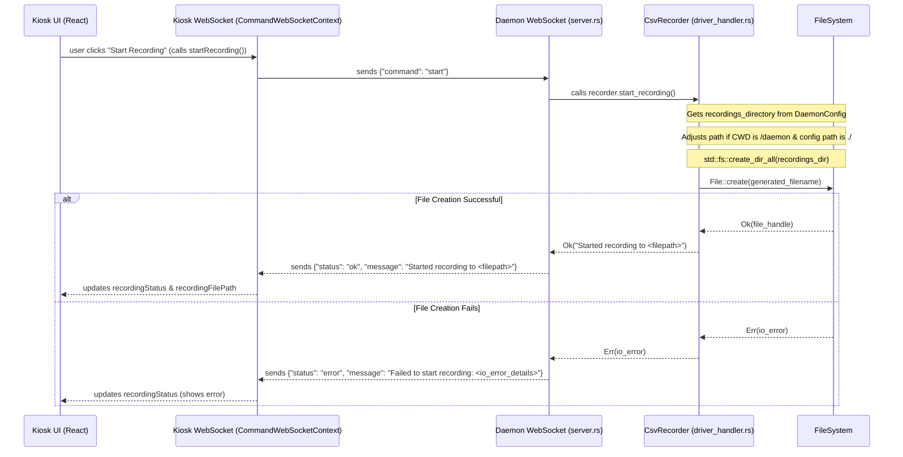

# Investigation Plan: Intermittent EEG Recording Failures

## 1. Problem Summary

Some EEG recording sessions, initiated from the Kiosk UI, were not saved to the `recordings/` directory, even though the functionality generally works. This occurred for 3 specific sessions, while subsequent tests were successful.

## 2. System Understanding: Recording Flow

The process for starting a recording involves the Kiosk UI, a WebSocket connection to the backend daemon, and file system operations handled by the `CsvRecorder` in the daemon.

### Key Components:

*   **Kiosk UI (`kiosk/`):**
    *   [`kiosk/src/components/EegRecordingControls.tsx`](kiosk/src/components/EegRecordingControls.tsx)
    *   [`kiosk/src/context/CommandWebSocketContext.tsx`](kiosk/src/context/CommandWebSocketContext.tsx)
*   **Daemon (`daemon/`):**
    *   [`daemon/src/server.rs`](daemon/src/server.rs) (specifically `handle_command_websocket`)
    *   [`daemon/src/driver_handler.rs`](daemon/src/driver_handler.rs) (specifically `CsvRecorder` struct and its methods: `start_recording`, `stop_recording`, `write_data`)
    *   [`daemon/src/main.rs`](daemon/src/main.rs) (initialization and orchestration)
    *   [`daemon/src/config.rs`](daemon/src/config.rs) (loading `DaemonConfig` from `../config.json`)

### Recording Start Flow Diagram:

### Configuration for `recordings_directory`:
1.  Loaded from `../config.json` (relative to daemon's Current Working Directory - CWD) by [`daemon/src/config.rs`](daemon/src/config.rs:44).
2.  If `../config.json` is missing/invalid, defaults to `../recordings/` (relative to daemon CWD) as per [`daemon/src/config.rs`](daemon/src/config.rs:30).
3.  This path is stored in `DaemonConfig` and used by `CsvRecorder`.
4.  `CsvRecorder::start_recording()` in [`daemon/src/driver_handler.rs`](daemon/src/driver_handler.rs:81-93) has logic to prepend `../` if the daemon's CWD ends with `/daemon` AND the `recordings_directory` from config starts with `./`.

## 3. Hypotheses for Intermittent Failure

1.  **Incorrect Path Resolution:** The CWD of the daemon, or the content of `config.json`, might have been temporarily different, leading to an incorrect target path for recordings.
2.  **Permissions Issue:** Temporary lack of write permissions to the target directory.
3.  **Race Condition or Resource Exhaustion:** Affecting `File::create()` during the failed sessions.
4.  **Error Propagation/Reporting Issue:** An error occurred but wasn't clearly reported or noticed.
5.  **Disk Full:** The relevant disk partition was temporarily full.
6.  **Invalid Characters in Filename Parameters:** Unlikely, but possible if `session` in `config.json` contained problematic characters.

## 4. Investigation Plan Steps

1.  **Check Daemon Logs (Priority 1):**
    *   Examine daemon console output from the time of failures.
    *   Look for logs related to:
        *   CWD (`main.rs`).
        *   Loaded `DaemonConfig` values, especially `recordings_directory` (`main.rs`).
        *   `CsvRecorder` path debugging: `DEBUG: Recordings directory from config:`, `DEBUG: Current directory:`, `DEBUG: Running from daemon directory:`, `DEBUG: Adjusted recordings path:`, `DEBUG: Absolute recordings path:`, `DEBUG: Creating recording file at:` (`driver_handler.rs`).
        *   Errors: `ERROR: Failed to get current directory:`, `File::create` errors (part of "Failed to start recording: {}" message), `std::fs::create_dir_all` errors.
        *   Config loading: "Configuration file not found..." or "Error parsing configuration file..." (`config.rs`).
        *   CSV writing warnings: "Warning: Failed to write data to CSV:" (`driver_handler.rs`).

2.  **Check Kiosk UI Console/Network Logs:**
    *   If possible, review browser developer console (Network & Console tabs) from the Kiosk UI during a failed recording.
    *   Inspect WebSocket messages on `/command`:
        *   Verify `{"command": "start"}` was sent.
        *   Analyze the daemon's response: success with filepath, or error message.

3.  **Inspect `config.json`:**
    *   Location: Project root ([`config.json`](config.json)).
    *   Verify `recordings_directory` value (e.g., `../recordings/`, `./recordings/`).
    *   Check `session` value for any unusual characters.

4.  **Review System State at Time of Failure (if possible):**
    *   Check for other system events, high load, disk space issues, or file permission changes.

5.  **Code Review (Focus: `CsvRecorder::start_recording` in [`daemon/src/driver_handler.rs`](daemon/src/driver_handler.rs:60-156)):**
    *   Analyze path resolution logic with various CWDs and `config.json` `recordings_directory` values.
    *   Assess if `self.config.session` could introduce problematic filename characters.

6.  **(If Needed) Add More Defensive Logging:**
    *   If existing logs are insufficient, temporarily add more detailed logging around `File::create()` in `CsvRecorder::start_recording`, logging the exact path and `File::create()` result.