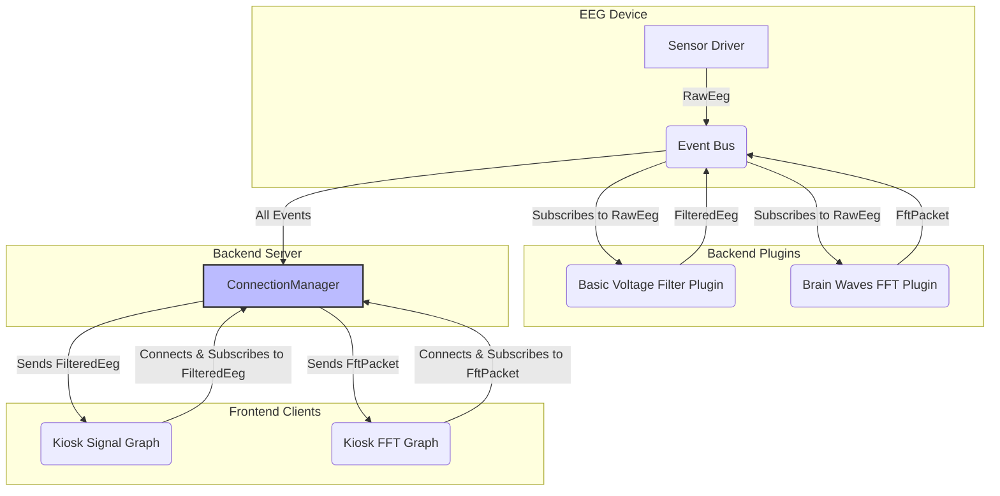

# EEG Data Flow and Subscription Model Fix Plan

## 1. Problem Diagnosis

The current EEG system exhibits two critical failures:
1.  **Data Freezing:** The signal graph in the Kiosk UI stops receiving data after a few seconds.
2.  **Empty FFT Graph:** The FFT graph displays no data.

The root cause is a flawed data handling architecture in the backend daemon. The `ConnectionManager`, which is responsible for handling all UI WebSocket clients, was not forwarding `RawEeg` data and was indiscriminately broadcasting all other data (`FilteredEeg`, `FftPacket`) to every connected client. This created a high-entropy system that was both broken and inefficient.

## 2. Architectural Goal: Data Parsimony via Subscriptions

To fix this, we will implement a **topic-based subscription model**. This will ensure that UI components only receive the specific data they need, reducing system entropy, network traffic, and CPU load.

The core principle is **data parsimony**: no component should receive data it does not intend to use.

## 3. Proposed Architecture

## 4. Implementation Steps

### Step 4.1: Backend Refactor (`crates/device/`)

**A. Consolidate WebSocket Endpoint:**
- In `src/server.rs`:
    - Remove the legacy `/eeg` WebSocket route.
    - Rename the `/applet/brain_waves/data` route to a more generic and future-proof name: **`/ws/data`**.
    - This single endpoint will now handle all incoming UI data connections, passing them directly to the `ConnectionManager`.

**B. Implement Subscription Logic in `ConnectionManager`:**
- In `src/connection_manager.rs`:
    - Define a `Client` message protocol for subscriptions using a `serde_json` struct (e.g., `ClientMessage` with `action`: "subscribe" or "unsubscribe", and `topics`: `Vec<String>`).
    - Modify the `Client` struct to include `subscriptions: HashSet<String>`.
    - Update the `add_client` function. The task spawned for each client will now listen for these `ClientMessage` JSONs and update the client's subscription set accordingly.
    - Replace the `broadcast_message` function with a new `dispatch_event` function. This function will:
        1.  Determine the topic of the incoming `SensorEvent` (e.g., "FilteredEeg", "FftPacket").
        2.  Iterate through all connected clients.
        3.  Send the event *only* to clients whose `subscriptions` set contains the event's topic.
    - Ensure client disconnection (detected via `send` error or a `close` frame) properly cleans up the client and its subscriptions from the `clients` HashMap.

### Step 4.2: Frontend Refactor (`kiosk/`)

**A. Centralize WebSocket Connection:**
- Create a new React Context, `WebSocketProvider`, in `kiosk/src/context/`.
- This provider will establish and maintain a single, persistent WebSocket connection to the new `/ws/data` endpoint.
- It will expose a `useWebSocket` hook that provides:
    - The connection status (`connected: bool`).
    - A `send` function to send messages to the backend.
    - A mechanism to register and unregister callbacks for specific event topics.

**B. Update UI Components to Use Subscriptions:**
- **`EegMonitor.tsx` (or a dedicated data handler component):**
    - Use the `useWebSocket` hook.
    - In a `useEffect`, when the component mounts, use the `send` function to send `{"action": "subscribe", "topics": ["FilteredEeg"]}`.
    - Register a callback to handle incoming `FilteredEeg` data and update the state for the signal graph.
    - In the `useEffect` cleanup function, send `{"action": "unsubscribe", "topics": ["FilteredEeg"]}`.
- **`FftRenderer.tsx` (or its parent):**
    - Use the `useWebSocket` hook.
    - In a `useEffect`, when the component mounts, send `{"action": "subscribe", "topics": ["FftPacket"]}`.
    - Register a callback to handle incoming `FftPacket` data.
    - In the `useEffect` cleanup function, send `{"action": "unsubscribe", "topics": ["FftPacket"]}`.

## 5. Expected Outcome

- The data freezing issue will be resolved. The signal graph will receive a continuous stream of `FilteredEeg` data.
- The FFT graph will correctly display data by receiving a dedicated `FftPacket` stream.
- The overall system architecture will be more robust, efficient, and scalable, with a clear and maintainable data flow.