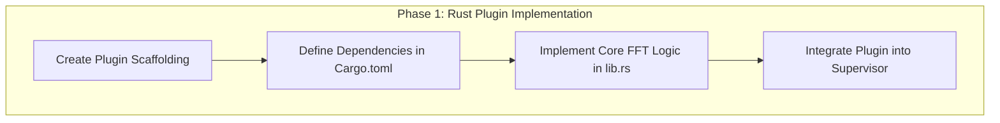
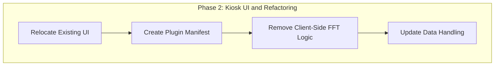

# Plan: Implement Rust-Based FFT Processing and Unify Architecture

**Date:** 2025-06-25

## 1. Executive Summary

The current implementation of FFT analysis is incorrectly located in the frontend (`kiosk/`) code, a remnant of a flawed architectural direction. This plan outlines the definitive steps to correct this by:

1.  **Creating a new, high-performance Rust plugin** (`brain_waves_fft`) to handle all FFT and Power Spectral Density (PSD) calculations.
2.  **Relocating the existing FFT UI** from the `kiosk/` components into the new plugin's `ui/` directory, creating a self-contained, reusable component.
3.  **Removing the incorrect client-side FFT logic** from the Kiosk application.
4.  **Ensuring the entire system adheres** to the established in-process, event-driven architecture defined in `eeg_types`.

This will resolve the architectural inconsistency, improve performance and maintainability, and deliver the feature as originally intended.

## 2. Detailed Implementation Plan

### Phase 1: Create the Rust FFT Plugin

This phase focuses on building the core backend component for FFT processing.



1.  **Create Plugin Scaffolding**:
    *   Create a new directory: `plugins/brain_waves_fft`
    *   Create a `src` subdirectory: `plugins/brain_waves_fft/src`
    *   Create the plugin's main file: `plugins/brain_waves_fft/src/lib.rs`
    *   Create the Cargo manifest: `plugins/brain_waves_fft/Cargo.toml`

2.  **Define Dependencies (`Cargo.toml`)**:
    *   Add the following dependencies to `plugins/brain_waves_fft/Cargo.toml`:
        ```toml
        [package]
        name = "brain_waves_fft_plugin"
        version = "0.1.0"
        edition = "2021"

        [dependencies]
        tokio = { workspace = true }
        tokio-util = "0.7"
        async-trait = "0.1"
        anyhow = "1.0"
        tracing = "0.1"
        rustfft = "6.1"
        num-complex = "0.4"
        hann-window = "0.1"

        # Local dependencies
        eeg_types = { path = "../../crates/eeg_types" }
        ```

3.  **Implement Core FFT Logic (`lib.rs`)**:
    *   The implementation in `plugins/brain_waves_fft/src/lib.rs` will follow the blueprint from `todo/fft_implementation_plan.md` and the structure of the `basic_voltage_filter` plugin.
    *   It will implement the `EegPlugin` trait from `eeg_types`.
    *   It will subscribe to `SensorEvent::FilteredEeg`.
    *   It will buffer data, apply a Hann window, and perform the FFT using `rustfft`.
    *   It will calculate the Power Spectral Density (PSD) in **µV²/Hz**, applying the necessary conversions as specified in your notes.
    *   It will broadcast the results as a `SensorEvent::FftPacket`.

4.  **Integrate Plugin into Supervisor**:
    *   Modify `crates/device/src/plugin_supervisor.rs` to register and run the new `BrainWavesFftPlugin`.

### Phase 2: Create the Plugin UI and Refactor Kiosk

This phase focuses on creating a self-contained UI for the plugin and cleaning up the Kiosk frontend.



5.  **Relocate Existing UI**:
    *   Create a new directory: `plugins/brain_waves_fft/ui`
    *   Move the existing FFT rendering logic. A new, clean `FftDisplay.tsx` will be created. We will analyze `EegMonitor.tsx`, `FftRenderer.tsx`, and related components to extract the essential visualization logic.
    *   Create `plugins/brain_waves_fft/ui/FftDisplay.tsx`. This component will be responsible for rendering the FFT data it receives.

6.  **Create Plugin Manifest (`plugin.toml`)**:
    *   Create a new file: `plugins/brain_waves_fft/plugin.toml`
    *   Add the following content to define the plugin and its UI component:
        ```toml
        id = "brain_waves_fft"
        name = "Brain Waves FFT"
        version = "0.1.0"
        author = "Elata"

        [ui]
        component = "FftDisplay"
        path = "ui/FftDisplay.tsx"
        ```

7.  **Remove Client-Side FFT Logic**:
    *   In `kiosk/src/components/EegDataHandler.tsx`, **delete** the `calculateFft` import and the associated code block that performs the FFT calculation.
    *   This is a critical step to ensure there is only one source of truth for FFT data.

8.  **Update Data Handling**:
    *   The `EegDataHandler` will already be receiving `FftPacket` events from the WebSocket if subscribed. We will ensure the `onFftData` callback correctly passes this data to the `EegMonitor`.
    *   `EegMonitor` will then pass this data down to the new, relocated `FftDisplay` component (which will be rendered in place of the old logic).

## 3. Validation

*   The primary validation will be observing the Kiosk UI correctly rendering the live PSD data originating from the new Rust plugin.
*   We will confirm that the `calculateFft` function and its usage have been completely removed from the frontend codebase.
*   The build will succeed, and the application will run without errors, demonstrating the architectural integrity.

This plan provides a clear, actionable path to resolving the current issues and aligning the project with its intended architecture.