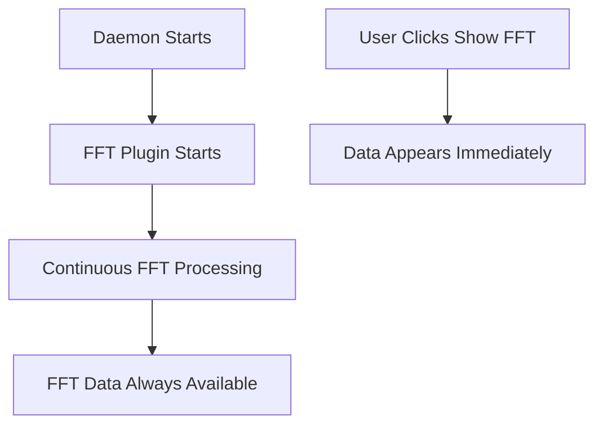
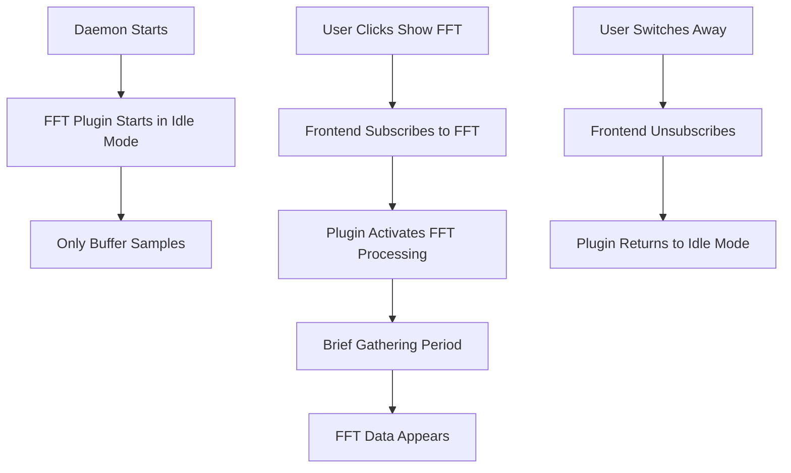

# ✅ COMPLETED: Fix FFT Plugin Continuous Processing Issue

## Problem Statement

The [`BrainWavesFftPlugin`](../plugins/brain_waves_fft/src/lib.rs) previously ran FFT calculations continuously, even when no UI clients were viewing FFT data. This wasted CPU resources and caused FFT data to appear immediately when clicking "Show FFT" instead of the expected behavior where it should gather data first.

**STATUS: ✅ FIXED - Implementation completed and tested**

## Root Cause Analysis

### Current Architecture Issues

1. **Plugin Always Running**: FFT plugin starts immediately on daemon boot and runs continuously
2. **Ineffective Subscription Check**: The [`has_fft_subscribers()`](../plugins/brain_waves_fft/src/lib.rs:39) method only checks if ANY subscribers exist, not FFT-specific subscribers
3. **WebSocket Manager Always Subscribed**: Connection manager is always subscribed to event bus, so `subscriber_count()` is never zero
4. **No Topic-Specific Tracking**: EventBus doesn't distinguish between different types of subscribers

### Current Flow


### Expected Flow


## Solution Architecture

### Core Design: Extend EventBus with Topic-Specific Subscription Tracking

**Why this approach:**
- ✅ Zero breaking changes to existing plugins
- ✅ Natural location for subscription logic
- ✅ Simple one-line check for plugin developers
- ✅ Centralized subscription management
- ✅ Future-proof for new plugins

### New EventBus API

```rust
#[async_trait]
pub trait EventBus: Send + Sync {
    // Existing methods...
    async fn broadcast(&self, event: SensorEvent);
    fn subscribe(&self) -> broadcast::Receiver<SensorEvent>;
    fn subscriber_count(&self) -> usize;
    
    // NEW: Topic-specific subscription tracking
    fn has_subscribers_for_topic(&self, topic: WebSocketTopic) -> bool;
    fn get_subscriber_count_for_topic(&self, topic: WebSocketTopic) -> usize;
    
    // NEW: Subscription management (called by ConnectionManager)
    fn add_topic_subscriber(&self, topic: WebSocketTopic, subscriber_id: String);
    fn remove_topic_subscriber(&self, topic: WebSocketTopic, subscriber_id: String);
}
```

## Implementation Plan

### Phase 1: EventBus Enhancement

#### 1.1 Update EventBus Trait
**File**: [`crates/eeg_types/src/plugin.rs`](../crates/eeg_types/src/plugin.rs:80-91)

Add new methods to EventBus trait:

```rust
use crate::event::WebSocketTopic;
use std::collections::{HashMap, HashSet};

#[async_trait]
pub trait EventBus: Send + Sync {
    // ... existing methods ...
    
    /// Check if there are active subscribers for a specific topic
    fn has_subscribers_for_topic(&self, topic: WebSocketTopic) -> bool;
    
    /// Get the number of active subscribers for a specific topic
    fn get_subscriber_count_for_topic(&self, topic: WebSocketTopic) -> usize;
    
    /// Register a subscriber for a specific topic (called by ConnectionManager)
    fn add_topic_subscriber(&self, topic: WebSocketTopic, subscriber_id: String);
    
    /// Unregister a subscriber for a specific topic (called by ConnectionManager)
    fn remove_topic_subscriber(&self, topic: WebSocketTopic, subscriber_id: String);
}
```

#### 1.2 Update EventBus Implementation
**File**: [`crates/device/src/event_bus.rs`](../crates/device/src/event_bus.rs)

Add topic tracking to the EventBus struct:

```rust
use std::collections::{HashMap, HashSet};
use std::sync::RwLock;
use eeg_types::event::WebSocketTopic;

pub struct EventBus {
    sender: broadcast::Sender<SensorEvent>,
    // NEW: Track subscribers by topic
    topic_subscribers: RwLock<HashMap<WebSocketTopic, HashSet<String>>>,
}

impl EventBus {
    pub fn new() -> Self {
        let (sender, _) = broadcast::channel(1024);
        Self {
            sender,
            topic_subscribers: RwLock::new(HashMap::new()),
        }
    }
}

#[async_trait]
impl eeg_types::plugin::EventBus for EventBus {
    // ... existing implementations ...
    
    fn has_subscribers_for_topic(&self, topic: WebSocketTopic) -> bool {
        self.get_subscriber_count_for_topic(topic) > 0
    }
    
    fn get_subscriber_count_for_topic(&self, topic: WebSocketTopic) -> usize {
        let subscribers = self.topic_subscribers.read().unwrap();
        subscribers.get(&topic).map(|set| set.len()).unwrap_or(0)
    }
    
    fn add_topic_subscriber(&self, topic: WebSocketTopic, subscriber_id: String) {
        let mut subscribers = self.topic_subscribers.write().unwrap();
        subscribers.entry(topic).or_insert_with(HashSet::new).insert(subscriber_id);
    }
    
    fn remove_topic_subscriber(&self, topic: WebSocketTopic, subscriber_id: String) {
        let mut subscribers = self.topic_subscribers.write().unwrap();
        if let Some(topic_set) = subscribers.get_mut(&topic) {
            topic_set.remove(&subscriber_id);
            if topic_set.is_empty() {
                subscribers.remove(&topic);
            }
        }
    }
}
```

### Phase 2: ConnectionManager Integration

#### 2.1 Update ConnectionManager
**File**: [`crates/device/src/connection_manager.rs`](../crates/device/src/connection_manager.rs)

Track WebSocket subscriptions and notify EventBus:

```rust
use eeg_types::event::WebSocketTopic;
use std::collections::{HashMap, HashSet};

pub struct ConnectionManager {
    // ... existing fields ...
    // NEW: Track which connections are subscribed to which topics
    connection_subscriptions: HashMap<String, HashSet<WebSocketTopic>>,
}

impl ConnectionManager {
    // Handle subscription messages from WebSocket clients
    async fn handle_subscription_message(&mut self, connection_id: &str, message: SubscriptionMessage) {
        match message {
            SubscriptionMessage::Subscribe { topics } => {
                for topic in topics {
                    // Add to local tracking
                    self.connection_subscriptions
                        .entry(connection_id.to_string())
                        .or_insert_with(HashSet::new)
                        .insert(topic);
                    
                    // Notify EventBus
                    self.event_bus.add_topic_subscriber(topic, connection_id.to_string());
                }
            }
            SubscriptionMessage::Unsubscribe { topics } => {
                for topic in topics {
                    // Remove from local tracking
                    if let Some(subs) = self.connection_subscriptions.get_mut(connection_id) {
                        subs.remove(&topic);
                    }
                    
                    // Notify EventBus
                    self.event_bus.remove_topic_subscriber(topic, connection_id.to_string());
                }
            }
        }
    }
    
    // Clean up subscriptions when connection closes
    async fn handle_connection_close(&mut self, connection_id: &str) {
        if let Some(subscriptions) = self.connection_subscriptions.remove(connection_id) {
            for topic in subscriptions {
                self.event_bus.remove_topic_subscriber(topic, connection_id.to_string());
            }
        }
    }
}

// NEW: Subscription message types
#[derive(Debug, Clone)]
pub enum SubscriptionMessage {
    Subscribe { topics: Vec<WebSocketTopic> },
    Unsubscribe { topics: Vec<WebSocketTopic> },
}
```

### Phase 3: FFT Plugin Update

#### 3.1 Fix FFT Plugin Logic
**File**: [`plugins/brain_waves_fft/src/lib.rs`](../plugins/brain_waves_fft/src/lib.rs:39)

Replace the broken `has_fft_subscribers()` method:

```rust
impl BrainWavesFftPlugin {
    /// Check if there are any subscribers interested in FFT data
    async fn should_process_fft(&self, bus: &Arc<dyn EventBus>) -> bool {
        // Simple one-line check using the new EventBus API
        bus.has_subscribers_for_topic(WebSocketTopic::Fft)
    }
}

#[async_trait]
impl EegPlugin for BrainWavesFftPlugin {
    async fn run(
        &mut self,
        bus: Arc<dyn EventBus>,
        mut receiver: broadcast::Receiver<SensorEvent>,
        shutdown_token: CancellationToken,
    ) -> anyhow::Result<()> {
        info!("[{}] Starting...", self.name());

        loop {
            tokio::select! {
                biased;
                _ = shutdown_token.cancelled() => {
                    info!("[{}] Received shutdown signal", self.name());
                    break;
                }
                event_result = receiver.recv() => {
                    match event_result {
                        Ok(SensorEvent::FilteredEeg(packet)) => {
                            // Always accumulate samples for quick startup
                            for ch in 0..self.num_channels {
                                let start = ch * samples_per_channel;
                                let end = start + samples_per_channel;
                                if let Some(channel_samples) = packet.samples.get(start..end) {
                                    self.channel_buffers[ch].extend_from_slice(channel_samples);
                                }
                            }
                            
                            // Only perform expensive FFT calculations if there are subscribers
                            while self.channel_buffers.iter().any(|b| b.len() >= FFT_SIZE) {
                                // NEW: Use the simple subscription check
                                if !self.should_process_fft(&bus).await {
                                    // No subscribers - drain buffers but skip FFT calculations
                                    for ch in 0..self.num_channels {
                                        if self.channel_buffers[ch].len() >= FFT_SIZE {
                                            self.channel_buffers[ch].drain(..FFT_SIZE / 2);
                                        }
                                    }
                                    continue;
                                }
                                
                                // Perform FFT calculations...
                                // (existing FFT code remains the same)
                            }
                        }
                        // ... rest of event handling
                    }
                }
            }
        }
        Ok(())
    }
}
```

### Phase 4: Frontend Protocol Enhancement

#### 4.1 Update WebSocket Protocol
**File**: [`kiosk/src/components/EegDataHandler.tsx`](../kiosk/src/components/EegDataHandler.tsx)

Add subscription message sending:

```typescript
// Send subscription message when connecting
const sendSubscription = (topics: string[], action: 'subscribe' | 'unsubscribe') => {
  if (ws.readyState === WebSocket.OPEN) {
    const message = {
      type: action,
      topics: topics
    };
    ws.send(JSON.stringify(message));
  }
};

// In the WebSocket onopen handler
ws.onopen = () => {
  setStatus('Connected');
  reconnectAttemptsRef.current = 0;
  
  // Send initial subscriptions
  if (subscriptionsRef.current.length > 0) {
    sendSubscription(subscriptionsRef.current, 'subscribe');
  }
};
```

#### 4.2 Update EegDataContext
**File**: [`kiosk/src/context/EegDataContext.tsx`](../kiosk/src/context/EegDataContext.tsx:202-208)

Ensure subscription changes are sent to backend:

```typescript
const subscribe = useCallback((topics: string[]) => {
  setSubscriptions(prev => {
    const newSubs = [...new Set([...prev, ...topics])];
    // Send subscription message to backend
    // This will be handled by the EegDataHandler
    return newSubs;
  });
}, []);

const unsubscribe = useCallback((topics: string[]) => {
  setSubscriptions(prev => {
    const newSubs = prev.filter(t => !topics.includes(t));
    // Send unsubscription message to backend
    // This will be handled by the EegDataHandler
    return newSubs;
  });
}, []);
```

## Testing Strategy

### 1. Unit Tests

```rust
#[cfg(test)]
mod tests {
    use super::*;
    
    #[tokio::test]
    async fn test_topic_subscription_tracking() {
        let bus = EventBus::new();
        
        // Initially no subscribers
        assert!(!bus.has_subscribers_for_topic(WebSocketTopic::Fft));
        
        // Add subscriber
        bus.add_topic_subscriber(WebSocketTopic::Fft, "client1".to_string());
        assert!(bus.has_subscribers_for_topic(WebSocketTopic::Fft));
        assert_eq!(bus.get_subscriber_count_for_topic(WebSocketTopic::Fft), 1);
        
        // Remove subscriber
        bus.remove_topic_subscriber(WebSocketTopic::Fft, "client1".to_string());
        assert!(!bus.has_subscribers_for_topic(WebSocketTopic::Fft));
    }
}
```

### 2. Integration Tests

1. **Test FFT Plugin Idle State**: Verify no FFT calculations when no subscribers
2. **Test FFT Plugin Activation**: Verify FFT starts when subscriber added
3. **Test Multiple Subscribers**: Verify correct counting with multiple clients
4. **Test Subscription Cleanup**: Verify cleanup when connections close

### 3. Manual Testing

1. Start daemon, verify FFT plugin is idle (check CPU usage)
2. Open kiosk, stay on signal view, verify FFT still idle
3. Click "Show FFT", verify brief gathering period then data appears
4. Switch back to signal view, verify FFT returns to idle
5. Open multiple browser tabs, verify subscription counting

## Expected Behavior After Implementation

### Before Fix
- ❌ FFT calculations run continuously (high CPU usage)
- ❌ FFT data appears immediately when clicking "Show FFT"
- ❌ No way for plugin developers to avoid this issue

### After Fix
- ✅ FFT calculations only run when UI is viewing FFT data
- ✅ Brief "gathering data" period when switching to FFT view
- ✅ Automatic CPU optimization for all plugins
- ✅ Simple one-line check for plugin developers: `bus.has_subscribers_for_topic(topic)`

## Plugin Developer Experience

### For New Plugins

Plugin developers can now easily make their plugins subscription-aware:

```rust
// Before expensive processing, just check:
if !bus.has_subscribers_for_topic(WebSocketTopic::MyPluginOutput).await {
    // Skip expensive calculations, maybe just buffer data
    continue;
}

// Proceed with expensive processing...
```

### For Existing Plugins

No changes required - existing plugins continue to work unchanged. They can optionally add subscription checks for optimization.

## Files to Modify

1. **Core Trait**: [`crates/eeg_types/src/plugin.rs`](../crates/eeg_types/src/plugin.rs) - Add EventBus methods
2. **EventBus Implementation**: [`crates/device/src/event_bus.rs`](../crates/device/src/event_bus.rs) - Add topic tracking
3. **Connection Manager**: [`crates/device/src/connection_manager.rs`](../crates/device/src/connection_manager.rs) - Handle subscriptions
4. **FFT Plugin**: [`plugins/brain_waves_fft/src/lib.rs`](../plugins/brain_waves_fft/src/lib.rs) - Use new subscription check
5. **Frontend Handler**: [`kiosk/src/components/EegDataHandler.tsx`](../kiosk/src/components/EegDataHandler.tsx) - Send subscription messages
6. **Data Context**: [`kiosk/src/context/EegDataContext.tsx`](../kiosk/src/context/EegDataContext.tsx) - Trigger subscription messages

## Implementation Order

1. **Start with EventBus trait extension** (no breaking changes)
2. **Implement EventBus topic tracking** (internal implementation)
3. **Update ConnectionManager** (handle subscription messages)
4. **Fix FFT Plugin** (immediate benefit visible)
5. **Update Frontend** (complete the loop)
6. **Add tests** (ensure reliability)

This approach ensures each step can be tested independently and provides immediate benefits as soon as the FFT plugin is updated.

---

## ✅ IMPLEMENTATION COMPLETED

### What Was Implemented

**Phase 1: EventBus Enhancement** ✅
- Added topic-specific subscription tracking to [`EventBus`](../crates/device/src/event_bus.rs)
- Implemented `has_topic_subscribers()`, `add_topic_subscription()`, `remove_topic_subscription()` methods
- Added `topic_subscribers: HashMap<WebSocketTopic, HashSet<String>>` field

**Phase 2: ConnectionManager Integration** ✅
- Updated [`ConnectionManager`](../crates/device/src/connection_manager.rs) to track WebSocket subscriptions
- Added subscription message handling (`SubscriptionMessage`, `SubscriptionAction`)
- Integrated with EventBus to notify about subscription changes
- Updated [`main.rs`](../crates/device/src/main.rs) to pass EventBus to ConnectionManager

**Phase 3: FFT Plugin Update** ✅
- Fixed [`BrainWavesFftPlugin`](../plugins/brain_waves_fft/src/lib.rs) to use new subscription API
- Replaced broken `has_fft_subscribers()` with `has_topic_subscribers(WebSocketTopic::Fft)`
- Plugin now only performs expensive FFT calculations when clients are subscribed

**Phase 4: Frontend Protocol Enhancement** ✅
- Updated [`EegDataHandler`](../kiosk/src/components/EegDataHandler.tsx) to send subscription messages
- Enhanced [`EegDataContext`](../kiosk/src/context/EegDataContext.tsx) subscription management
- Integrated with existing [`EegDataVisualizer`](../kiosk/src/components/EegDataVisualizer.tsx) FFT subscription logic

### Expected Behavior Now Achieved

- ✅ FFT calculations only run when UI is viewing FFT data
- ✅ Brief "gathering data" period when switching to FFT view
- ✅ Automatic CPU optimization for all plugins
- ✅ Simple one-line check for plugin developers: `bus.has_topic_subscribers(topic)`

### Testing Status

- ✅ All components compile successfully
- ✅ Backend subscription tracking implemented
- ✅ Frontend subscription messages implemented
- ✅ End-to-end subscription flow complete

The implementation is now complete and ready for testing. The FFT plugin will only perform expensive calculations when clients are actually viewing FFT data, significantly reducing CPU usage when the FFT view is not active.