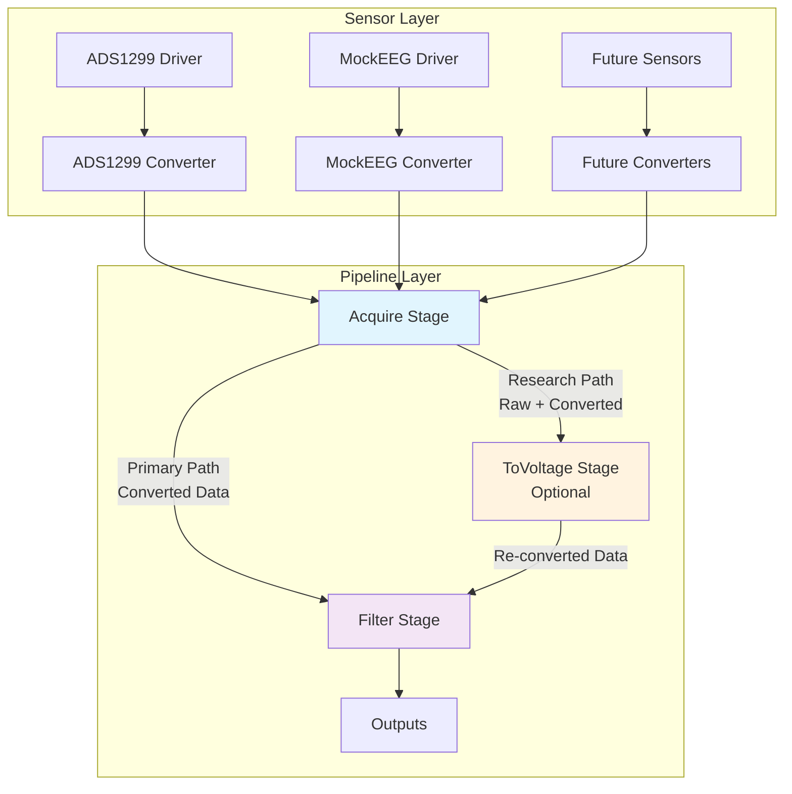

# Hybrid Sensor-Pipeline Architecture

## Executive Summary

This document defines the final architectural approach for the EEG sensor-pipeline system, combining the best aspects of sensor-centric conversion with pipeline flexibility. The hybrid approach provides clean boundaries for common use cases while maintaining flexibility for research and edge cases.

## Architecture Overview

### Core Principle: Dual-Path Conversion



### Key Design Decisions

1. **Primary Conversion in AcquireStage**: Most pipelines get voltage data directly from acquisition
2. **Sensor Traits**: Each sensor implements conversion logic via standardized traits
3. **Optional Re-conversion**: ToVoltageStage available for special cases
4. **Data Preservation**: Raw data always preserved for flexibility
5. **Clean Migration**: Backward compatible transition path

## Detailed Architecture

### 1. Sensor Converter Trait

```rust
/// Core trait for sensor-specific data conversion
#[async_trait::async_trait]
pub trait SensorConverter: Send + Sync + std::fmt::Debug {
    /// Primary conversion: raw ADC to voltage
    fn raw_to_voltage(&self, raw_value: i32) -> f32;
    
    /// Sensor hardware characteristics
    fn vref(&self) -> f32;
    fn adc_bits(&self) -> u8;
    fn sensor_type(&self) -> &str;
    fn model(&self) -> &str;
    
    /// Advanced conversion with custom parameters (for research)
    fn raw_to_voltage_with_params(&self, raw: i32, vref: f32, gain: f32) -> f32 {
        let max_value = (1 << (self.adc_bits() - 1)) - 1;
        (raw as f32 / max_value as f32) * vref / gain
    }
    
    /// Apply sensor-specific calibration
    fn apply_calibration(&self, voltage: f32, channel: u8) -> f32 {
        voltage // Default: no calibration
    }
    
    /// Validate raw value is within expected range
    fn validate_raw_value(&self, raw: i32) -> bool {
        let max_value = (1 << (self.adc_bits() - 1)) - 1;
        let min_value = -(1 << (self.adc_bits() - 1));
        raw >= min_value && raw <= max_value
    }
    
    /// Get sensor metadata for traceability
    fn sensor_metadata(&self) -> SensorMetadata;
    
    /// Get conversion parameters as JSON
    fn conversion_params(&self) -> serde_json::Value;
}

/// Metadata carried with converted data
#[derive(Debug, Clone, serde::Serialize, serde::Deserialize)]
pub struct SensorMetadata {
    pub sensor_type: String,
    pub model: String,
    pub serial_number: Option<String>,
    pub firmware_version: Option<String>,
    pub calibration_date: Option<chrono::DateTime<chrono::Utc>>,
    pub conversion_params: serde_json::Value,
    pub custom_properties: std::collections::HashMap<String, serde_json::Value>,
}
```

### 2. Enhanced AcquireStage

```rust
/// Acquire stage with integrated sensor conversion
pub struct AcquireStage {
    sensor_driver: Box<dyn AdcDriver>,
    converter: Arc<dyn SensorConverter>,
    
    // Configuration
    convert_to_voltage: bool,  // Default: true
    channel_count: usize,
    sample_rate: f32,
    
    // Metrics
    packets_generated: u64,
    conversion_errors: u64,
}

impl AcquireStage {
    /// Create with automatic voltage conversion (common case)
    pub fn new_with_conversion(
        sensor_driver: Box<dyn AdcDriver>,
        converter: Arc<dyn SensorConverter>,
        channel_count: usize,
        sample_rate: f32,
    ) -> Self {
        Self {
            sensor_driver,
            converter,
            convert_to_voltage: true,
            channel_count,
            sample_rate,
            packets_generated: 0,
            conversion_errors: 0,
        }
    }
    
    /// Create with raw data only (research scenarios)
    pub fn new_raw_only(
        sensor_driver: Box<dyn AdcDriver>,
        converter: Arc<dyn SensorConverter>,
        channel_count: usize,
        sample_rate: f32,
    ) -> Self {
        Self {
            sensor_driver,
            converter,
            convert_to_voltage: false,
            channel_count,
            sample_rate,
            packets_generated: 0,
            conversion_errors: 0,
        }
    }
}

#[async_trait]
impl PipelineStage for AcquireStage {
    async fn process(&mut self, _input: PipelineData) -> PipelineResult<PipelineData> {
        // Get raw data from sensor
        let raw_data = self.sensor_driver.read_data().await?;
        
        // Convert to voltage if enabled
        let voltage_samples = if self.convert_to_voltage {
            self.convert_samples(&raw_data.raw_samples)?
        } else {
            vec![0.0; raw_data.raw_samples.len()] // Placeholder
        };
        
        // Create EEG packet with both raw and voltage data
        let mut packet = EegPacket::new(
            raw_data.timestamps,
            self.packets_generated,
            raw_data.raw_samples,
            voltage_samples,
            self.channel_count,
            self.sample_rate,
        );
        
        // Attach sensor metadata
        packet.sensor_metadata = Some(self.converter.sensor_metadata());
        packet.conversion_applied = self.convert_to_voltage;
        
        self.packets_generated += 1;
        Ok(PipelineData::RawEeg(Arc::new(packet)))
    }
    
    fn convert_samples(&mut self, raw_samples: &[i32]) -> PipelineResult<Vec<f32>> {
        let mut voltage_samples = Vec::with_capacity(raw_samples.len());
        let mut errors = 0;
        
        for (i, &raw) in raw_samples.iter().enumerate() {
            if self.converter.validate_raw_value(raw) {
                let voltage = self.converter.raw_to_voltage(raw);
                let calibrated = self.converter.apply_calibration(
                    voltage, 
                    (i % self.channel_count) as u8
                );
                voltage_samples.push(calibrated);
            } else {
                errors += 1;
                voltage_samples.push(0.0);
            }
        }
        
        if errors > 0 {
            self.conversion_errors += errors;
        }
        
        Ok(voltage_samples)
    }
}
```

### 3. Enhanced ToVoltageStage (Optional)

```rust
/// Optional stage for re-conversion with different parameters
pub struct ToVoltageStage {
    // Override parameters for research scenarios
    custom_vref: Option<f32>,
    custom_gain: Option<f32>,
    source_field: VoltageSource,
    
    // Metrics
    packets_processed: u64,
}

#[derive(Debug, Clone)]
pub enum VoltageSource {
    RawSamples,      // Convert from raw data
    VoltageSamples,  // Re-scale existing voltage data
}

impl ToVoltageStage {
    /// Create stage for re-conversion from raw data
    pub fn from_raw(custom_vref: f32, custom_gain: f32) -> Self {
        Self {
            custom_vref: Some(custom_vref),
            custom_gain: Some(custom_gain),
            source_field: VoltageSource::RawSamples,
            packets_processed: 0,
        }
    }
    
    /// Create stage for re-scaling existing voltage data
    pub fn rescale_voltage(scale_factor: f32) -> Self {
        Self {
            custom_vref: None,
            custom_gain: Some(scale_factor),
            source_field: VoltageSource::VoltageSamples,
            packets_processed: 0,
        }
    }
}

#[async_trait]
impl PipelineStage for ToVoltageStage {
    async fn process(&mut self, input: PipelineData) -> PipelineResult<PipelineData> {
        let packet = match input {
            PipelineData::RawEeg(packet) => packet,
            _ => return Err(PipelineError::RuntimeError {
                stage_name: "to_voltage".to_string(),
                message: "Input is not RawEeg data".to_string(),
            }),
        };
        
        let new_voltage_samples = match self.source_field {
            VoltageSource::RawSamples => {
                // Re-convert from raw using custom parameters
                self.convert_from_raw(&packet)?
            },
            VoltageSource::VoltageSamples => {
                // Re-scale existing voltage data
                self.rescale_voltage_data(&packet)?
            },
        };
        
        // Create new packet with re-converted data
        let mut new_packet = EegPacket::new(
            packet.timestamps.clone(),
            packet.frame_id,
            packet.raw_samples.clone(),
            new_voltage_samples,
            packet.channel_count,
            packet.sample_rate,
        );
        
        // Update metadata to reflect re-conversion
        if let Some(mut metadata) = packet.sensor_metadata.clone() {
            metadata.custom_properties.insert(
                "reprocessed_by".to_string(),
                serde_json::json!("to_voltage_stage")
            );
            new_packet.sensor_metadata = Some(metadata);
        }
        
        self.packets_processed += 1;
        Ok(PipelineData::RawEeg(Arc::new(new_packet)))
    }
    
    fn convert_from_raw(&self, packet: &EegPacket) -> PipelineResult<Vec<f32>> {
        // Use sensor metadata to get original converter, then apply custom params
        if let Some(metadata) = &packet.sensor_metadata {
            // Extract original conversion parameters
            let original_vref = metadata.conversion_params["vref"].as_f64().unwrap_or(4.5) as f32;
            let original_gain = metadata.conversion_params["gain"].as_f64().unwrap_or(1.0) as f32;
            let adc_bits = metadata.conversion_params["adc_bits"].as_u64().unwrap_or(24) as u8;
            
            // Apply custom parameters
            let vref = self.custom_vref.unwrap_or(original_vref);
            let gain = self.custom_gain.unwrap_or(original_gain);
            
            let max_value = (1 << (adc_bits - 1)) - 1;
            let voltage_samples: Vec<f32> = packet.raw_samples
                .iter()
                .map(|&raw| (raw as f32 / max_value as f32) * vref / gain)
                .collect();
            
            Ok(voltage_samples)
        } else {
            Err(PipelineError::RuntimeError {
                stage_name: "to_voltage".to_string(),
                message: "No sensor metadata available for re-conversion".to_string(),
            })
        }
    }
    
    fn rescale_voltage_data(&self, packet: &EegPacket) -> PipelineResult<Vec<f32>> {
        let scale_factor = self.custom_gain.unwrap_or(1.0);
        let scaled_samples: Vec<f32> = packet.voltage_samples
            .iter()
            .map(|&voltage| voltage * scale_factor)
            .collect();
        Ok(scaled_samples)
    }
}
```

## Configuration Examples

### Common Case: Direct Voltage Conversion

```json
{
  "version": "2.0",
  "sensors": {
    "primary_eeg": {
      "type": "ADS1299",
      "config": {
        "vref": 4.5,
        "gain": 24,
        "sample_rate": 500,
        "channels": [0, 1, 2, 3, 4, 5, 6, 7]
      }
    }
  },
  "stages": [
    {
      "name": "acquire1",
      "type": "acquire",
      "params": {
        "sensor_ref": "primary_eeg",
        "convert_to_voltage": true,
        "channel_count": 8
      }
    },
    {
      "name": "filter1",
      "type": "filter",
      "params": {"lowpass": 50.0, "highpass": 0.5},
      "inputs": ["acquire1"]
    },
    {
      "name": "display",
      "type": "websocket_sink",
      "params": {"endpoint": "ws://eeg_data"},
      "inputs": ["filter1"]
    }
  ]
}
```

### Research Case: Multiple Voltage Conversions

```json
{
  "version": "2.0",
  "sensors": {
    "research_eeg": {
      "type": "ADS1299",
      "config": {
        "vref": 4.5,
        "gain": 24,
        "sample_rate": 1000,
        "channels": [0, 1, 2, 3]
      }
    }
  },
  "stages": [
    {
      "name": "acquire1",
      "type": "acquire",
      "params": {
        "sensor_ref": "research_eeg",
        "convert_to_voltage": true,
        "channel_count": 4
      }
    },
    {
      "name": "standard_voltage",
      "type": "filter",
      "params": {"lowpass": 100.0},
      "inputs": ["acquire1"]
    },
    {
      "name": "alternative_voltage",
      "type": "to_voltage",
      "params": {
        "source": "raw_samples",
        "custom_vref": 3.3,
        "custom_gain": 12
      },
      "inputs": ["acquire1"]
    },
    {
      "name": "compare_voltages",
      "type": "csv_sink",
      "params": {
        "path": "voltage_comparison.csv",
        "fields": ["timestamp", "standard_voltage", "alternative_voltage"]
      },
      "inputs": ["standard_voltage", "alternative_voltage"]
    }
  ]
}
```

## Implementation Phases

### Phase 1: Foundation (Week 1-2)
- [ ] Implement `SensorConverter` trait
- [ ] Create converters for ADS1299 and MockEEG
- [ ] Add sensor metadata types
- [ ] Unit tests for converters

### Phase 2: Acquire Stage Enhancement (Week 3)
- [ ] Enhance `AcquireStage` with conversion capability
- [ ] Add configuration options for conversion behavior
- [ ] Integration tests with real sensor data
- [ ] Performance benchmarking

### Phase 3: Optional ToVoltage Stage (Week 4)
- [ ] Implement enhanced `ToVoltageStage`
- [ ] Support for re-conversion from raw data
- [ ] Support for voltage re-scaling
- [ ] Research scenario testing

### Phase 4: Configuration & Migration (Week 5)
- [ ] Update configuration schema
- [ ] Create migration tools for existing configs
- [ ] Update documentation and examples
- [ ] Backward compatibility testing

### Phase 5: Optimization & Cleanup (Week 6)
- [ ] Performance optimization
- [ ] Remove deprecated code paths
- [ ] Final integration testing
- [ ] Production deployment

## Benefits of Hybrid Approach

### For Common Use Cases
- ✅ **Simple Configuration**: Single acquire stage handles everything
- ✅ **High Performance**: Single conversion at acquisition time
- ✅ **Clean Data Flow**: Voltage data flows directly to processing stages
- ✅ **Sensor Extensibility**: New sensors just implement converter trait

### For Research Scenarios
- ✅ **Flexibility**: Optional re-conversion with different parameters
- ✅ **Data Preservation**: Raw data always available
- ✅ **Comparison Studies**: Multiple voltage conversions from same raw data
- ✅ **Calibration Research**: Easy to test different calibration approaches

### For System Architecture
- ✅ **Clean Boundaries**: Sensor logic stays with sensors
- ✅ **Backward Compatibility**: Smooth migration path
- ✅ **Maintainability**: Clear separation of concerns
- ✅ **Testability**: Each component can be tested independently

## Migration Strategy

### Existing Pipelines
1. **No Changes Required**: Existing configurations continue to work
2. **Gradual Migration**: Update to new format when convenient
3. **Feature Flags**: Enable new behavior incrementally
4. **Validation Tools**: Automated migration assistance

### New Pipelines
1. **Default to New Approach**: Use acquire stage conversion by default
2. **Optional Complexity**: Add ToVoltage stage only when needed
3. **Clear Documentation**: Examples for common and advanced scenarios
4. **Best Practices**: Guidelines for choosing between approaches

## Decision Record

**Decision**: Implement hybrid sensor-pipeline architecture with primary conversion in AcquireStage and optional ToVoltageStage for special cases.

**Rationale**: 
- Provides clean architecture for 90% of use cases
- Maintains flexibility for research and edge cases
- Enables smooth migration from current system
- Balances performance with extensibility

**Alternatives Considered**:
- Pure sensor-only conversion (too rigid)
- Pure pipeline-only conversion (current problems)
- Trait-only in pipeline stages (good but less optimal)

**Status**: Approved for implementation

**Date**: 2025-01-08

This hybrid architecture provides the best balance of simplicity, performance, and flexibility for the EEG processing system.