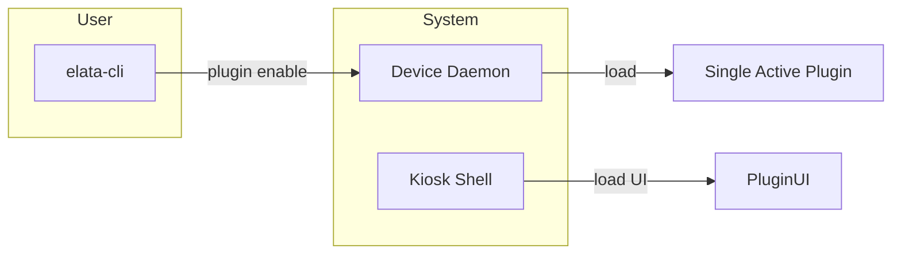
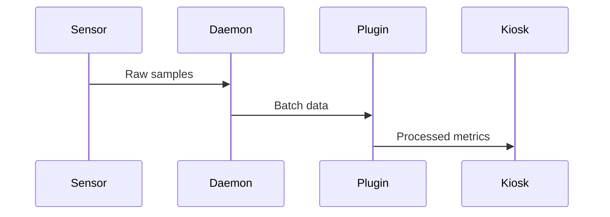

# Elata EEG - Refactored Architecture (v0.6)

> **Simplified plugin model (June 2025 update)**  
> *Focus on single-plugin operation initially with simplified QoS*

---

## 1 Goals & Guiding Principles
| Goal | Rationale |
|------|-----------|
| **Driver purity** | Keep hardware I/O free of DSP or UI concerns |
| **Plugin-owned DSP** | Each plugin ships its own processing logic |
| **Simple IPC** | WebSocket transport with optional Rust callbacks |
| **Single-plugin focus** | Avoid complexity of concurrent plugin operation |

---

## 2 Directory Layout (monorepo)

elata-eeg/
│
├─ crates/ # Rust workspace
│ ├─ sensors/ # sensor-specific code
│ │ └─ ads1299/
│ └─ device/ # main daemon
│
├─ plugins/ # user-installable extensions
│ ├─ brain-waves-display/ 
│ │ ├─ ui/ # TS/JS for Kiosk
│ │ ├─ backend/ # Rust crate
│ │ └─ plugin.toml # manifest
│ └─ …
│
├─ kiosk/ # Next.js shell
├─ scripts/ # dev/CI helpers
└─ Cargo.toml

---

## 3 Plugin Lifecycle



---

## 4 Communication Protocols

### 4.1 Kiosk ⇄ Device Daemon
WebSocket messages:
```json
{
  "seq": 123,
  "payload": { /* type-specific */ }
}
```

### 4.2 Device Daemon ⇄ Plugin Backend
**Single data stream**:
- All plugins receive same data format
- No QoS tier selection
- Fixed 50ms batch size

---

## 5 Data Flow (Single Plugin)



---

## 6 Implementation Checklist
1. Implement single-plugin activation in Device Daemon
2. Remove QoS tier system from plugin.toml
3. Move downsampling to sensor drivers
4. Standardize on 50ms batch size
5. Update Kiosk to manage single-plugin UI

---

## 8 Future Work
| Feature | Status |
|---------|--------|
| **Bearer tokens** | Requires performance testing |
| **Multi-plugin** | Needs congestion management design |
| **Dynamic QoS** | Deferred until multi-plugin support |
| **DSP library** | Optional crate for common algorithms |
| **Downsampling Strategy** | Sensor driver level , simplifies plugins, multi sensor maybe|


---

## Key Changes Summary
1. **Simplified Operation**: Single active plugin avoids congestion
2. **Downsampling**: Moved to sensor drivers
3. **Batch Size**: Standardized 50ms batches
4. **QoS Removed**: Simplified initial implementation
5. **Renaming**: "drivers" → "sensors"
