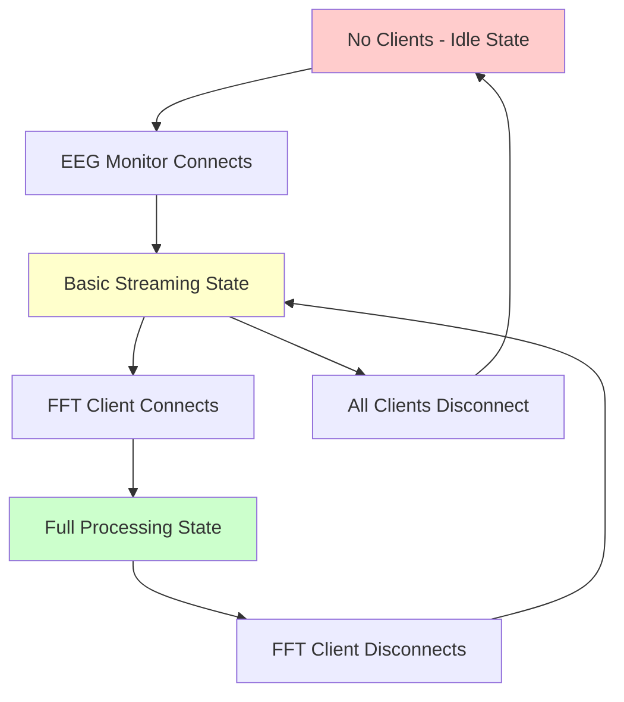

# EEG Performance Fix Implementation Plan

**Created:** 6/4/2025  
**Status:** Ready for Implementation  
**Priority:** Critical - System Cannot Start  

## Problem Analysis

### Current Issue
- **Permission Error**: PID file path `/var/run/eeg_daemon.pid` requires root privileges
- **System Status**: New consolidated system is implemented but cannot start
- **Performance Goal**: Achieve 0% CPU usage when no clients connected

### Root Cause
The PID manager is trying to write to a system directory that requires root access, but the daemon runs as user `elata`.

## Implementation Plan

### Phase 1: Fix PID File Permission (CRITICAL)

**File**: [`daemon/src/main.rs`](../daemon/src/main.rs:40)  
**Change**: Update PID file path from `/var/run/eeg_daemon.pid` to `/tmp/eeg_daemon.pid`

```rust
// Current (line 40):
let pid_file_path = "/var/run/eeg_daemon.pid";

// Fix to:
let pid_file_path = "/tmp/eeg_daemon.pid";
```

**Rationale**: `/tmp` is user-writable and appropriate for development/testing

### Phase 2: Complete WebSocket Integration (PERFORMANCE)

**Problem**: Connection manager exists but WebSocket handlers don't use it yet

#### 2.1 Update WebSocket Handlers
**File**: [`daemon/src/server.rs`](../daemon/src/server.rs)

**Changes Needed**:
1. Pass connection manager to each WebSocket handler
2. Register clients on connection with appropriate DSP requirements
3. Unregister clients on disconnection

#### 2.2 Client Type Mapping
| WebSocket Endpoint | Client Type | DSP Requirements |
|-------------------|-------------|------------------|
| `/ws/eeg/data__basic_voltage_filter` | EEG Monitor | Basic filtering only |
| `/applet/brain_waves/data` | FFT Analysis | Filtering + FFT |
| `/eeg` | Raw Data | Raw samples only |

#### 2.3 Expected State Transitions


### Phase 3: Test Performance Impact

#### 3.1 CPU Usage Verification
- **Idle State**: Should be 0% CPU usage
- **Basic State**: ~2% CPU usage with filtering
- **Full State**: ~3% CPU usage with FFT

#### 3.2 Process Count Verification
- **Before**: Multiple `eeg_daemon` processes
- **After**: Single `eeg_daemon` process

### Phase 4: EEG System Simplification (OPTIONAL)

**File**: [`driver/src/eeg_system/mod.rs`](../driver/src/eeg_system/mod.rs)  
**Current**: 347 lines with complex async task management  
**Goal**: Reduce to ~150 lines by moving DSP to coordinator  

**Benefits**:
- Cleaner separation of concerns
- Easier maintenance
- Better performance through centralized DSP

## Implementation Steps

1. **Fix PID File Path** (5 minutes)
   - Change `/var/run/eeg_daemon.pid` to `/tmp/eeg_daemon.pid`
   - Test daemon startup

2. **Integrate Connection Manager** (30 minutes)
   - Update WebSocket handlers to use connection manager
   - Map client types to DSP requirements
   - Test client registration/unregistration

3. **Verify Performance** (15 minutes)
   - Test idle state (0% CPU)
   - Test basic streaming (2% CPU)
   - Test full processing (3% CPU)

4. **Optional: Simplify EEG System** (45 minutes)
   - Move DSP logic to coordinator
   - Reduce complexity in eeg_system/mod.rs

## Success Criteria

- ✅ Daemon starts without permission errors
- ✅ Single process running (no multiple instances)
- ✅ 0% CPU usage when no clients connected
- ✅ Appropriate CPU usage based on client needs
- ✅ All existing functionality preserved

## Risk Mitigation

- **Backup**: Current working code is preserved
- **Testing**: Each phase can be tested independently
- **Rollback**: Changes are minimal and easily reversible

---

**Next Action**: Switch to Code mode to implement Phase 1 (PID file fix)