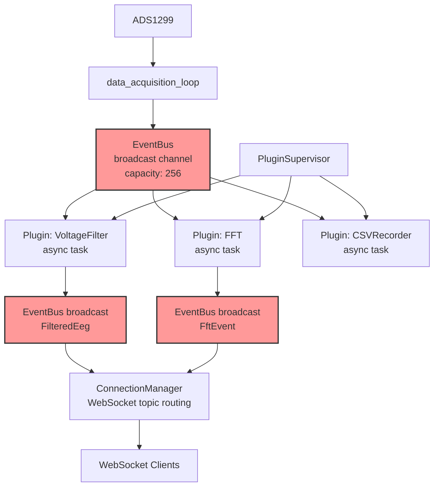
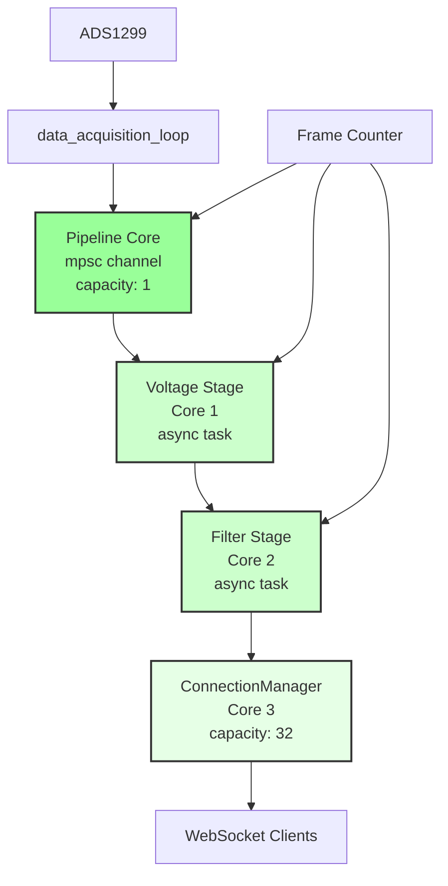
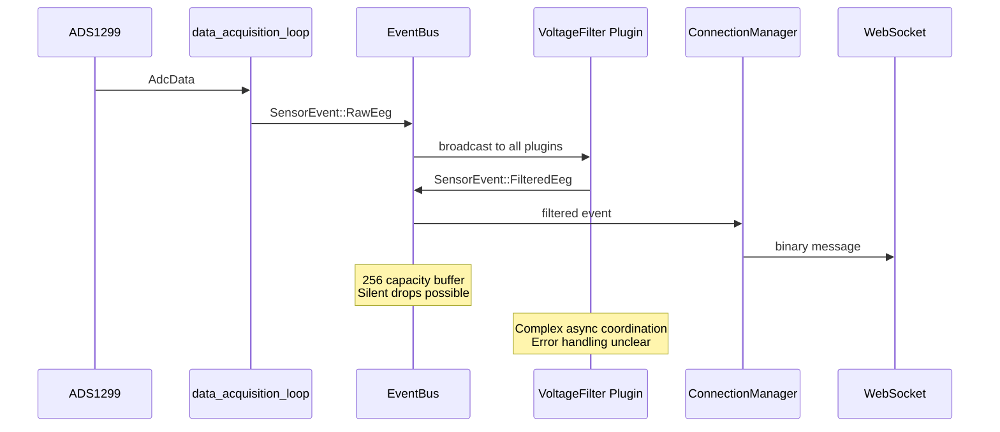
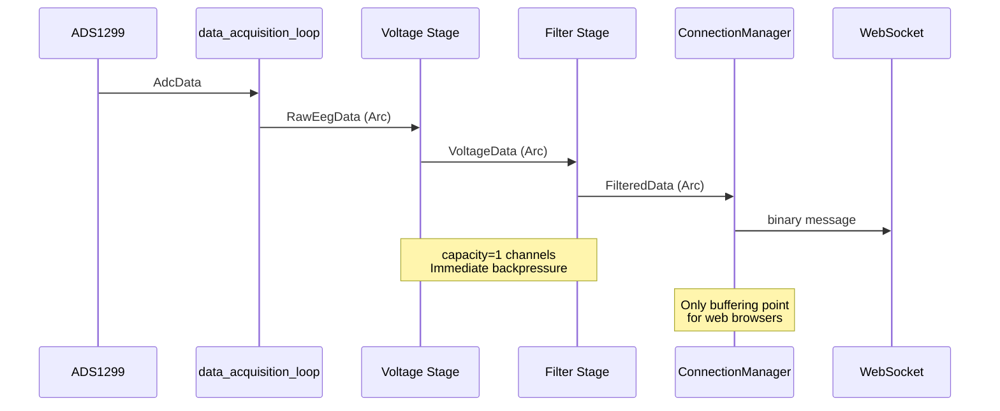

# Pipeline Implementation - Detailed Plan

## Current vs Proposed Architecture

### Current EventBus Architecture


### Proposed Pipeline Architecture


## Data Flow Comparison

### Current: Complex Event Broadcasting


### Proposed: Simple Linear Pipeline


## Implementation Steps

### Step 1: Create Pipeline Data Types

```rust
// File: crates/device/src/pipeline_types.rs

use std::sync::Arc;

#[derive(Debug, Clone)]
pub struct RawEegData {
    pub frame_id: u64,
    pub timestamps: Arc<Vec<u64>>,
    pub raw_samples: Arc<Vec<i32>>,
    pub channel_count: usize,
    pub sample_rate: f32,
}

#[derive(Debug, Clone)]
pub struct VoltageData {
    pub frame_id: u64,
    pub timestamps: Arc<Vec<u64>>,
    pub voltage_samples: Arc<Vec<f32>>,
    pub channel_count: usize,
    pub sample_rate: f32,
}

#[derive(Debug, Clone)]
pub struct FilteredData {
    pub frame_id: u64,
    pub timestamps: Arc<Vec<u64>>,
    pub filtered_samples: Arc<Vec<f32>>,
    pub channel_count: usize,
    pub sample_rate: f32,
}

impl FilteredData {
    /// Convert to binary format for WebSocket transmission
    pub fn to_binary(&self) -> Vec<u8> {
        // Reuse existing FilteredEegPacket serialization logic
        let packet = eeg_types::event::FilteredEegPacket {
            timestamps: (*self.timestamps).clone(),
            frame_id: self.frame_id,
            samples: (*self.filtered_samples).clone().into(),
            channel_count: self.channel_count,
            sample_rate: self.sample_rate,
        };
        packet.to_binary()
    }
}
```

### Step 2: Create Pipeline Core

```rust
// File: crates/device/src/pipeline_core.rs

use std::sync::Arc;
use tokio::sync::mpsc;
use tokio::task::JoinHandle;
use tokio_util::sync::CancellationToken;
use anyhow::{Result, Context};
use tracing::{info, error, warn};

use crate::pipeline_types::{RawEegData, VoltageData, FilteredData};

pub struct Pipeline {
    // Input from data_acquisition_loop
    raw_data_tx: mpsc::Sender<Arc<RawEegData>>,
    
    // Stage handles
    voltage_handle: JoinHandle<Result<()>>,
    filter_handle: JoinHandle<Result<()>>,
    
    // Output to ConnectionManager
    filtered_data_rx: mpsc::Receiver<Arc<FilteredData>>,
}

impl Pipeline {
    pub fn new(shutdown_token: CancellationToken) -> (Self, mpsc::Receiver<Arc<FilteredData>>) {
        // Create channels between stages (capacity=1 for immediate backpressure)
        let (raw_tx, raw_rx) = mpsc::channel::<Arc<RawEegData>>(1);
        let (voltage_tx, voltage_rx) = mpsc::channel::<Arc<VoltageData>>(1);
        let (filter_tx, filter_rx) = mpsc::channel::<Arc<FilteredData>>(1);
        
        // Spawn voltage conversion stage
        let voltage_shutdown = shutdown_token.clone();
        let voltage_handle = tokio::spawn(async move {
            voltage_stage(raw_rx, voltage_tx, voltage_shutdown).await
        });
        
        // Spawn filtering stage  
        let filter_shutdown = shutdown_token.clone();
        let filter_handle = tokio::spawn(async move {
            filter_stage(voltage_rx, filter_tx, filter_shutdown).await
        });
        
        let pipeline = Self {
            raw_data_tx: raw_tx,
            voltage_handle,
            filter_handle,
            filtered_data_rx: filter_rx,
        };
        
        (pipeline, filter_rx)
    }
    
    pub async fn send_raw_data(&self, data: Arc<RawEegData>) -> Result<()> {
        self.raw_data_tx.send(data).await
            .context("Failed to send raw data to pipeline")
    }
    
    pub async fn shutdown(self) -> Result<()> {
        // Wait for all stages to complete
        if let Err(e) = self.voltage_handle.await? {
            error!("Voltage stage error: {}", e);
        }
        if let Err(e) = self.filter_handle.await? {
            error!("Filter stage error: {}", e);
        }
        Ok(())
    }
}

// Stage 1: Convert raw ADC values to voltage
async fn voltage_stage(
    mut raw_rx: mpsc::Receiver<Arc<RawEegData>>,
    voltage_tx: mpsc::Sender<Arc<VoltageData>>,
    shutdown_token: CancellationToken,
) -> Result<()> {
    info!("Voltage stage starting");
    let mut expected_frame_id = 0u64;
    
    loop {
        tokio::select! {
            biased;
            _ = shutdown_token.cancelled() => {
                info!("Voltage stage received shutdown signal");
                break;
            }
            Some(raw_data) = raw_rx.recv() => {
                // Check for dropped frames
                if raw_data.frame_id != expected_frame_id {
                    let dropped = raw_data.frame_id - expected_frame_id;
                    error!("Voltage stage: detected {} dropped frames (expected {}, got {})", 
                           dropped, expected_frame_id, raw_data.frame_id);
                    return Err(anyhow::anyhow!("Frame drop detected in voltage stage"));
                }
                expected_frame_id = raw_data.frame_id + 1;
                
                // Convert raw samples to voltage
                // TODO: Get vref and gain from config
                let vref = 4.5;
                let gain = 24.0;
                
                let voltage_samples: Vec<f32> = raw_data.raw_samples
                    .iter()
                    .map(|&raw| eeg_sensor::ads1299::helpers::ch_raw_to_voltage(raw, vref, gain))
                    .collect();
                
                let voltage_data = Arc::new(VoltageData {
                    frame_id: raw_data.frame_id,
                    timestamps: raw_data.timestamps.clone(),
                    voltage_samples: Arc::new(voltage_samples),
                    channel_count: raw_data.channel_count,
                    sample_rate: raw_data.sample_rate,
                });
                
                // Send to next stage (will error if filter stage is busy)
                voltage_tx.send(voltage_data).await
                    .context("Failed to send voltage data to filter stage")?;
            }
            else => {
                warn!("Voltage stage: raw data channel closed");
                break;
            }
        }
    }
    
    info!("Voltage stage stopped");
    Ok(())
}

// Stage 2: Apply DSP filtering
async fn filter_stage(
    mut voltage_rx: mpsc::Receiver<Arc<VoltageData>>,
    filter_tx: mpsc::Sender<Arc<FilteredData>>,
    shutdown_token: CancellationToken,
) -> Result<()> {
    info!("Filter stage starting");
    let mut expected_frame_id = 0u64;
    
    // Initialize signal processor (reuse from existing plugin)
    let mut signal_processor = basic_voltage_filter_plugin::dsp::SignalProcessor::new(
        500, // sample_rate - TODO: get from config
        8,   // num_channels - TODO: get from config  
        0.5, // high_pass_cutoff_hz
        50.0, // low_pass_cutoff_hz
        60.0, // powerline_filter_hz
    );
    
    loop {
        tokio::select! {
            biased;
            _ = shutdown_token.cancelled() => {
                info!("Filter stage received shutdown signal");
                break;
            }
            Some(voltage_data) = voltage_rx.recv() => {
                // Check for dropped frames
                if voltage_data.frame_id != expected_frame_id {
                    let dropped = voltage_data.frame_id - expected_frame_id;
                    error!("Filter stage: detected {} dropped frames (expected {}, got {})", 
                           dropped, expected_frame_id, voltage_data.frame_id);
                    return Err(anyhow::anyhow!("Frame drop detected in filter stage"));
                }
                expected_frame_id = voltage_data.frame_id + 1;
                
                // Apply filtering (reuse logic from existing plugin)
                let mut filtered_samples = (*voltage_data.voltage_samples).clone();
                let samples_per_channel = filtered_samples.len() / voltage_data.channel_count;
                
                for channel_idx in 0..voltage_data.channel_count {
                    let start = channel_idx * samples_per_channel;
                    let end = start + samples_per_channel;
                    
                    if let Some(channel_chunk) = filtered_samples.get_mut(start..end) {
                        let input_chunk = channel_chunk.to_vec();
                        if let Err(e) = signal_processor.process_chunk(channel_idx, &input_chunk, channel_chunk) {
                            error!("Filter stage: error processing channel {}: {}", channel_idx, e);
                            // Use unfiltered data on error
                            channel_chunk.copy_from_slice(&input_chunk);
                        }
                    }
                }
                
                let filtered_data = Arc::new(FilteredData {
                    frame_id: voltage_data.frame_id,
                    timestamps: voltage_data.timestamps.clone(),
                    filtered_samples: Arc::new(filtered_samples),
                    channel_count: voltage_data.channel_count,
                    sample_rate: voltage_data.sample_rate,
                });
                
                // Send to ConnectionManager (will error if CM is busy)
                filter_tx.send(filtered_data).await
                    .context("Failed to send filtered data to ConnectionManager")?;
            }
            else => {
                warn!("Filter stage: voltage data channel closed");
                break;
            }
        }
    }
    
    info!("Filter stage stopped");
    Ok(())
}
```

### Step 3: Update data_acquisition_loop

```rust
// In main.rs - modify data_acquisition_loop function

async fn data_acquisition_loop(
    mut adc_rx: tokio::sync::mpsc::Receiver<AdcData>,
    pipeline: Arc<Pipeline>, // Replace EventBus with Pipeline
    config: Arc<Mutex<AdcConfig>>,
    shutdown_token: CancellationToken,
) -> anyhow::Result<()> {
    // ... existing frame batching logic ...
    
    // Replace EventBus broadcast with Pipeline send
    let raw_eeg_data = Arc::new(RawEegData {
        frame_id: frame_counter,
        timestamps: Arc::new(sample_timestamps),
        raw_samples: Arc::new(flattened_raw_samples),
        channel_count: num_channels,
        sample_rate: sample_rate.into(),
    });
    
    // Send to pipeline (will error immediately if pipeline is busy)
    pipeline.send_raw_data(raw_eeg_data).await
        .context("Failed to send data to pipeline")?;
    
    frame_counter += 1;
}
```

### Step 4: Update ConnectionManager

```rust
// Modify ConnectionManager to receive from pipeline instead of EventBus

impl ConnectionManager {
    pub fn new(
        connection_rx: mpsc::Receiver<WebSocket>,
        pipeline_rx: mpsc::Receiver<Arc<FilteredData>>, // Replace EventBus receiver
        // Remove event_bus parameter
    ) -> Self {
        // ... existing implementation but receive from pipeline_rx
    }
    
    pub async fn run(&mut self, shutdown_token: CancellationToken) {
        loop {
            tokio::select! {
                // ... existing WebSocket connection handling ...
                
                Some(filtered_data) = self.pipeline_rx.recv() => {
                    // Convert to WebSocket message format
                    let payload = Bytes::from(filtered_data.to_binary());
                    self.dispatch_binary_event(WebSocketTopic::FilteredEeg as u8, payload).await;
                }
            }
        }
    }
}
```

## Migration Strategy

### Phase 1: Parallel Implementation
1. Implement pipeline alongside existing EventBus
2. Keep both systems running
3. Compare outputs for validation

### Phase 2: Switch Over
1. Update data_acquisition_loop to use pipeline
2. Update ConnectionManager to receive from pipeline
3. Disable EventBus and plugins

### Phase 3: Cleanup
1. Remove EventBus code
2. Remove PluginSupervisor
3. Remove plugin dependencies
4. Clean up imports and dead code

## Error Handling Strategy

### Frame Drop Detection
```rust
// Each stage tracks expected frame_id
if received_frame_id != expected_frame_id {
    let dropped_count = received_frame_id - expected_frame_id;
    return Err(anyhow!("Dropped {} frames at {} stage", dropped_count, stage_name));
}
```

### Backpressure Handling
```rust
// Immediate error propagation - no try_send()
channel.send(data).await.context("Stage X is busy")?;
```

### Error Recovery
```rust
// In main.rs supervisor loop
if let Err(e) = pipeline_handle.await {
    error!("Pipeline failed: {}", e);
    // Restart entire pipeline
    pipeline = create_new_pipeline();
}
```

## Performance Characteristics

### Current EventBus System
- **Memory**: 256 * sizeof(SensorEvent) buffer per subscriber
- **CPU**: Broadcast to all plugins, even if not needed
- **Latency**: Variable due to plugin async coordination
- **Errors**: Silent drops, hard to debug

### Proposed Pipeline System  
- **Memory**: 3 * sizeof(Arc<Data>) total buffering
- **CPU**: Linear processing, no unnecessary work
- **Latency**: Predictable, single-threaded per stage
- **Errors**: Immediate detection and propagation

## Testing Plan

1. **Unit Tests**: Each pipeline stage in isolation
2. **Integration Tests**: Full pipeline with mock data
3. **Performance Tests**: Compare with EventBus system
4. **Error Tests**: Verify frame drop detection
5. **Load Tests**: Multiple WebSocket clients

## Benefits Summary

1. **Simplicity**: Linear data flow vs complex event broadcasting
2. **Reliability**: Immediate error detection vs silent failures  
3. **Performance**: Zero-copy Arc sharing, no unnecessary broadcasts
4. **Debuggability**: Clear error propagation and frame tracking
5. **Maintainability**: Single pipeline file vs distributed plugin system