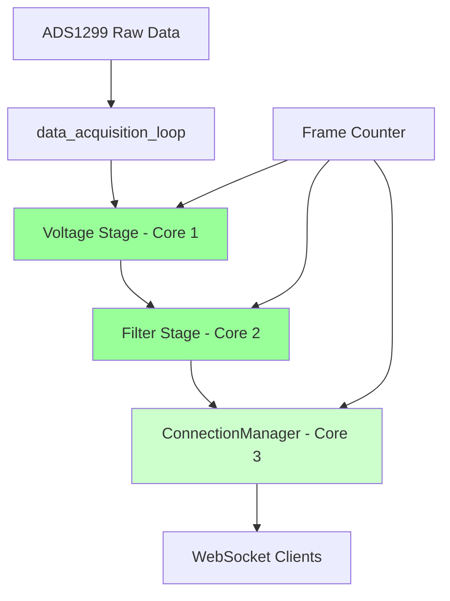

# Pipeline Transition Plan

## Overview
Replace EventBus with simple multi-core pipeline: ADS1299 → Voltage Conversion → Filtering → WebSocket

## Design Principles
1. **No channel buffering** between processing stages (capacity=1)
2. **Only ConnectionManager buffers** for multiple web browsers
3. **Frame counters** for drop detection
4. **Immediate error propagation** - no try_send(), just fail fast
5. **Multi-core** - each stage in separate async task

## Data Flow



## Implementation Steps

### Phase 1: Create Pipeline Core
- [ ] Create `crates/device/src/pipeline_core.rs`
- [ ] Define data types: `RawEegData`, `VoltageData`, `FilteredData`
- [ ] Implement frame counter logic
- [ ] Create pipeline stages as separate async functions

### Phase 2: Replace EventBus in main.rs
- [ ] Remove EventBus initialization
- [ ] Remove PluginSupervisor
- [ ] Replace with Pipeline initialization
- [ ] Update data_acquisition_loop to send to pipeline

### Phase 3: Update ConnectionManager
- [ ] Modify ConnectionManager to receive from pipeline channel
- [ ] Add buffering only for web browser connections
- [ ] Keep existing WebSocket topic subscription logic

### Phase 4: Remove Dead Code
- [ ] Remove `event_bus.rs`
- [ ] Remove `plugin_supervisor.rs`
- [ ] Remove plugin dependencies from Cargo.toml
- [ ] Clean up unused imports

## Data Types

```rust
// Core pipeline data structures
#[derive(Debug, Clone)]
pub struct RawEegData {
    pub frame_id: u64,
    pub timestamps: Arc<Vec<u64>>,
    pub raw_samples: Arc<Vec<i32>>,
    pub channel_count: usize,
    pub sample_rate: f32,
}

#[derive(Debug, Clone)]
pub struct VoltageData {
    pub frame_id: u64,
    pub timestamps: Arc<Vec<u64>>,
    pub voltage_samples: Arc<Vec<f32>>,
    pub channel_count: usize,
    pub sample_rate: f32,
}

#[derive(Debug, Clone)]
pub struct FilteredData {
    pub frame_id: u64,
    pub timestamps: Arc<Vec<u64>>,
    pub filtered_samples: Arc<Vec<f32>>,
    pub channel_count: usize,
    pub sample_rate: f32,
}
```

## Pipeline Stages

### Stage 1: Voltage Conversion
- Input: `RawEegData` from data_acquisition_loop
- Process: Convert raw ADC values to voltage using vref/gain
- Output: `VoltageData` to filter stage
- Error: If filter stage busy, propagate error up

### Stage 2: Basic Filtering  
- Input: `VoltageData` from voltage stage
- Process: Apply DSP filters (high-pass, low-pass, powerline)
- Output: `FilteredData` to ConnectionManager
- Error: If ConnectionManager busy, propagate error up

### Stage 3: ConnectionManager (existing)
- Input: `FilteredData` from filter stage
- Process: Serialize and send to WebSocket clients
- Buffering: Only here, for multiple web browser connections
- Error: Drop frames if web browsers are slow

## Error Handling Strategy

1. **Frame Drop Detection**: Each stage checks frame_id sequence
2. **Immediate Propagation**: No try_send() - fail fast on backpressure
3. **Error Context**: Include stage name and frame_id in errors
4. **Recovery**: Let main.rs decide whether to restart or continue

## Channel Configuration

```rust
// Between processing stages - no buffering
let (voltage_tx, voltage_rx) = mpsc::channel::<Arc<VoltageData>>(1);
let (filter_tx, filter_rx) = mpsc::channel::<Arc<FilteredData>>(1);

// To ConnectionManager - buffer for web browsers
let (websocket_tx, websocket_rx) = mpsc::channel::<Arc<FilteredData>>(32); // batch_size
```

## Benefits

1. **Simpler Architecture**: Linear pipeline vs complex EventBus
2. **Better Error Handling**: Immediate failure vs silent drops
3. **Easier Debugging**: Clear data flow and error propagation
4. **Multi-Core Utilization**: Each stage on separate core
5. **Zero-Copy**: Arc<T> for data sharing between stages

## Migration Strategy

1. Keep existing code working during transition
2. Implement pipeline alongside EventBus initially
3. Switch data_acquisition_loop to use pipeline
4. Remove EventBus and plugins after verification
5. Clean up dead code

## Testing

- [ ] Verify frame counters detect drops correctly
- [ ] Test error propagation through pipeline
- [ ] Confirm multi-core utilization
- [ ] Validate WebSocket data integrity
- [ ] Performance comparison with EventBus system