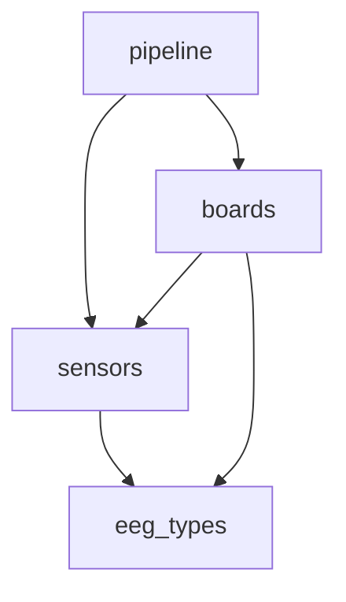

# Remaining Compilation Errors and Fix Plan

## Current Dependency Graph

The cyclic dependency between `pipeline`, `sensors`, and `boards` has been successfully resolved. The current dependency graph is as follows:

## Analysis of Remaining Compiler Errors

Even with the cycle broken, there are several remaining compiler errors that need to be addressed. These errors are all related to the refactoring that was done to break the cycle.

Here's a breakdown of the errors and the plan to fix them:

### 1. Unresolved Imports

*   **Error:** `unresolved import ...`
*   **Files Affected:**
    *   `crates/daemon/src/config.rs`
    *   `crates/daemon/src/plugin_supervisor.rs`
    *   `crates/pipeline/examples/basic_pipeline.rs`
    *   `crates/pipeline/examples/full_pipeline_test.rs`
    *   `crates/pipeline/src/stages/eeg_source.rs`
    *   `crates/daemon/src/main.rs`
*   **Cause:** The refactoring moved several types and traits to different crates.
*   **Fix:** I will update the `use` statements in each of the affected files to point to the new locations of the types and traits.

### 2. `AdcConfig` Field Removed

*   **Error:** `struct AdcConfig has no field named board_driver`
*   **File Affected:** `crates/daemon/src/main.rs`
*   **Cause:** The `board_driver` field was removed from `AdcConfig` as part of the refactoring. The logic for selecting a driver has been moved to the `AdcDriverBuilder`.
*   **Fix:** I will replace the old driver creation logic with the new `AdcDriverBuilder`. This will involve creating a new builder, setting the driver type and ADC config, and then calling `build()`.

## Next Steps

I will now proceed with fixing these errors. I will start with the unresolved imports and then move on to the `AdcConfig` issue.