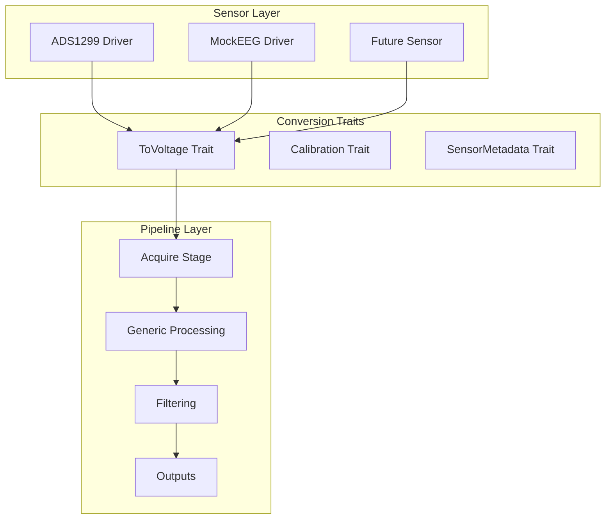

# Sensor-Pipeline Architecture Analysis & Recommendations

## Executive Summary

This document analyzes the architectural tension between sensor-specific logic and generic pipeline stages in the EEG system, building on the existing pipeline-graph-architecture and current codebase analysis.

## Current State Analysis

### What We Have
- **Sensors/Devices**: ADS1299, MockEEG with hardware-specific drivers
- **Pipeline Stages**: Generic stages like `to_voltage` with parameterized conversion logic
- **Data Flow**: Raw ADC → Pipeline Conversion → Voltage → Processing → Outputs
- **Architecture**: DAG-based pipeline with shared computation and fan-out

### The Core Problem
The `to_voltage` stage currently contains generic conversion logic that assumes all sensors follow the same pattern:
```rust
fn raw_to_voltage(&self, raw_value: i32) -> f32 {
    let max_value = (1 << (self.adc_bits - 1)) - 1;
    (raw_value as f32 / max_value as f32) * self.vref
}
```

This creates coupling between pipeline stages and sensor characteristics.

## Architectural Options Analysis

### Option A: Pipeline Stages Own Logic (Current)
**Pros**: Simple, direct control
**Cons**: Adding new sensors requires modifying pipeline stages, code duplication

### Option B: Trait-Based Sensor Conversion
**Pros**: Extensible, clean boundaries
**Cons**: Pipeline must know which sensor instance to use

### Option C: Sensor-Only Conversion
**Pros**: Fully generic pipeline
**Cons**: Loses raw data for reprocessing, some stages may need raw values

### Option D: Hybrid with Dynamic Dispatch
**Pros**: Maximum flexibility, supports multiple sensor types
**Cons**: Higher complexity, runtime overhead

## Recommended Architecture: Enhanced Option B

### Core Principle: Sensors Own Their Domain Knowledge



### Key Design Decisions

1. **Sensors implement conversion traits** but pipeline stages remain generic
2. **Conversion happens at the sensor-pipeline boundary** (in acquire stage)
3. **Pipeline stages work with standardized data** but can access sensor metadata
4. **Raw data is preserved** for reprocessing scenarios

## Detailed Implementation Plan

### Phase 1: Define Sensor Conversion Traits

```rust
/// Trait for sensor-specific voltage conversion
pub trait SensorConverter: Send + Sync {
    /// Convert raw ADC value to voltage
    fn raw_to_voltage(&self, raw_value: i32) -> f32;
    
    /// Get sensor reference voltage
    fn vref(&self) -> f32;
    
    /// Get ADC resolution in bits
    fn adc_bits(&self) -> u8;
    
    /// Get sensor-specific metadata
    fn sensor_metadata(&self) -> SensorMetadata;
    
    /// Handle sensor-specific calibration
    fn apply_calibration(&self, voltage: f32, channel: u8) -> f32 {
        voltage // Default: no calibration
    }
}

/// Metadata about the sensor
#[derive(Debug, Clone)]
pub struct SensorMetadata {
    pub sensor_type: String,
    pub model: String,
    pub calibration_date: Option<chrono::DateTime<chrono::Utc>>,
    pub custom_properties: HashMap<String, serde_json::Value>,
}
```

### Phase 2: Implement Traits for Existing Sensors

```rust
// In crates/sensors/src/ads1299/converter.rs
pub struct Ads1299Converter {
    pub vref: f32,
    pub adc_bits: u8,
    pub gain: f32,
    pub calibration_data: Option<CalibrationData>,
}

impl SensorConverter for Ads1299Converter {
    fn raw_to_voltage(&self, raw_value: i32) -> f32 {
        let max_value = (1 << (self.adc_bits - 1)) - 1;
        let voltage = (raw_value as f32 / max_value as f32) * self.vref;
        // Apply ADS1299-specific scaling
        voltage / self.gain
    }
    
    fn vref(&self) -> f32 { self.vref }
    fn adc_bits(&self) -> u8 { self.adc_bits }
    
    fn sensor_metadata(&self) -> SensorMetadata {
        SensorMetadata {
            sensor_type: "ADS1299".to_string(),
            model: "ADS1299EEG_FE".to_string(),
            calibration_date: self.calibration_data.as_ref().map(|c| c.date),
            custom_properties: HashMap::new(),
        }
    }
    
    fn apply_calibration(&self, voltage: f32, channel: u8) -> f32 {
        if let Some(cal) = &self.calibration_data {
            voltage * cal.channel_gains[channel as usize] + cal.channel_offsets[channel as usize]
        } else {
            voltage
        }
    }
}
```

### Phase 3: Modify Acquire Stage to Use Sensor Converters

```rust
// In crates/pipeline/src/stages/acquire.rs
pub struct AcquireStage {
    sensor_driver: Box<dyn AdcDriver>,
    converter: Arc<dyn SensorConverter>,
    // ... other fields
}

impl AcquireStage {
    pub fn new(
        sensor_driver: Box<dyn AdcDriver>,
        converter: Arc<dyn SensorConverter>
    ) -> Self {
        Self { sensor_driver, converter }
    }
}

#[async_trait]
impl PipelineStage for AcquireStage {
    async fn process(&mut self, _input: PipelineData) -> PipelineResult<PipelineData> {
        // Get raw data from sensor
        let raw_data = self.sensor_driver.read_data().await?;
        
        // Convert using sensor-specific logic
        let voltage_samples: Vec<f32> = raw_data.raw_samples
            .iter()
            .enumerate()
            .map(|(i, &raw)| {
                let voltage = self.converter.raw_to_voltage(raw);
                self.converter.apply_calibration(voltage, (i % self.channel_count) as u8)
            })
            .collect();
        
        // Create EegPacket with both raw and converted data
        let packet = EegPacket::new(
            raw_data.timestamps,
            raw_data.frame_id,
            raw_data.raw_samples,
            voltage_samples,
            self.channel_count,
            self.sample_rate,
        );
        
        // Attach sensor metadata
        packet.set_sensor_metadata(self.converter.sensor_metadata());
        
        Ok(PipelineData::RawEeg(Arc::new(packet)))
    }
}
```

### Phase 4: Simplify or Remove to_voltage Stage

Since conversion now happens in the acquire stage, the `to_voltage` stage becomes either:

1. **Removed entirely** (recommended for most cases)
2. **Simplified to handle re-conversion** with different parameters for research scenarios
3. **Converted to a generic scaling stage** for post-acquisition adjustments

### Phase 5: Update Pipeline Configuration

```json
{
  "stages": [
    {
      "name": "acquire1",
      "type": "acquire",
      "params": {
        "sensor_type": "ADS1299",
        "sensor_config": {
          "vref": 4.5,
          "gain": 24,
          "adc_bits": 24,
          "sample_rate": 500
        }
      }
    },
    {
      "name": "filter1",
      "type": "filter",
      "params": {"lowpass": 0.5},
      "inputs": ["acquire1"]
    }
  ]
}
```

## Benefits of This Approach

1. **Extensibility**: New sensors only need to implement the converter trait
2. **Clean Boundaries**: Sensor logic stays with sensors, pipeline logic stays generic
3. **Flexibility**: Supports complex sensor-specific calibration and conversion
4. **Data Preservation**: Raw data is still available for reprocessing
5. **Performance**: Conversion happens once at acquisition time
6. **Testability**: Converter traits can be easily mocked for testing

## Edge Cases Handled

1. **Multiple Sensor Types**: Each acquire stage has its own converter
2. **Non-linear Conversion**: Converter trait can implement any conversion logic
3. **Calibration**: Built into the converter with per-channel adjustments
4. **Legacy/Mock Sensors**: Implement simple converters that match current behavior
5. **Research Scenarios**: Raw data preserved for alternative processing

## Migration Strategy

1. **Phase 1**: Implement traits and converters alongside existing code
2. **Phase 2**: Update acquire stages to use converters (backward compatible)
3. **Phase 3**: Deprecate to_voltage stage parameters in favor of sensor configs
4. **Phase 4**: Remove or simplify to_voltage stage
5. **Phase 5**: Update documentation and examples

## Comparison with Original Analysis

This approach aligns with the "Enhanced Option B" from the original analysis but with key improvements:

- **Conversion happens at acquisition boundary** rather than in separate pipeline stages
- **Raw data is preserved** for flexibility
- **Sensor metadata is carried forward** for traceability
- **Pipeline stages remain truly generic** while supporting sensor-specific needs

## Next Steps

1. Implement the `SensorConverter` trait and related types
2. Create converters for existing sensors (ADS1299, MockEEG)
3. Update acquire stage to use converters
4. Test with existing pipeline configurations
5. Plan deprecation of current to_voltage stage approach

This architecture provides the extensibility and clean boundaries needed while maintaining the flexibility of the current pipeline system.