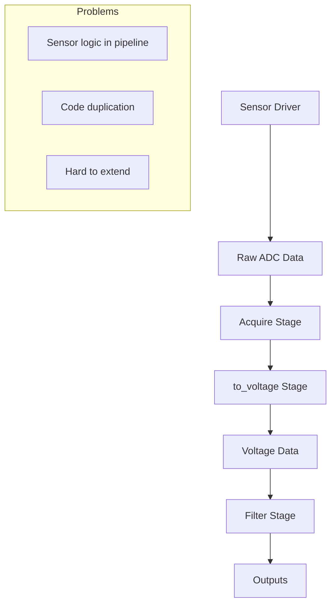
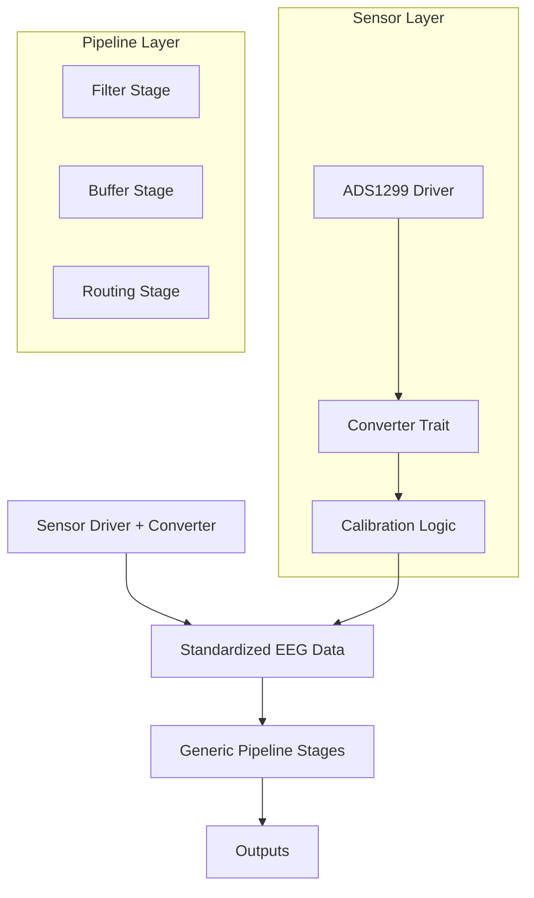

# Sensor-Pipeline Implementation Plan

## Overview

This document provides a detailed implementation plan for restructuring the sensor-pipeline architecture to eliminate code duplication and improve extensibility while maintaining clean separation of concerns.

## Current vs. Proposed Architecture

### Current Architecture Flow


### Proposed Architecture Flow


## Implementation Phases

### Phase 1: Define Core Traits and Types

#### 1.1 Create Sensor Converter Trait

**File**: `crates/sensors/src/converter.rs`

```rust
use std::collections::HashMap;
use serde_json::Value;
use chrono::{DateTime, Utc};

/// Trait for sensor-specific data conversion
#[async_trait::async_trait]
pub trait SensorConverter: Send + Sync + std::fmt::Debug {
    /// Convert raw ADC value to voltage
    fn raw_to_voltage(&self, raw_value: i32) -> f32;
    
    /// Get sensor reference voltage
    fn vref(&self) -> f32;
    
    /// Get ADC resolution in bits
    fn adc_bits(&self) -> u8;
    
    /// Get sensor-specific metadata
    fn sensor_metadata(&self) -> SensorMetadata;
    
    /// Apply sensor-specific calibration
    fn apply_calibration(&self, voltage: f32, channel: u8) -> f32 {
        voltage // Default: no calibration
    }
    
    /// Validate raw value is within expected range
    fn validate_raw_value(&self, raw_value: i32) -> bool {
        let max_value = (1 << (self.adc_bits() - 1)) - 1;
        let min_value = -(1 << (self.adc_bits() - 1));
        raw_value >= min_value && raw_value <= max_value
    }
    
    /// Get conversion parameters as JSON for serialization
    fn conversion_params(&self) -> Value;
}

/// Metadata about the sensor and its configuration
#[derive(Debug, Clone, serde::Serialize, serde::Deserialize)]
pub struct SensorMetadata {
    pub sensor_type: String,
    pub model: String,
    pub serial_number: Option<String>,
    pub firmware_version: Option<String>,
    pub calibration_date: Option<DateTime<Utc>>,
    pub conversion_params: Value,
    pub custom_properties: HashMap<String, Value>,
}

/// Calibration data for multi-channel sensors
#[derive(Debug, Clone, serde::Serialize, serde::Deserialize)]
pub struct CalibrationData {
    pub date: DateTime<Utc>,
    pub channel_gains: Vec<f32>,
    pub channel_offsets: Vec<f32>,
    pub temperature_coefficient: Option<f32>,
    pub notes: Option<String>,
}
```

#### 1.2 Enhanced EEG Data Types

**File**: `crates/eeg_types/src/event.rs` (additions)

```rust
/// Enhanced EEG packet with sensor metadata
#[derive(Debug, Clone)]
pub struct EegPacket {
    // Existing fields...
    pub timestamps: Vec<u64>,
    pub frame_id: u64,
    pub raw_samples: Vec<i32>,
    pub voltage_samples: Vec<f32>,
    pub channel_count: usize,
    pub sample_rate: f32,
    
    // New fields
    pub sensor_metadata: Option<SensorMetadata>,
    pub conversion_applied: bool,
    pub quality_metrics: Option<DataQualityMetrics>,
}

#[derive(Debug, Clone, serde::Serialize, serde::Deserialize)]
pub struct DataQualityMetrics {
    pub signal_to_noise_ratio: Option<f32>,
    pub saturation_count: u32,
    pub out_of_range_count: u32,
    pub timestamp_jitter: Option<f32>,
}
```

### Phase 2: Implement Sensor-Specific Converters

#### 2.1 ADS1299 Converter

**File**: `crates/sensors/src/ads1299/converter.rs`

```rust
use super::super::converter::{SensorConverter, SensorMetadata, CalibrationData};
use serde_json::{json, Value};
use std::collections::HashMap;

#[derive(Debug, Clone)]
pub struct Ads1299Converter {
    pub vref: f32,
    pub adc_bits: u8,
    pub gain: f32,
    pub model: String,
    pub serial_number: Option<String>,
    pub calibration_data: Option<CalibrationData>,
}

impl Ads1299Converter {
    pub fn new(vref: f32, gain: f32) -> Self {
        Self {
            vref,
            adc_bits: 24, // ADS1299 is always 24-bit
            gain,
            model: "ADS1299EEG_FE".to_string(),
            serial_number: None,
            calibration_data: None,
        }
    }
    
    pub fn with_calibration(mut self, calibration: CalibrationData) -> Self {
        self.calibration_data = Some(calibration);
        self
    }
    
    pub fn with_serial_number(mut self, serial: String) -> Self {
        self.serial_number = Some(serial);
        self
    }
}

#[async_trait::async_trait]
impl SensorConverter for Ads1299Converter {
    fn raw_to_voltage(&self, raw_value: i32) -> f32 {
        // ADS1299-specific conversion formula
        let max_value = (1 << (self.adc_bits - 1)) - 1;
        let voltage = (raw_value as f32 / max_value as f32) * self.vref;
        
        // Apply gain scaling (ADS1299 has programmable gain)
        voltage / self.gain
    }
    
    fn vref(&self) -> f32 { self.vref }
    fn adc_bits(&self) -> u8 { self.adc_bits }
    
    fn sensor_metadata(&self) -> SensorMetadata {
        SensorMetadata {
            sensor_type: "ADS1299".to_string(),
            model: self.model.clone(),
            serial_number: self.serial_number.clone(),
            firmware_version: None, // Could be read from device
            calibration_date: self.calibration_data.as_ref().map(|c| c.date),
            conversion_params: self.conversion_params(),
            custom_properties: HashMap::new(),
        }
    }
    
    fn apply_calibration(&self, voltage: f32, channel: u8) -> f32 {
        if let Some(cal) = &self.calibration_data {
            if (channel as usize) < cal.channel_gains.len() {
                voltage * cal.channel_gains[channel as usize] + 
                cal.channel_offsets[channel as usize]
            } else {
                voltage
            }
        } else {
            voltage
        }
    }
    
    fn conversion_params(&self) -> Value {
        json!({
            "vref": self.vref,
            "adc_bits": self.adc_bits,
            "gain": self.gain,
            "conversion_formula": "linear_bipolar"
        })
    }
}
```

#### 2.2 Mock EEG Converter

**File**: `crates/sensors/src/mock_eeg/converter.rs`

```rust
use super::super::converter::{SensorConverter, SensorMetadata};
use serde_json::{json, Value};
use std::collections::HashMap;

#[derive(Debug, Clone)]
pub struct MockEegConverter {
    pub vref: f32,
    pub adc_bits: u8,
    pub noise_level: f32,
}

impl MockEegConverter {
    pub fn new() -> Self {
        Self {
            vref: 3.3,
            adc_bits: 16,
            noise_level: 0.01,
        }
    }
}

#[async_trait::async_trait]
impl SensorConverter for MockEegConverter {
    fn raw_to_voltage(&self, raw_value: i32) -> f32 {
        // Simple linear conversion for mock data
        let max_value = (1 << (self.adc_bits - 1)) - 1;
        (raw_value as f32 / max_value as f32) * self.vref
    }
    
    fn vref(&self) -> f32 { self.vref }
    fn adc_bits(&self) -> u8 { self.adc_bits }
    
    fn sensor_metadata(&self) -> SensorMetadata {
        SensorMetadata {
            sensor_type: "MockEEG".to_string(),
            model: "Simulated".to_string(),
            serial_number: Some("MOCK-001".to_string()),
            firmware_version: Some("1.0.0".to_string()),
            calibration_date: None,
            conversion_params: self.conversion_params(),
            custom_properties: HashMap::new(),
        }
    }
    
    fn conversion_params(&self) -> Value {
        json!({
            "vref": self.vref,
            "adc_bits": self.adc_bits,
            "noise_level": self.noise_level,
            "conversion_formula": "linear_mock"
        })
    }
}
```

### Phase 3: Update Acquire Stage

#### 3.1 Enhanced Acquire Stage

**File**: `crates/pipeline/src/stages/acquire.rs` (major refactor)

```rust
use async_trait::async_trait;
use serde_json::json;
use std::collections::HashMap;
use std::sync::Arc;
use tracing::{info, error, warn};

use eeg_types::{EegPacket, DataQualityMetrics};
use sensors::{AdcDriver, DriverEvent, SensorConverter};
use crate::data::PipelineData;
use crate::error::{PipelineError, PipelineResult};
use crate::stage::{PipelineStage, StageFactory, StageParams, StageMetric};

/// Enhanced acquire stage that integrates sensor drivers with converters
pub struct AcquireStage {
    sensor_driver: Box<dyn AdcDriver>,
    converter: Arc<dyn SensorConverter>,
    channel_count: usize,
    sample_rate: f32,
    
    // Metrics
    packets_generated: u64,
    conversion_errors: u64,
    quality_warnings: u64,
}

impl AcquireStage {
    pub fn new(
        sensor_driver: Box<dyn AdcDriver>,
        converter: Arc<dyn SensorConverter>,
        channel_count: usize,
        sample_rate: f32,
    ) -> Self {
        Self {
            sensor_driver,
            converter,
            channel_count,
            sample_rate,
            packets_generated: 0,
            conversion_errors: 0,
            quality_warnings: 0,
        }
    }
    
    fn calculate_quality_metrics(&self, raw_samples: &[i32], voltage_samples: &[f32]) -> DataQualityMetrics {
        let mut saturation_count = 0;
        let mut out_of_range_count = 0;
        
        let max_raw = (1 << (self.converter.adc_bits() - 1)) - 1;
        let min_raw = -(1 << (self.converter.adc_bits() - 1));
        
        for &raw in raw_samples {
            if raw >= max_raw || raw <= min_raw {
                saturation_count += 1;
            }
            if !self.converter.validate_raw_value(raw) {
                out_of_range_count += 1;
            }
        }
        
        DataQualityMetrics {
            signal_to_noise_ratio: None, // Could calculate if needed
            saturation_count,
            out_of_range_count,
            timestamp_jitter: None, // Could calculate from timestamps
        }
    }
}

#[async_trait]
impl PipelineStage for AcquireStage {
    async fn process(&mut self, _input: PipelineData) -> PipelineResult<PipelineData> {
        // Get raw data from sensor driver
        // Note: This would need to be adapted based on your actual driver interface
        let raw_data = match self.sensor_driver.read_data().await {
            Ok(data) => data,
            Err(e) => {
                return Err(PipelineError::RuntimeError {
                    stage_name: "acquire".to_string(),
                    message: format!("Sensor read error: {}", e),
                });
            }
        };
        
        // Convert raw samples to voltages using sensor-specific converter
        let mut voltage_samples = Vec::with_capacity(raw_data.raw_samples.len());
        let mut conversion_errors = 0;
        
        for (i, &raw) in raw_data.raw_samples.iter().enumerate() {
            if self.converter.validate_raw_value(raw) {
                let voltage = self.converter.raw_to_voltage(raw);
                let calibrated_voltage = self.converter.apply_calibration(
                    voltage, 
                    (i % self.channel_count) as u8
                );
                voltage_samples.push(calibrated_voltage);
            } else {
                conversion_errors += 1;
                voltage_samples.push(0.0); // Or some error value
                warn!("Invalid raw value {} at sample {}", raw, i);
            }
        }
        
        if conversion_errors > 0 {
            self.conversion_errors += conversion_errors;
        }
        
        // Calculate quality metrics
        let quality_metrics = self.calculate_quality_metrics(&raw_data.raw_samples, &voltage_samples);
        
        if quality_metrics.saturation_count > 0 || quality_metrics.out_of_range_count > 0 {
            self.quality_warnings += 1;
        }
        
        // Create enhanced EEG packet
        let mut packet = EegPacket::new(
            raw_data.timestamps,
            self.packets_generated,
            raw_data.raw_samples,
            voltage_samples,
            self.channel_count,
            self.sample_rate,
        );
        
        // Attach sensor metadata and quality info
        packet.sensor_metadata = Some(self.converter.sensor_metadata());
        packet.conversion_applied = true;
        packet.quality_metrics = Some(quality_metrics);
        
        self.packets_generated += 1;
        
        info!("Generated EEG packet #{} with sensor conversion applied", 
              self.packets_generated);
        
        Ok(PipelineData::RawEeg(Arc::new(packet)))
    }
    
    fn stage_type(&self) -> &'static str {
        "acquire"
    }
    
    fn description(&self) -> &'static str {
        "Data acquisition stage with integrated sensor conversion"
    }
    
    async fn initialize(&mut self) -> PipelineResult<()> {
        info!("Initializing acquire stage with sensor: {}", 
               self.converter.sensor_metadata().sensor_type);
        
        // Initialize sensor driver
        if let Err(e) = self.sensor_driver.start_acquisition().await {
            return Err(PipelineError::RuntimeError {
                stage_name: "acquire".to_string(),
                message: format!("Failed to start sensor acquisition: {}", e),
            });
        }
        
        Ok(())
    }
    
    async fn cleanup(&mut self) -> PipelineResult<()> {
        info!("Cleaning up acquire stage, generated {} packets, {} conversion errors, {} quality warnings", 
               self.packets_generated, self.conversion_errors, self.quality_warnings);
        
        if let Err(e) = self.sensor_driver.stop_acquisition().await {
            error!("Error stopping sensor acquisition: {}", e);
        }
        
        Ok(())
    }
    
    fn get_metrics(&self) -> Vec<StageMetric> {
        vec![
            StageMetric::new(
                "packets_generated".to_string(),
                self.packets_generated as f64,
                "count".to_string(),
            ),
            StageMetric::new(
                "conversion_errors".to_string(),
                self.conversion_errors as f64,
                "count".to_string(),
            ),
            StageMetric::new(
                "quality_warnings".to_string(),
                self.quality_warnings as f64,
                "count".to_string(),
            ),
            StageMetric::new(
                "sensor_vref".to_string(),
                self.converter.vref() as f64,
                "V".to_string(),
            ),
        ]
    }
}
```

### Phase 4: Update Pipeline Configuration

#### 4.1 Enhanced Configuration Schema

```json
{
  "version": "2.0",
  "metadata": {
    "created": "2025-01-08T22:00:00Z",
    "description": "Enhanced pipeline with sensor-specific conversion"
  },
  "sensors": {
    "primary_eeg": {
      "type": "ADS1299",
      "config": {
        "vref": 4.5,
        "gain": 24,
        "sample_rate": 500,
        "channels": [0, 1, 2, 3, 4, 5, 6, 7],
        "calibration_file": "ads1299_cal_20250108.json"
      }
    }
  },
  "stages": [
    {
      "name": "acquire1",
      "type": "acquire",
      "params": {
        "sensor_ref": "primary_eeg",
        "channel_count": 8
      }
    },
    {
      "name": "filter1",
      "type": "filter",
      "params": {
        "lowpass": 50.0,
        "highpass": 0.5,
        "notch": 60.0
      },
      "inputs": ["acquire1"]
    },
    {
      "name": "display_ws",
      "type": "websocket_sink",
      "params": {
        "endpoint": "ws://filtered_data",
        "fields": ["timestamp", "voltage_samples", "sensor_metadata"]
      },
      "inputs": ["filter1"]
    }
  ]
}
```

## Migration Strategy

### Step 1: Parallel Implementation
- Implement new traits alongside existing code
- Create converters for existing sensors
- Add feature flag for new vs. old behavior

### Step 2: Gradual Transition
- Update acquire stage to optionally use converters
- Deprecate to_voltage stage parameters
- Update documentation and examples

### Step 3: Full Migration
- Remove old conversion logic from pipeline stages
- Make converter usage mandatory in acquire stage
- Update all configuration files

### Step 4: Cleanup
- Remove deprecated code
- Optimize performance
- Add comprehensive tests

## Testing Strategy

### Unit Tests
- Test each converter implementation
- Test acquire stage with different sensors
- Test error handling and edge cases

### Integration Tests
- Test full pipeline with real sensor data
- Test configuration loading and validation
- Test migration from old to new format

### Performance Tests
- Benchmark conversion performance
- Test memory usage with large datasets
- Validate real-time processing capabilities

## Benefits Summary

1. **Extensibility**: New sensors only need converter implementation
2. **Maintainability**: Sensor logic stays with sensor code
3. **Flexibility**: Supports complex calibration and conversion
4. **Data Quality**: Built-in validation and quality metrics
5. **Traceability**: Full sensor metadata preserved with data
6. **Performance**: Single conversion at acquisition time

This implementation plan provides a clear path forward while maintaining backward compatibility during the transition.