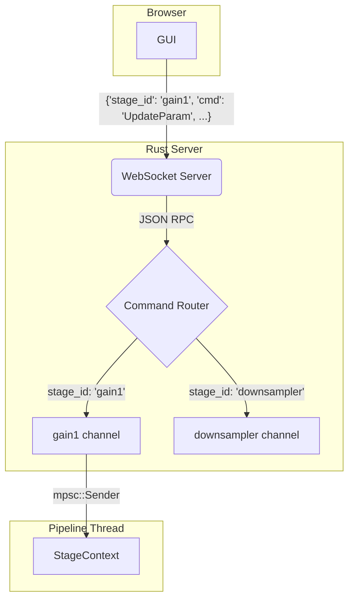

# Unified Hybrid Sensor Pipeline Architecture

**Version: 1.1**

This document provides a single, authoritative guide to the new hybrid sensor pipeline architecture. It consolidates the high-level design, detailed implementation plan, transition strategy, and answers to key technical questions.

## 1. Executive Summary

To meet the high-performance requirements of the project, we are adopting a hybrid pipeline architecture. This design separates the system into two distinct planes:

*   **The Control Plane:** The existing `PipelineGraph` and `PipelineRuntime`, responsible for configuration, management, and low-frequency event handling using standard `tokio` channels.
*   **The Data Plane:** A new, high-performance path for real-time sensor data. It is built on four core principles:
    1.  **Zero-Copy Data Flow:** Pre-allocated `MemoryPool`s provide reusable data packets of various sizes, eliminating runtime allocations.
    2.  **Lock-Free Communication:** Bounded, lock-free queues (`rtrb` or `crossbeam`) pass lightweight packet pointers between stages, avoiding mutex contention.
    3.  **Data-Driven Execution:** The pipeline is activated by the arrival of data from the acquisition source, similar to an interrupt-driven system. The run loop is non-blocking to ensure responsiveness.
    4.  **Separation of Concerns:** The data path is isolated from the control path, allowing for independent operation and control (e.g., pausing the pipeline).

This approach provides the performance and stability required for real-time processing while retaining the flexibility of the existing system for control and configuration.

## 2. Architectural Deep Dive

### 2.1. Data Flow and Key Components

```mermaid
graph TD
    subgraph Control Plane (Tokio-based)
        A[PipelineRuntime] -- Manages --> B{PipelineGraph};
        B -- Configures & Spawns --> D_Thread;
    end

    subgraph Data Plane (Dedicated Thread)
        style D_Thread fill:#f9f,stroke:#333,stroke-width:2px
        D_Thread["Data Plane Thread Loop"];
        
        subgraph within D_Thread
            Pool[Memory Pool] -- Allocates --> P1(Packet);
            Acquire -- Pushes to --> Q1{Queue};
            Q1 -- Pops from --> Gain;
            Gain -- Pushes to --> Q2{Queue};
            Q2 -- Pops from --> Sink;
        end
    end
    
    subgraph Packet Structure
        P1 -- Contains --> Header[PacketHeader];
        P1 -- Contains --> Data[T: Buffer];
    end

    A -- "Control Msgs (e.g., change param)" --> Gain;
    Sink -- "Returns Packet to" --> Pool;

    style Pool fill:#ccf,stroke:#333,stroke-width:2px
    style Q1 fill:#eef,stroke:#333,stroke-width:1px
    style Q2 fill:#eef,stroke:#333,stroke-width:1px
    style P1 fill:#dfd,stroke:#333,stroke-width:1px
```

### 2.2. The `MemoryPool` and `Packet<T>` Smart Pointer

The `MemoryPool` is a thread-safe, lock-free container that holds a number of pre-allocated `Packet<T>` buffers. Its internal free-list is implemented with `crossbeam::ArrayQueue` for maximum performance.

*   **`Packet<T>`:** A smart pointer that contains a `PacketHeader` and a mutable reference to a buffer (`T`). Its `Drop` implementation automatically returns the buffer to its origin pool. This is the cornerstone of the zero-copy design.
*   **`PacketHeader`:** A metadata struct carried with every packet. It includes essential runtime information like `batch_size` and `timestamp`. Stages that modify the data's shape (e.g., a downsampler) are responsible for updating the header before sending the packet downstream.
*   **Acquisition Methods:** The pool provides two ways to get a packet:
    *   `acquire()`: An `async` method that waits until a packet is available.
    *   `try_acquire()`: A non-blocking method that returns `Option<Packet<T>>`. This allows stages to handle pool exhaustion by either dropping a frame or applying backpressure.
*   **Safety:** The implementation of the pool and packet requires `unsafe` Rust to manage the static lifetimes. This code will be isolated in its own module and rigorously tested with `miri` and `loom` to prevent undefined behavior.
*   **Multiple Pools for Different Data Shapes:** The system supports multiple, named memory pools. This is critical for stages like downsamplers, which change the batch size (and thus packet size) of the data. A stage can acquire a packet from one pool and produce a packet for another.

### 2.2.1. Dynamic Batch Size Handling

The pipeline supports dynamic batch sizes to accommodate stages that alter the data's shape, such as downsamplers or FFT windowing stages. The batch size is not a single, pipeline-wide constant. Instead, it is a property of the data itself, carried within each `Packet<T>`'s header.

*   **Propagation:** By default, a stage should assume the output batch size is the same as the input batch size. Most stages, like filters or gain stages, modify data in-place and do not need to change the batch size.
*   **Transformation:** Stages that fundamentally change the number of samples (e.g., a downsampler that consumes 16 samples to produce 1) are responsible for this transformation. The workflow is as follows:
    1.  Receive an input `Packet<T>` (e.g., with `batch_size: 16`).
    2.  Process the data.
    3.  Acquire a *new* `Packet<U>` from a `MemoryPool` configured for the smaller output size (e.g., `batch_size: 1`).
    4.  Populate the new packet and send it downstream.
*   **Origination:** The initial batch size is determined by the acquisition stage at the beginning of the pipeline (e.g., reading from a sensor). This stage acquires packets from a memory pool configured for its specific needs.

This model provides maximum flexibility, allowing different parts of the pipeline to operate on data chunks of the most appropriate size, which is critical for both performance (e.g., FFTs on power-of-two sizes) and latency (e.g., smaller batches for UI updates).

### 2.3. Bounded, Lock-Free Queues

Communication between data plane stages is handled by bounded, single-producer, single-consumer (SPSC) or multiple-producer, single-consumer (MPSC) lock-free queues.

*   **No Mutexes:** These queues use atomic operations, not mutexes, for all per-packet communication, ensuring the data path is wait-free.
*   **Configurable Capacity:** The capacity of each queue is a critical tuning parameter set in the pipeline's JSON configuration. A small capacity (e.g., 4) minimizes latency for fast stages, while a larger capacity (e.g., 200) absorbs jitter for slow, I/O-bound stages like a WebSocket sink.
*   **Sizing Formula:** As a rule of thumb, the minimum queue capacity can be estimated with the formula: `min_capacity = ceil(max_stage_latency_ms / batch_period_ms)`. This helps prevent random guessing during configuration.

## 3. Implementation Plan

### 3.1. Core Data Structures (`Packet<T>`, `MemoryPool`, `StageQueue`)

1.  **`Packet<T>`:** Implement the smart pointer with a custom `Drop` trait to return its buffer to the pool.
2.  **`MemoryPool<T>`:** Implement the lock-free pool using `crossbeam::ArrayQueue`. Provide both `acquire` (blocking) and `try_acquire` (non-blocking) methods. Hot-path methods like `acquire` and `release` should be marked with `#[inline(always)]`.
3.  **`StageQueue<T>`:** Create a wrapper around `rtrb` or `crossbeam::queue::ArrayQueue` that implements our `Input` and `Output` traits.

### 3.2. Stage and Runtime Implementation

1.  **`Input`/`Output` Traits:**
    ```rust
    pub trait Input<T> {
        async fn recv(&mut self) -> Result<Option<Packet<T>>, StageError>;
    }
    pub trait Output<T> {
        async fn send(&mut self, packet: Packet<T>) -> Result<(), StageError>;
    }
    ```
2.  **`DataPlaneStage` Trait:** Define the core trait for all high-performance stages.
3.  **`StageContext`:** Create the context struct passed to each stage, containing access to the memory pool and the stage's I/O channels.
4.  **`HybridRuntime`:** Implement the runtime that executes the data plane loop on a dedicated thread.

### 3.3. Configuration Loading

The `GraphBuilder` will be updated to:
1.  Read queue capacities from a `connections` array in the JSON config.
2.  Define and configure multiple `memory_pools` with specific packet sizes and counts.
3.  Recognize a new `data_plane` stage type.
4.  Deserialize stage-specific `params` from the JSON (e.g., filter coefficients, downsampling factors) and pass them to the stage's constructor.
5.  Connect stage inputs and outputs, including specifying which memory pool an output should draw from.

## 4. Stage Developer's Guide & Code Example

A developer implements the `DataPlaneStage` trait. The runtime handles the rest.

**The primary source of truth for the developer experience is the detailed code example document: [`todo/pipeline-stage-code-example.md`](todo/pipeline-stage-code-example.md).** That document provides fully-commented examples of how to build stages that handle data processing, memory management, and pipeline control.

**Key Principles for Stage Developers:**

*   **Receive a Packet:** `let packet = context.inputs.get_mut("my_input").unwrap().recv().await?;`
*   **Handle Empty Queues:** The `recv` call is non-blocking. If it returns `Ok(None)`, the stage should simply `return Ok(())` to yield its turn in the run loop.
*   **Modify In-Place:** If possible, modify the packet's data directly. This is the most efficient approach.
*   **Allocate a New Packet:** Only if the stage's output is a different type or size from its input, call `let new_packet = context.memory_pool.acquire::<NewType>().await;`
*   **Send a Packet:** `context.outputs.get_mut("my_output").unwrap().send(packet).await?;`
*   **Memory Release is Automatic:** `Packet<T>`'s `Drop` implementation handles returning memory to the pool.

## 5. Transition Plan

The transition will be incremental to minimize risk.

1.  **Phase 1 (Coexistence):** Create `ToDataPlane` and `FromDataPlane` bridge stages. This allows the new and old runtimes to coexist, with data being copied between them.
2.  **Phase 2 (Migration):** Migrate performance-critical stages (e.g., Gain stage) to the `DataPlaneStage` trait one by one.
3.  **Phase 3 (Full Transition):** Once all high-rate stages are migrated, remove the bridge stages.

## 6. Risk Analysis & Mitigation

This design's primary complexity lies in the `unsafe` code required for the memory pool.

*   **Risk:** Undefined behavior (data races, memory corruption) due to incorrect `unsafe` implementation.
*   **Mitigation:**
    1.  **Isolation:** The `MemoryPool` and `Packet` will be developed in a separate, self-contained module.
    2.  **Rigorous Testing:** Use `miri` to detect undefined behavior and `loom` to test for concurrency issues under heavy load.
    3.  **Fault Injection:** Wrap stage execution in `catch_unwind` to prevent a single stage panic from corrupting the memory pool.
    4.  **Observability:** Add `tracing` spans to all key operations (acquire, release, send, recv) to monitor the system's health.

This unified document provides a complete and actionable plan. Are you ready to approve this architecture and move forward with implementation?

## 7. Implementation and Documentation Standards

To ensure clarity and maintainability, the following standards are required for implementation:

1.  **In-Code Documentation:** All `unsafe` blocks must be accompanied by a `// SAFETY:` comment explaining the invariants that make the operation safe.
2.  **Conceptual Comments:** Complex mechanisms (e.g., the non-blocking run loop, memory pool management, backpressure handling) must be explained with high-level comments in the relevant modules.
3.  **Configuration-Driven:** All magic numbers (queue sizes, batch sizes, filter taps, etc.) must be configurable through the pipeline's JSON configuration file, not hardcoded.
4.  **Explicit Error Handling:** All functions that can fail must return a `Result`. Panics should only be used for unrecoverable logic errors. Stage execution will be wrapped in `catch_unwind` to prevent a single plugin from crashing the data plane.

## 8. Pipeline Control & State Management

This section details the mechanisms for controlling the pipeline's state and passing commands from the user interface to individual stages.

### 8.1. “Recording Lock”: Preventing Live Edits

To ensure data integrity and system stability during a recording, the pipeline implements a "recording lock." This lock prevents parameters from being changed while the pipeline is actively processing data. The responsibility for enforcing this is layered.

| Layer              | What it protects                                    | How to implement                                                                                                                                                                     |
| ------------------ | --------------------------------------------------- | ------------------------------------------------------------------------------------------------------------------------------------------------------------------------------------ |
| **GUI**            | UX clarity (“Settings greyed-out while REC is red”) | Disable controls when the pipeline state → `Running`                                                                                                                                 |
| **Runtime (Rust)** | Hard safety—prevents rogue clients/scripts          | Add `PipelineState` in the runtime. `UpdateParam` is *ignored* (or queued) unless `state == Paused`. <br>`rust if runtime_state.load() == Running { return Err(StageError::Busy); }` |

### 8.2. GUI to Stage Control Flow

Control commands (e.g., updating a filter's coefficients) originate from the GUI and are sent to the pipeline runtime over a single WebSocket connection. The server then routes the command to the appropriate stage's control channel.



The JSON RPC message contains the `stage_id` which the server uses as a key to look up the correct `mpsc::Sender` for the target stage.

**Example JSON RPC:**
```json
{
  "stage_id": "gain1",
  "cmd": "UpdateParam",
  "key": "gain",
  "value": 1.5
}
```