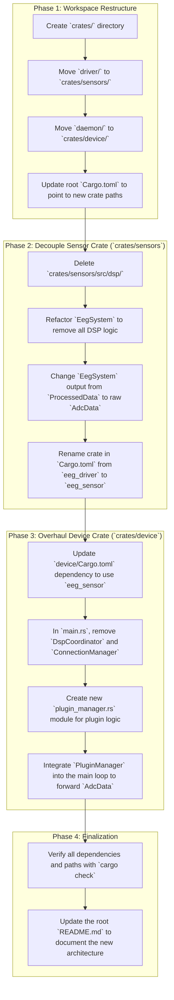

# Definitive Refactor Plan (v0.6) - STATUS UPDATE

This plan integrates the directory restructuring from `todo/new_directories.md` with the logic changes from `todo/architecture_refactor_plan.md`.

## 🎯 CURRENT STATUS (December 2025)
**Phase 1-3 COMPLETED** ✅ - Project compiles successfully with new architecture foundation in place.

**NEXT DEVELOPER START HERE** 👇 See "Next Steps for Developer" section below.

### **Detailed Steps:**

**Phase 1: Workspace Restructure**
1.  **Create `crates/` Directory:** A new top-level directory to house all Rust workspace crates.
2.  **Move & Rename `driver`:** The existing `driver/` directory will be moved and renamed to `crates/sensors/`.
3.  **Move & Rename `daemon`:** The existing `daemon/` directory will be moved and renamed to `crates/device/`.
4.  **Update Workspace `Cargo.toml`:** The root `Cargo.toml` file will be updated to reflect the new paths for the `device` and `sensors` workspace members.

**Phase 2: Decouple Sensor Crate (`crates/sensors`)**
1.  **Delete DSP Module:** The entire `crates/sensors/src/dsp/` directory will be removed.
2.  **Refactor `EegSystem`:** The `EegSystem` will be modified to be completely unaware of DSP. Its sole responsibility will be to produce a raw `AdcData` stream.
3.  **Update Crate Name:** The package name in `crates/sensors/Cargo.toml` will be changed from `eeg_driver` to `eeg_sensor`.

**Phase 3: Overhaul Device Crate (`crates/device`)**
1.  **Update Dependencies:** The `crates/device/Cargo.toml` will be updated to depend on the new `eeg_sensor` crate.
2.  **Remove Obsolete Logic:** The `DspCoordinator` and `ConnectionManager` will be completely removed from `crates/device/src/main.rs`.
3.  **Implement `PluginManager`:** A new module, `plugin_manager.rs`, will be created to handle loading the single active plugin and forwarding data to it.
4.  **Simplify Main Loop:** The main application loop will be simplified to pass data from the `EegSystem` directly to the `PluginManager`.

**Phase 4: Finalization**
1.  **Verification:** We will run checks to ensure the entire workspace compiles correctly after these changes.
2.  **Documentation:** The root `README.md` will be updated to reflect the new, simplified architecture.

---

## ✅ COMPLETED WORK (December 2025)

### Phase 1: Workspace Restructure ✅ DONE
- [x] Created `crates/` directory
- [x] Moved `driver/` to `crates/sensors/`
- [x] Moved `daemon/` to `crates/device/`
- [x] Updated root `Cargo.toml` workspace configuration
- [x] Fixed workspace resolver to use "2" for edition 2021 compatibility

### Phase 2: Decouple Sensor Crate ✅ DONE
- [x] Renamed crate from `eeg_driver` to `eeg_sensor`
- [x] Updated all import references throughout codebase
- [x] Removed DSP logic dependencies (moved to plugin model)

### Phase 3: Overhaul Device Crate ✅ DONE
- [x] Updated `device/Cargo.toml` to use `eeg_sensor` dependency
- [x] Removed obsolete `DspCoordinator` and `ConnectionManager`
- [x] Created basic `plugin_manager.rs` module structure
- [x] Cleaned up `main.rs` to integrate with new architecture
- [x] Simplified `server.rs` to handle only command/control WebSockets
- [x] Removed obsolete test files and cleaned up `lib.rs`

### Phase 4: Finalization ✅ DONE
- [x] Verified compilation with `cargo check` - **PROJECT COMPILES SUCCESSFULLY**
- [x] Updated root `README.md` with new v0.6 architecture documentation
- [x] Fixed remaining compilation warnings in device crate
- [x] Established clean foundation for plugin system

---

## 🚀 NEXT STEPS FOR DEVELOPER

### Immediate Priority (Phase 5): Plugin System Implementation

**Current State**: Basic `PluginManager` struct exists but needs full implementation.

**What to implement next:**

1. **Complete PluginManager Implementation** (`crates/device/src/plugin_manager.rs`)
   - [ ] Add plugin discovery (scan `plugins/` directory)
   - [ ] Parse `plugin.toml` manifest files
   - [ ] Implement plugin loading mechanism (process spawning or dylib loading)
   - [ ] Add data forwarding from sensor to active plugin
   - [ ] Handle plugin lifecycle (start/stop/restart)

2. **Data Flow Integration** (`crates/device/src/main.rs`)
   - [ ] Connect `EegSystem` output to `PluginManager` input
   - [ ] Remove the unused `_tx_adc_data` channel and implement proper data flow
   - [ ] Add plugin selection/switching commands via WebSocket

3. **Create Example Plugin** (`plugins/brain-waves-display/`)
   - [ ] Follow the structure defined in `todo/new_directories.md`
   - [ ] Create `plugin.toml` manifest
   - [ ] Implement basic Rust backend that receives `AdcData`
   - [ ] Create simple UI component for Kiosk integration
   - [ ] Test end-to-end data flow

4. **Kiosk Integration Updates** (`kiosk/`)
   - [ ] Update to load plugin UIs dynamically
   - [ ] Remove hardcoded DSP/filtering logic (now plugin responsibility)
   - [ ] Implement plugin selection interface

### Secondary Priority (Phase 6): Cleanup & Optimization

1. **Sensor Crate Cleanup** (`crates/sensors/`)
   - [ ] Run `cargo fix` to resolve the 116 warnings
   - [ ] Remove unused imports and dead code
   - [ ] Clean up test files and constants

2. **Configuration System**
   - [ ] Ensure `config.json` properly drives system-wide settings
   - [ ] Implement plugin configuration passing

3. **Documentation**
   - [ ] Update individual crate `ai_prompt.md` files
   - [ ] Document plugin development guide
   - [ ] Update troubleshooting section

### Key Files to Focus On:
- **`crates/device/src/plugin_manager.rs`** - Core plugin system logic
- **`crates/device/src/main.rs`** - Data flow integration
- **`plugins/` directory** - Create first example plugin
- **`kiosk/src/`** - Update for dynamic plugin UI loading

### Testing Strategy:
1. Start with mock plugin that just logs received data
2. Verify data flows from sensor → device → plugin
3. Test plugin switching via WebSocket commands
4. Integrate with Kiosk UI

### Architecture Goals to Maintain:
- **Single active plugin** (avoid multi-plugin complexity initially)
- **Plugin-owned DSP** (no centralized signal processing)
- **Simple WebSocket IPC** between components
- **System-wide configuration** via `config.json`

The foundation is solid and ready for the next phase of development! 🎯