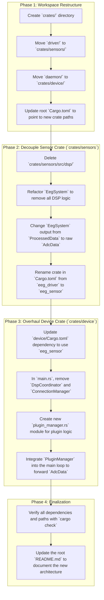

# Definitive Refactor Plan (v0.6)

This plan integrates the directory restructuring from `todo/new_directories.md` with the logic changes from `todo/architecture_refactor_plan.md`.

### **Detailed Steps:**

**Phase 1: Workspace Restructure**
1.  **Create `crates/` Directory:** A new top-level directory to house all Rust workspace crates.
2.  **Move & Rename `driver`:** The existing `driver/` directory will be moved and renamed to `crates/sensors/`.
3.  **Move & Rename `daemon`:** The existing `daemon/` directory will be moved and renamed to `crates/device/`.
4.  **Update Workspace `Cargo.toml`:** The root `Cargo.toml` file will be updated to reflect the new paths for the `device` and `sensors` workspace members.

**Phase 2: Decouple Sensor Crate (`crates/sensors`)**
1.  **Delete DSP Module:** The entire `crates/sensors/src/dsp/` directory will be removed.
2.  **Refactor `EegSystem`:** The `EegSystem` will be modified to be completely unaware of DSP. Its sole responsibility will be to produce a raw `AdcData` stream.
3.  **Update Crate Name:** The package name in `crates/sensors/Cargo.toml` will be changed from `eeg_driver` to `eeg_sensor`.

**Phase 3: Overhaul Device Crate (`crates/device`)**
1.  **Update Dependencies:** The `crates/device/Cargo.toml` will be updated to depend on the new `eeg_sensor` crate.
2.  **Remove Obsolete Logic:** The `DspCoordinator` and `ConnectionManager` will be completely removed from `crates/device/src/main.rs`.
3.  **Implement `PluginManager`:** A new module, `plugin_manager.rs`, will be created to handle loading the single active plugin and forwarding data to it.
4.  **Simplify Main Loop:** The main application loop will be simplified to pass data from the `EegSystem` directly to the `PluginManager`.

**Phase 4: Finalization**
1.  **Verification:** We will run checks to ensure the entire workspace compiles correctly after these changes.
2.  **Documentation:** The root `README.md` will be updated to reflect the new, simplified architecture.