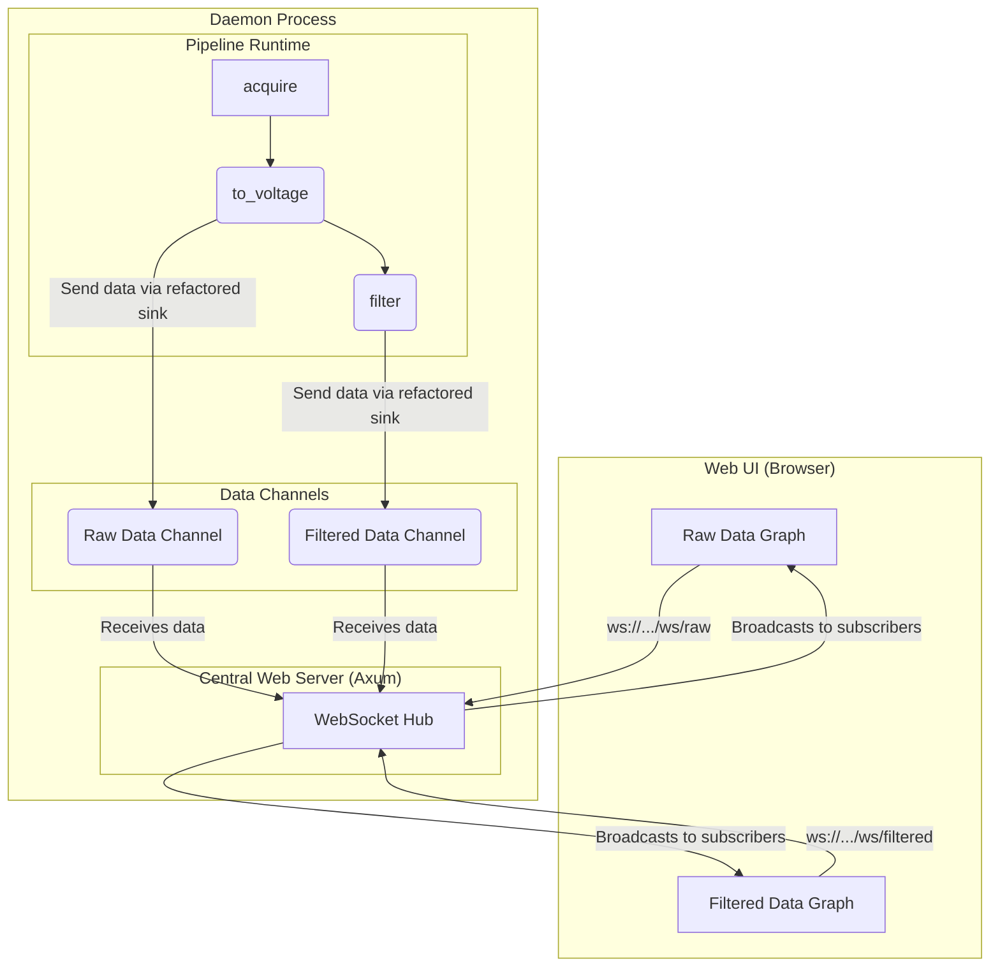

# Architectural Plan: Centralized Web UI Control Plane

This document summarizes the investigation and architectural decisions for creating a web-based UI to control the EEG daemon's data pipeline.

## 1. Initial Investigation & Questions

The initial query focused on understanding the core mechanics of the existing data pipeline.

-   **Q1: Can a sensor be a pipeline stage?**
-   **Q2: How does the `csv_recorder` get both raw and voltage data?**
-   **Q3: Where do timestamps originate?**

## 2. Core Pipeline Analysis & Findings

Our investigation of the `crates/pipeline` and `crates/daemon` code revealed the following:

-   **Sensor as a Source:** A sensor is indeed the root of a pipeline, represented by an `acquire` stage that produces the initial `Packet`s.
-   **Combined Data Packets:** The `csv_sink` works by receiving a special `Packet::RawAndVoltage` packet. The upstream `to_voltage` stage is responsible for creating this combined packet, preserving the original raw data alongside the new voltage data. This avoids the need for a complex fan-in stage.
-   **Timestamp Integrity:** Timestamps are generated by the sensor driver at the moment of acquisition and are placed in the `PacketHeader`. This header is immutable and travels with the data through every stage, ensuring a consistent source of truth.
-   **Architectural Duality:** The codebase contains two distinct architectures:
    1.  A legacy **event-bus system** in `crates/eeg_types`.
    2.  The modern, explicit **pipeline graph system** in `crates/pipeline`.
    -   **Decision:** All future development will build upon the `pipeline` system.

## 3. The Web Control Plane: From Standalone Sinks to a Central Hub

The initial implementation of the `websocket_sink` stage showed it acting as its own standalone web server for each instance.

**User Feedback:** This is not the desired architecture. The goal is to have a single, centralized web server within the main daemon process that manages all UI communication.

### Proposed Architecture: Centralized WebSocket Hub

This is the agreed-upon architecture for the web control plane.

-   **Core Principle:** The daemon process is the single source of truth. It runs the pipeline and hosts the web server. The pipeline itself does not directly handle web connections.
-   **Data Flow:** A `websocket_sink` in the pipeline will no longer be a server. It will be a simple component that receives a data packet and forwards it into a `tokio::sync::broadcast` channel, whose receiver is held by the central WebSocket Hub.

## 4. Implementation Plan

The following is a comprehensive to-do list for implementing this architecture.

-   [ ] **Decision: Adopt Centralized Web Server:** Formally adopt the architecture where a single web server runs inside the daemon, managing all API and WebSocket traffic.
-   [ ] **Task: Add Web Server Dependencies:** Add `tokio`, `axum`, and `tower-http` to the `crates/daemon/Cargo.toml` and remove the old `warp` dependency.
-   [ ] **Task: Create Central Web Server:** Implement the Axum web server in `crates/daemon/src/web_server.rs`, including a shared `AppState` for communication channels.
-   [ ] **Task: Create WebSocket Hub:** Within the central web server, implement a hub to manage WebSocket connections and topic subscriptions (e.g., `/ws/data/raw`, `/ws/data/filtered`).
-   [ ] **Task: Refactor `websocket_sink` Stage:** Modify the existing `websocket_sink` so that it no longer starts a server. Instead, it should accept a channel `Sender` during creation and send all received packets into that channel.
-   [ ] **Task: Integrate Web Server into Daemon:** In `crates/daemon/src/main.rs`, spawn the new web server as a long-running `tokio` task and provide it with the necessary channels to communicate with the pipeline control loop.
-   [ ] **Task: Define Pipeline Control API:** Design and implement HTTP endpoints (e.g., `POST /api/pipeline/load`, `GET /api/pipeline/status`) for the web UI to manage the pipeline.
-   [ ] **Task: Design "Idle/Heartbeat" Pipeline:** Create a default pipeline configuration that runs on startup, sending a simple heartbeat to a WebSocket endpoint to signal to the UI that the daemon is live.
-   [ ] **Task: Document New Architecture:** Create a new markdown file (`crates/daemon/ARCHITECTURE.md`) to document the centralized web server design, data flow, and API endpoints for future reference.
-   [ ] **Task: Plan for Legacy Code Deprecation:** Create a plan to phase out the unused parts of the old event-bus system to reduce complexity.
