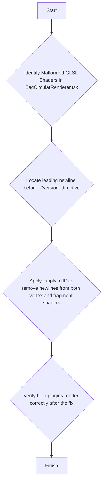

# WebGL Shader Fix Plan

## 1. Problem Analysis

The application's `brain_waves_fft` and `eeg-circular-graph` plugins are failing to render. Console logs indicate multiple WebGL errors, specifically:

```
WebGL warning: linkProgram: Must have a compiled vertex shader attached:
SHADER_INFO_LOG:
ERROR: 0:2: '
' : #version directive must occur on the first line of the shader
```

This error points to a malformed shader source string.

## 2. Root Cause

The root cause was identified in `plugins/eeg-circular-graph/ui/EegCircularRenderer.tsx`. The GLSL shader source code is defined within template literals that contain a leading newline character before the `#version 300 es` directive.

**Problematic Code:**
```typescript
// Vertex Shader
gl.shaderSource(vertexShader, `
  #version 300 es
  ...
`);

// Fragment Shader
gl.shaderSource(fragmentShader, `
  #version 300 es
  ...
`);
```

The GLSL specification requires the `#version` directive to be the very first token in the shader string. The leading newline violates this rule, causing the shader compilation to fail. This critical error in one component likely destabilizes the WebGL context, causing other WebGL-dependent components (like the FFT renderer) to fail as well.

## 3. Execution Plan

The fix is to remove the leading newline from both the vertex and fragment shader source strings in `plugins/eeg-circular-graph/ui/EegCircularRenderer.tsx`.



This targeted change will ensure the shaders are compliant with the GLSL specification, allowing them to compile successfully and enabling the circular graph to render. This is expected to resolve the instability in the WebGL context and allow the FFT graph to render as well.