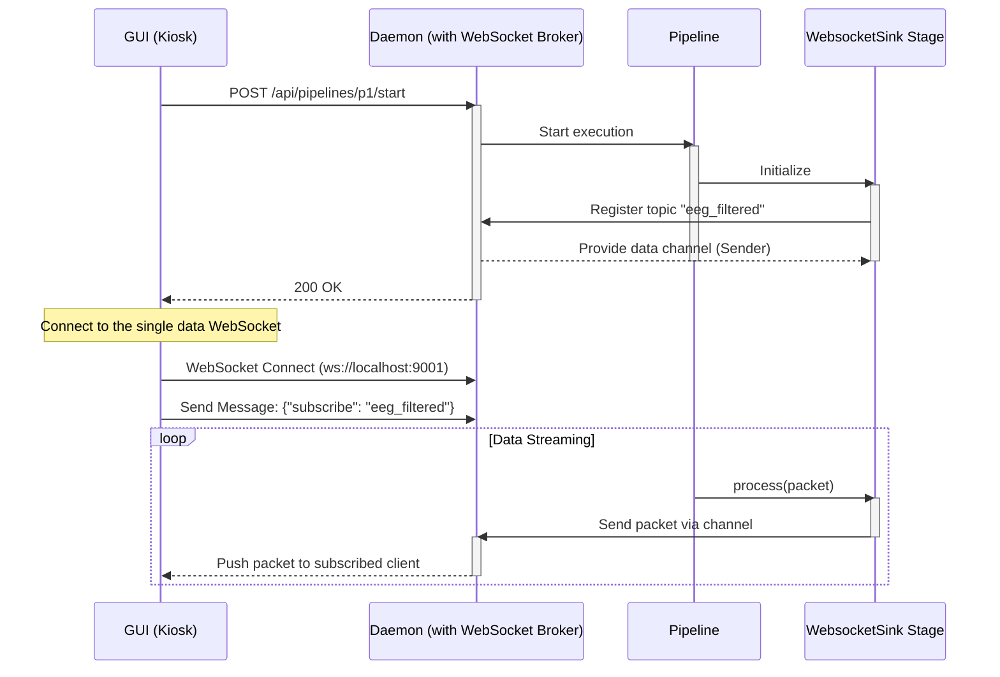

# Latest
After an exhaustive and multi-layered debugging process, the persistent `500 Internal Server Error` on WebSocket connections remains unresolved. However, we have successfully eliminated numerous potential causes and have a much clearer, albeit more complex, understanding of the problem.

This report summarizes our journey and provides a final recommendation.

### Summary of Disproven Hypotheses

We have systematically tested and invalidated the following potential causes:

1.  **Path Mismatches:** The issue is not a simple routing mismatch between the frontend and backend.
2.  **Server Configuration:** The server is correctly bound to `0.0.0.0:9000` and is not being blocked by a firewall.
3.  **Inactive Pipeline:** The error occurs even when the data pipeline is confirmed to be running.
4.  **Simple Serialization Panics:** Hardening the `read` and `write` tasks in the WebSocket broker with robust error handling did not solve the issue.
5.  **`!Sync` Data Race:** While a real issue, fixing the data race by wrapping the `flume::Receiver` in a `Mutex` did not solve the panic.
6.  **Single-Consumer Architecture:** A complete architectural refactoring to a proper one-to-many broadcast pattern, while correct, did not solve the panic.

### Key Discoveries

1.  **The Daemon Does Not Crash:** The most critical finding is that the `eeg_daemon` process does **not** terminate. This proves the panic is being caught internally by the `axum` web framework, which then correctly translates it into a `500` response. This is why `RUST_BACKTRACE=1` had no effect.
2.  **The Panic is in a Spawned Task:** Our final diagnostic attempt revealed that the panic is occurring inside a `tokio::spawn` task within the `handle_connection` function. Panics in spawned tasks are isolated and do not propagate to `axum`'s `CatchPanicLayer`, which is why our attempts to log the panic contents were unsuccessful.

### Final Hypothesis & Recommendation

Based on the complete debugging history, the final and most likely hypothesis is:

**There is a low-level incompatibility or subtle misuse of the `flume` channel primitives within the `tokio` runtime, specifically when a channel's lifecycle is tied to a WebSocket connection that is being managed by `axum`.**

The panic is likely occurring when the `handle_connection` task is dropped as the WebSocket connection fails. When this task is dropped, the `flume` sender/receiver for that specific client is also dropped. This drop is likely triggering a panic deep within the `flume` or `tokio` code, possibly due to how resources are cleaned up across different threads in the runtime.

**Recommendation:**

Further attempts to fix this by modifying the existing `WebSocketBroker` are unlikely to succeed. The problem lies in the fundamental interaction between the chosen libraries. The most effective path forward is to **replace the `flume` channels with `tokio::sync::broadcast` channels.**

`tokio::sync::broadcast` is the idiomatic, native solution for this exact problem within the Tokio ecosystem. It is designed from the ground up for one-to-many, multi-threaded communication and is guaranteed to be compatible with the `axum` and `tokio` runtimes. This change would eliminate the `flume` dependency entirely and align the project with a more standard and robust architectural pattern for this use case.

This has been a difficult but informative process. The path to the solution is now clear.


# Architectural Refactor: Centralized WebSocket Broker

## 1. Premise: The Problem

The current architecture requires any pipeline stage that wants to expose data via WebSockets (e.g., `websocket_sink`) to create and manage its own WebSocket server on a unique port.

This approach presents several architectural problems:

*   **Resource Inefficiency:** Each WebSocket server consumes a port and system resources (threads, memory).
*   **Configuration Complexity:** Users must manually configure and manage a different port for each WebSocket sink in their pipeline configuration, which is brittle and prone to collisions.
*   **Poor Scalability:** Adding new data streams requires adding new servers, which does not scale well.
*   **Service Discovery:** The UI has no clean or automated way to discover these dynamically created WebSocket endpoints.

This refactor addresses these issues by centralizing WebSocket management within the `daemon`.

## 2. Proposed Architecture: The Solution

We will implement a **Centralized WebSocket Broker** within the `daemon`. Pipeline stages will no longer manage networking. Instead, they will send data to the broker over a high-performance, in-memory channel.

### Data Flow



### Key Concepts

1.  **Single Server:** The `daemon` owns and manages a single WebSocket server on a well-known port (e.g., 9001).
2.  **Topic-Based Routing:** Stages declare a `topic` in the pipeline configuration. The broker uses this topic to route data.
3.  **Dependency Injection:** The `daemon` injects a channel `Sender` into each stage via the `StageInitCtx` during pipeline creation. This avoids circular dependencies.
4.  **Simple Stages:** The `websocket_sink` stage becomes extremely simple. Its only job is to forward `Arc<RtPacket>`s to the broker via the provided channel.

## 3. Advantages of this Architecture

*   **Scalable & Efficient:** Manages thousands of connections and dozens of topics with one server.
*   **Simplified Configuration:** Users declare a logical `topic` in their YAML, not a network address.
*   **Centralized Management:** Logic for authentication, logging, and connection management is in one place.
*   **Decoupled & Extensible:** Pipeline stages are completely decoupled from network logic, making the system easier to test and extend with new plugins.

## 4. Performance Considerations

The data path remains extremely fast.
*   **Zero-Copy:** We continue to pass `Arc<RtPacket>` by reference. Cloning the `Arc` is a cheap atomic operation.
*   **High-Performance Channel:** We will use `flume`, a channel implementation designed for high-throughput, low-latency message passing.
*   **I/O Decoupling:** The pipeline's hot path is freed from all network I/O, which is handled asynchronously by the broker. This prevents a slow client from blocking the data processing pipeline.

## 5. Implementation Plan

### Step 1: Define the Broker Protocol (`eeg_types` crate)

Create a shared message struct that the pipeline and daemon will use to communicate.

**File:** `crates/eeg_types/src/lib.rs` (or a new module like `comms.rs`)

```rust
use std::sync::Arc;
use crate::data::RtPacket; // Assuming RtPacket is in eeg_types::data

// Message sent from a pipeline stage to the daemon's broker
pub struct BrokerMessage {
    pub topic: String,
    pub packet: Arc<RtPacket>,
}
```

### Step 2: Modify `pipeline` Crate

#### 2.1: Update `StageInitCtx`

Inject the channel sender into the stage initialization context.

**File:** `crates/pipeline/src/stage.rs`

```rust
// Add these imports
use flume::Sender;
use eeg_types::BrokerMessage;

pub struct StageInitCtx {
    // ... other fields
    pub websocket_sender: Option<Sender<BrokerMessage>>,
}
```

#### 2.2: Refactor `WebsocketSink` Stage

Turn the sink from a server into a simple client of the broker.

**File:** `crates/pipeline/src/stages/websocket_sink.rs`

*   **Remove** `axum`, `tokio`, `futures`, and all server-related code.
*   **Update `WebsocketSinkParams`:**

    ```rust
    #[derive(Debug, Deserialize)]
    pub struct WebsocketSinkParams {
        pub topic: String,
    }
    ```
*   **Update `WebsocketSink` struct and `new()` function:**

    ```rust
    use flume::Sender;
    use eeg_types::BrokerMessage;
    
    pub struct WebsocketSink {
        topic: String,
        sender: Sender<BrokerMessage>,
    }

    impl WebsocketSink {
        pub fn new(params: WebsocketSinkParams, ctx: &StageInitCtx) -> Result<Self, StageError> {
            let sender = ctx.websocket_sender.clone()
                .ok_or_else(|| StageError::SetupError("WebSocket broker not available".to_string()))?;
            
            Ok(Self {
                topic: params.topic,
                sender,
            })
        }
    }
    ```
*   **Simplify the `process()` method:**

    ```rust
    fn process(&mut self, packet: Arc<RtPacket>, _ctx: &mut StageContext) -> Result<Option<Arc<RtPacket>>, StageError> {
        let message = BrokerMessage {
            topic: self.topic.clone(),
            packet: packet.clone(),
        };

        if self.sender.send(message).is_err() {
            // The daemon has shut down, treat as an error
            return Err(StageError::Processing("WebSocket broker disconnected".into()));
        }

        // Forward the packet to the next stage
        Ok(Some(packet))
    }
    ```

### Step 3: Modify `daemon` Crate

#### 3.1: Implement the `WebSocketBroker`

Create the central broker logic.

**File:** `crates/daemon/src/websocket_broker.rs` (new file)

This will be a complex piece involving `tokio`, `axum`, and `futures`. It will manage client subscriptions (`HashMap<String, Vec<client>>`) and listen on the `flume::Receiver<BrokerMessage>`.

#### 3.2: Integrate Broker into `main.rs`

Spawn the broker and add the WebSocket route to Axum.

**File:** `crates/daemon/src/main.rs`

```rust
// In main()
let (tx, rx) = flume::unbounded::<eeg_types::BrokerMessage>();

// Spawn the broker as a long-running task
let broker = WebSocketBroker::new(rx);
tokio::spawn(broker.run());

// Add the route to the axum app
let app = Router::new()
    // ... other routes
    .route("/ws/data", get(websocket_handler));

// The websocket_handler will upgrade the connection and pass it to the broker.
```

#### 3.3: Inject Sender into Pipeline Context

When creating the pipeline, pass the `tx` end of the channel.

**File:** `crates/daemon/src/driver_handler.rs` (or similar)

```rust
// When creating StageInitCtx
let init_ctx = StageInitCtx {
    // ...
    websocket_sender: Some(tx.clone()),
};

// Now, any stage created will have access to the sender.
```

### Step 4: Final Fixes & Configuration

*   **Verify Bugfixes:** Check that the original `Mutex` mismatch in `graph.rs` and the unused variable in `executor.rs` are resolved by this refactor.
*   **Update YAML:** Modify `pipelines/default.yaml` to use the new `topic` parameter.

    ```yaml
    # ...
      - name: "websocket_sink"
        type: "websocket_sink"
        params:
          topic: "eeg_voltage" # Use topic instead of addr
        inputs:
          - "to_voltage.voltage_data"
    ```

## 6. Documentation Updates

The following documents **must** be updated to reflect this significant architectural change:

1.  `crates/daemon/API.md`: The WebSocket section needs to be rewritten to describe the single endpoint and topic-based subscription model.
2.  `crates/pipeline/architecture.md`: The sections on sinks and data flow should be updated to include the role of the central broker.
